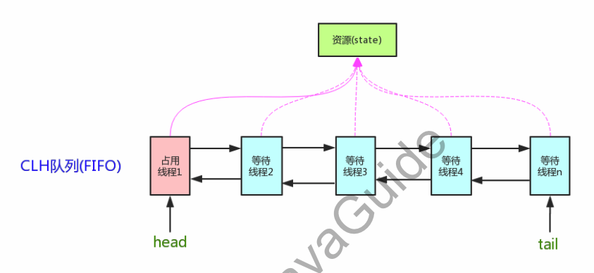
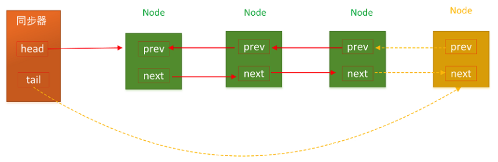
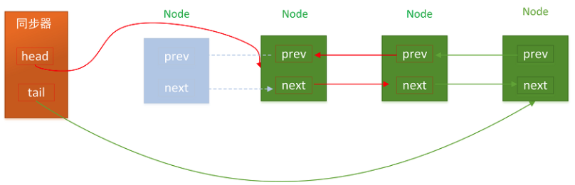
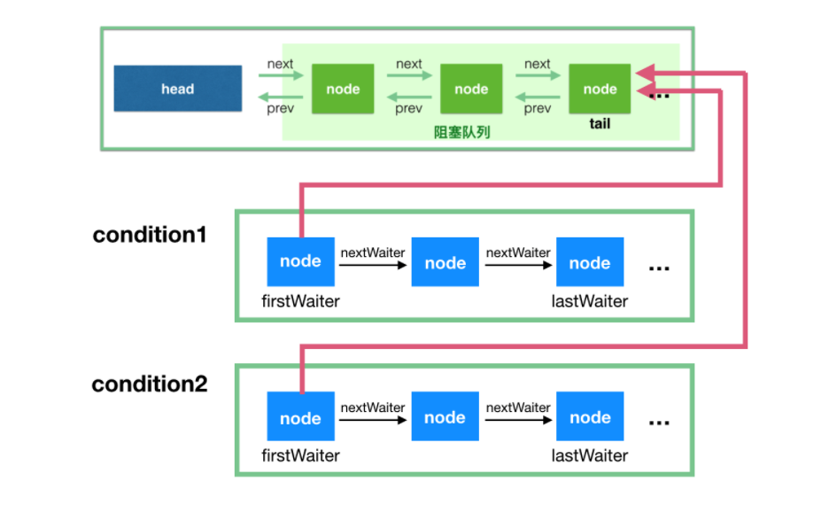
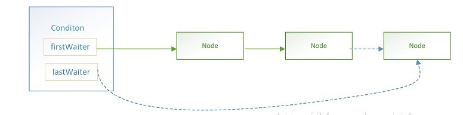

## AQS组件

### 什么是AQS

AQS(AbstractQueuedSynchronizer），即队列同步器。它是构建锁或者其他同步组件的基础框架（如ReentrantLock、ReentrantReadWriteLock、Semaphore等），JUC并发包的作者（Doug Lea）期望它能够成为实现大部分同步需求的基础。它是JUC并发包中的核心基础组件。

核心思想是：如果被请求的共享资源空闲，则将当前请求资源的线程设置为有效的工作线程，并且将共享资源的状态设置为锁定。如果被请求的共享资源被占用，那么就需要一套阻塞等待和被唤醒的锁分配机制，这个机制AQS就是通过CLH这个虚拟的队列锁实现的，即将暂时用不到的线程加到队列中。

CLH（Craig Landin and Hagersten）队列是一个虚拟的双向队列（即不存在队列实例，只存在节点间的关联关系）。AQS将每个请求共享资源的线程封装成一个CLH锁队列的一个节点（Node）来实现锁的分配。


### AQS的作用

AQS解决了实现同步器时涉及到的大量细节问题，例如获取同步状态、FIFO同步队列。基于AQS来构建同步器可以带来很多好处。它不仅能够极大地减少实现工作，而且也不必处理在多个位置上发生的竞争问题。

### State状态

AQS维护了一个volatile int类型的变量state表示当前同步状态。当state>0时表示已经获取了锁，当state = 0时表示释放了锁。

它提供了三个方法来对同步状态state进行操作：

> getState()：返回同步状态的当前值 setState()：设置当前同步状态 compareAndSetState()：使用CAS设置当前状态，该方法能够保证状态设置的原子性。

这三种操作均是CAS原子操作，其中compareAndSetState的实现依赖于Unsafe的compareAndSwapInt()方法

### 资源共享方式

AQS定义两种资源共享方式：

- Exclusive（独占，只有一个线程能执行，如ReentrantLock）
- Share（共享，多个线程可同时执行，如Semaphore/CountDownLatch）

不同的自定义同步器争用共享资源的方式也不同。自定义同步器在实现时只需要实现共享资源state的获取与释放方式即可，至于具体线程等待队列的维护（如获取资源失败入队/唤醒出队等），AQS已经在顶层实现好了。

### AQS的模板方法模式

同步器的设计是基于模板方法模式的，自定义同步器的方式是：

1. 继承AQS类，并重写其中的指定方法。
2. 将AQS组合在自定义的同步组件中，并调用其模板方法，而这些模板方法会调用使用者重写的方法。

自定义同步器实现时主要实现以下几种方法：

> - isHeldExclusively()：当前同步器是否在独占式模式下被线程占用，一般该方法表示是否被当前线程所独占。只有用到condition才需要去实现它。
> - tryAcquire(int)：独占方式。尝试获取同步状态，成功则返回true，失败则返回false。其他线程需要等待该线程释放同步状态才能获取同步状态。
> - tryRelease(int)：独占方式。尝试释放同步状态，成功则返回true，失败则返回false。
> - tryAcquireShared(int)：共享方式。尝试获取同步状态。负数表示失败；0表示成功，但没有剩余可用资源；正数表示成功，且有剩余资源。
> - tryReleaseShared(int)：共享方式。尝试释放同步状态，如果释放后允许唤醒后续等待结点，返回true，否则返回false。

### CLH虚拟同步队列

AQS内部维护着一个FIFO队列，该队列就是CLH同步队列，遵循FIFO原则（ First Input First Output先进先出）。CLH同步队列是一个FIFO双向队列，AQS依赖它来完成同步状态的管理。（虚拟队列不包含head节点）



当前线程如果获取同步状态失败时，AQS则会将当前线程已经等待状态等信息构造成一个节点（Node）并将其加入到CLH同步队列，同时会阻塞当前线程，当同步状态释放时，会把首节点唤醒（公平锁），使其再次尝试获取同步状态。

#### 入队

CLH队列入列非常简单，就是tail指向新节点、新节点的prev指向当前最后的节点，当前最后一个节点的next指向当前节点。



```java
private Node addWaiter(Node mode) {
    //新建Node
    Node node = new Node(Thread.currentThread(), mode);
    //快速尝试添加尾节点
    Node pred = tail;
    if (pred != null) {
        node.prev = pred;
        //CAS设置尾节点
        if (compareAndSetTail(pred, node)) {
            pred.next = node;
            return node;
        }
    }
    //多次尝试
    enq(node);
    return node;
}
//通过死循环的方式尝试，直至成功
private Node enq(final Node node) {
        for (;;) {
            Node t = tail;
            if (t == null) { // Must initialize
                if (compareAndSetHead(new Node()))
                    tail = head;
            } else {
                node.prev = t;
                if (compareAndSetTail(t, node)) {
                    t.next = node;
                    return t;
                }
            }
        }
    }
```

#### 出队

CLH同步队列遵循FIFO，首节点的线程释放同步状态后，将会唤醒它的后继节点（next），而后继节点将会在获取同步状态成功时将自己设置为首节点。head执行该节点并断开原首节点的next和当前节点的prev即可，注意在这个过程是不需要使用CAS来保证的，因为只有一个线程能够成功获取到同步状态。



## JUC中Condition

从Lock中调用newCondition()方法，返回的实际上AQS中的一个内部类ConditionObject。

```java
public class ConditionObject implements Condition, java.io.Serializable {
}
```

### 等待队列

每个Condition对象都包含着一个**FIFO队列**，该队列是Condition对象通知/等待功能的关键。在队列中每一个节点都包含着一个线程引用，该线程就是在该Condition对象上等待的线程。



```java
public class ConditionObject implements Condition, java.io.Serializable {
    private static final long serialVersionUID = 1173984872572414699L;
    
    //头节点
    private transient Node firstWaiter;
    //尾节点
    private transient Node lastWaiter;

    public ConditionObject() {
    }

    /** 省略方法 **/
}
```

Condition有首尾指针，当前线程调用await()方法时，即以当前线程构建的一个节点（Node），并加到队列的尾部。



Node里面包含了当前线程的引用。Node定义与AQS的CLH同步队列的节点使用的都是同一个类（AbstractQueuedSynchronized.Node静态内部类）。

Condition的队列结构比CLH同步队列的结构简单些，新增过程较为简单只需要将原尾节点的nextWaiter指向新增节点，然后更新lastWaiter即可。

### 等待状态

调用Condition的await()方法会使当前线程进入等待状态，同时会加入到Condition等待队列同时释放锁。当从await()方法返回时，当前线程一定是获取了Condition相关连的锁。

```java
public final void await() throws InterruptedException {
    // 当前线程中断
    if (Thread.interrupted())
        throw new InterruptedException();
    //当前线程加入等待队列
    Node node = addConditionWaiter();
    //释放锁
    long savedState = fullyRelease(node);
    int interruptMode = 0;
    /**
         * 检测此节点的线程是否在同步队上，如果不在，则说明该线程还不具备竞争锁的资格，则继续等待
         * 直到检测到此节点在同步队列上
         */
    while (!isOnSyncQueue(node)) {
        //线程挂起
        LockSupport.park(this);
        //如果已经中断了，则退出
        if ((interruptMode = checkInterruptWhileWaiting(node)) != 0)
            break;
    }
    //竞争同步状态
    if (acquireQueued(node, savedState) && interruptMode != THROW_IE)
        interruptMode = REINTERRUPT;
    //清理下条件队列中的不是在等待条件的节点
    if (node.nextWaiter != null) // clean up if cancelled
        unlinkCancelledWaiters();
    if (interruptMode != 0)
        reportInterruptAfterWait(interruptMode);
}
```

此段代码的逻辑是：首先将当前线程新建一个节点同时加入到条件队列中，然后释放当前线程持有的同步状态。然后则是不断检测该节点代表的线程释放出现在CLH同步队列中（收到signal信号之后就会在AQS队列中检测到），如果不存在则一直挂起，否则参与竞争同步状态

### 通知（signal）

调用Condition的signal()方法，将会唤醒在等待队列中等待最长时间的节点（条件队列里的首节点），在唤醒节点前，会将节点移到CLH同步队列中。

调用`condition1.signal()` 触发一次唤醒，此时唤醒的是队头，会将condition1 对应的**条件队列**的 firstWaiter（队头） 移到**阻塞队列的队尾**，等待获取锁，获取锁后 await 方法才能返回，继续往下执行。

```java
public final void signal() {
    //检测当前线程是否为拥有锁的独
    if (!isHeldExclusively())
        throw new IllegalMonitorStateException();
    //头节点，唤醒条件队列中的第一个节点
    Node first = firstWaiter;
    if (first != null)
        doSignal(first);    //唤醒
}
```

1. 先检测当前线程是否持有锁，这是前置条件。
2. 唤醒等待队列中的第一个节点。

```java
private void doSignal(Node first) {
    do {
        //修改头结点，完成旧头结点的移出工作
        if ( (firstWaiter = first.nextWaiter) == null)
            lastWaiter = null;
        first.nextWaiter = null;
    } while (!transferForSignal(first) &&
             (first = firstWaiter) != null);
}
```

doSignal()主要完成两件事：

1. 修改头节点
2. 调用transferForSignal(first)将头节点移到CLH队列中，参与锁的竞争。