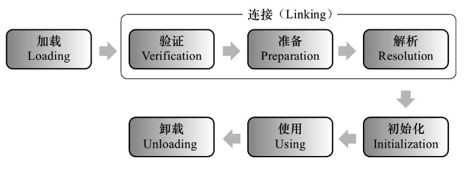
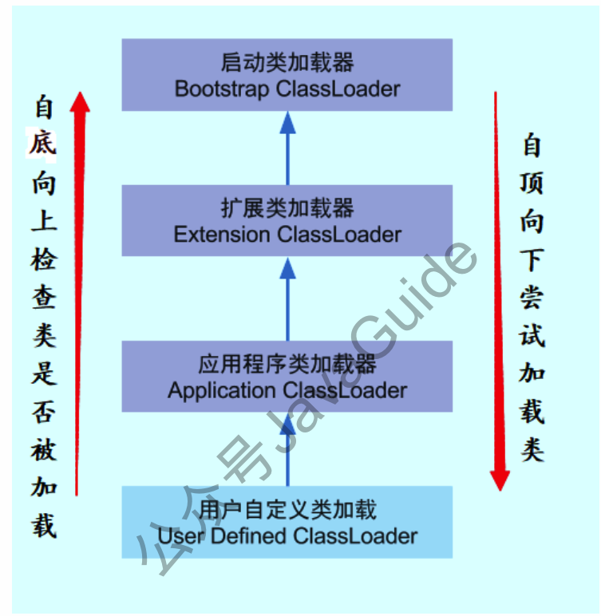

## 类加载过程

类加载，即将一个.Class文件加载进内存的过程。分为以下步骤：

### 加载

在内存中生成一个代表该类的java.lang.Class对象。

1. 通过类的全限定名获取定义此类的二进制字节流。
2. 将字节流所代表的静态存储结构转换为方法区的运行时数据结构。
3. 在内存中生成代表该类的Class对象。作为方法区这些数据的访问入口。

Java虚拟机规范并没有具体说明，获取类的二进制字节流并没有知名从哪里获取，可以从.class文件获取，从Zip包获取（ JAR􏲁，EAR，􏲁WAR格式的基础􏳂），从其他文件生成，比如.JSP文件。

一个非数组类的加载阶段（获取类的二进制字节流）是可控性最强的阶段，我们可以使用自定义的类加载器去控制获取方式。数组类型不通过类加载器创建，由Java虚拟机直接创建。

### 连接

加载和连接阶段部分内容是交叉进行的，可能加载阶段还未结束，连接已经开始。

## 类加载器

JVM内置了三个重要的 ClassLoader，除BootStrapClassLoader外，其他类加载器均有Java实现，并且全部继承自java.lang.ClassLoader。

1. **BootstrapClassLoader（启动类加载器）**

   最顶层加载器，由C++实现，负责加载%JAVA_HOME%/lib下的jar包和类，或通过-Xbootclasspath 参数指定路径中的，且被虚拟机认可(按文件名识别，如 rt.jar)的类。

2. **ExtensionClassLoader(拓展类加载器)**

   负责加载 JAVA_HOME\lib\ext 目录中的，或通过 java.ext.dirs 系统变量指定路径中的类库。

3. **AppClassLoader（应用程序类加载器􏴋)**

   􏰢􏴗面向用户的加载器，负载加载当前ClassPath下的所有jar和类。

 ### 双亲委派模型

JVM通过双亲委派模型进行类的加载。不想使用双亲委派模型，则可以自定义类加载器，通过继承 java.lang.ClassLoader实现自定义的类加载器。

当一个类收到了类加载请求，他首先不会尝试自己去加载这个类，而是把这个请求委派给父

类去完成，每一个层次类加载器都是如此，因此所有的加载请求都应该传送到启动类加载其中，

只有当父类加载器反馈自己无法完成这个请求的时候(在它的加载路径下没有找到所需加载的

Class)，子类加载器才会尝试自己去加载。

采用双亲委派的一个好处是比如加载位于 rt.jar 包中的类 java.lang.Object，不管是哪个加载

器加载这个类，最终都是委托给顶层的启动类加载器进行加载，这样就保证了使用不同的类加载

器最终得到的都是同样一个 Object 对象。

> JVM区分不同类的方式是 类加载器+类的全限定名，相同类被不同加载器加载后得到的是两个不同的类