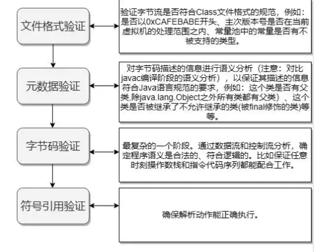
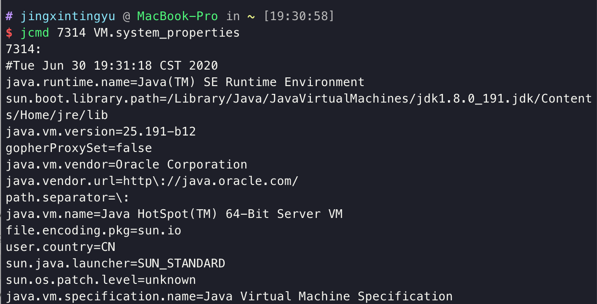

## 类加载过程

类加载，即将一个.Class文件加载进内存的过程。分为以下步骤：


### 加载

在内存中生成一个代表该类的java.lang.Class对象。

1. 通过类的全限定名获取定义此类的二进制字节流。
2. 将字节流所代表的静态存储结构转换为方法区的运行时数据结构。
3. 在内存中生成代表该类的Class对象。作为方法区这些数据的访问入口。

Java虚拟机规范并没有具体说明，获取类的二进制字节流并没有知名从哪里获取，可以从.class文件获取，从Zip包获取（ JAR，EAR，WAR格式的基础），从其他文件生成，比如.JSP文件。

一个非数组类的加载阶段（获取类的二进制字节流）是可控性最强的阶段，我们可以使用自定义的类加载器去控制获取方式。数组类型不通过类加载器创建，由Java虚拟机直接创建。


### 连接

加载和连接阶段部分内容是交叉进行的，可能加载阶段还未结束，连接已经开始。

#### 验证



#### 准备

**准备阶段是正式为类变量分配内存并设置类变量初始值的阶段**，这些内存都将在方法区中分配。对于该阶段有以下几点需要注意：

1. 这时候进行内存分配的仅包括类变量（static），而不包括实例变量，实例变量会在对象实例化时随着对象一块分配在 Java 堆中。
2. 这里所设置的初始值"通常情况"下是数据类型默认的零值（如0、0L、null、false等），比如我们定义了`public static int value=111` ，那么 value 变量在准备阶段的初始值就是 0 而不是111（初始化阶段才会复制）。特殊情况：比如给 value 变量加上了 fianl 关键字`public static final int value=111` ，那么准备阶段 value 的值就被复制为 111。

#### 解析

解析阶段是虚拟机将常量池内的符号引用替换为直接引用的过程。解析动作主要针对类或接口、字段、类方法、接口方法、方法类型、方法句柄和调用限定符7类符号引用进行。

符号引用就是一组符号来描述目标，可以是任何字面量。**直接引用**就是直接指向目标的指针、相对偏移量或一个间接定位到目标的句柄。在程序实际运行时，只有符号引用是不够的，举个例子：在程序执行方法时，系统需要明确知道这个方法所在的位置。Java 虚拟机为每个类都准备了一张方法表来存放类中所有的方法。当需要调用一个类的方法的时候，只要知道这个方法在方发表中的偏移量就可以直接调用该方法了。通过解析操作符号引用就可以直接转变为目标方法在类中方法表的位置，从而使得方法可以被调用。

综上，解析阶段是虚拟机将常量池内的符号引用替换为直接引用的过程，也就是得到类或者字段、方法在内存中的指针或者偏移量。

### 初始化

初始化是类加载的最后一步，也是真正执行类中定义的 Java 程序代码(字节码)，初始化阶段是执行类构造器 <clinit>()方法的过程。

对于<clinit>()方法的调用，虚拟机会自己确保其在多线程环境中的安全性。因为<clinit>()方法是带锁线程安全，所以在多线程环境下进行类初始化的话可能会引起死锁，并且这种死锁很难被发现。

对于初始化阶段，虚拟机严格规范了有且只有5中情况下，必须对类进行初始化：

1. 当遇到 new 、 getstatic、putstatic或invokestatic 这4条直接码指令时，比如 new 一个类，读取一个静态字段(未被 final 修饰)、或调用一个类的静态方法时。
2. 使用 `java.lang.reflect` 包的方法对类进行反射调用时 ，如果类没初始化，需要触发其初始化。
3. 初始化一个类，如果其父类还未初始化，则先触发该父类的初始化。
4. 当虚拟机启动时，用户需要定义一个要执行的主类 (包含 main 方法的那个类)，虚拟机会先初始化这个类。
5. 当使用 JDK1.7 的动态动态语言时，如果一个 MethodHandle 实例的最后解析结构为 REF_getStatic、REF_putStatic、REF_invokeStatic、的方法句柄，并且这个句柄没有初始化，则需要先触发器初始化。

## 类加载器

JVM内置了三个重要的 ClassLoader，除BootStrapClassLoader外，其他类加载器均有Java实现，并且全部继承自java.lang.ClassLoader。

1. **BootstrapClassLoader（启动类加载器）**

   最顶层加载器，由C++实现，负责加载%JAVA_HOME%/lib下的jar包和类，或通过-Xbootclasspath 参数指定路径中的，且被虚拟机认可(按文件名识别，如 rt.jar)的类。

2. **ExtensionClassLoader(拓展类加载器)**

   负责加载 JAVA_HOME\lib\ext 目录中的，或通过 java.ext.dirs 系统变量指定路径中的类库。

3. **AppClassLoader（应用程序类加载器)**

   面向用户的加载器，负载加载当前ClassPath下的所有jar和类。


### AppClassLoader

```java
static class AppClassLoader extends URLClassLoader {
        final URLClassPath ucp = SharedSecrets.getJavaNetAccess().getURLClassPath(this);

        public static ClassLoader getAppClassLoader(final ClassLoader var0) throws IOException {
            final String var1 = System.getProperty("java.class.path");
            final File[] var2 = var1 == null ? new File[0] : Launcher.getClassPath(var1);
            return (ClassLoader)AccessController.doPrivileged(new PrivilegedAction<Launcher.AppClassLoader>() {
                public Launcher.AppClassLoader run() {
                    URL[] var1x = var1 == null ? new URL[0] : Launcher.pathToURLs(var2);
                    return new Launcher.AppClassLoader(var1x, var0);
                }
            });
        }
}
```

从源码可以看到AppClassLoader从系统参数读取了java.class.path属性，各种ide都为程序指定了这个参数。可用jcmd命令查看：



### 类加载过程

在前面介绍类加载器的代理模式的时候，提到过类加载器会首先代理给其它类加载器来尝试加载某个类。这就意味着真正完成类的加载工作的类加载器和启动这个加载过程的类加载器，有可能不是同一个。真正完成类的加载工作是通过调用 `defineClass`来实现的；而启动类的加载过程是通过调用 `loadClass`来实现的。前者称为一个类的定义加载器（defining loader），后者称为初始加载器（initiating loader）。在 Java 虚拟机判断两个类是否相同的时候，使用的是类的定义加载器。也就是说，哪个类加载器启动类的加载过程并不重要，重要的是最终定义这个类的加载器。两种类加载器的关联之处在于：一个类的定义加载器是它引用的其它类的初始加载器。如类 `com.example.Outer`引用了类 `com.example.Inner`，则由类 `com.example.Outer`的定义加载器负责启动类 `com.example.Inner`的加载过程。

方法 `loadClass()`抛出的是 `java.lang.ClassNotFoundException`异常；方法 `defineClass()`抛出的是 `java.lang.NoClassDefFoundError`异常。

类加载器在成功加载某个类之后，会把得到的 `java.lang.Class`类的实例缓存起来。下次再请求加载该类的时候，类加载器会直接使用缓存的类的实例，而不会尝试再次加载。也就是说，对于一个类加载器实例来说，相同全名的类只加载一次，即 `loadClass`方法不会被重复调用。

### 加载器:类不会重复加载

 类的唯一性：同一个类加载器，类的全限定名一样，代表同一个类。

使用同一个类加载器，对同一个class的不同版本进行加载，不能加载到最新的class文件，即不支持热加载。

```java
public class classLoader {
    public static void main(String[] args) throws Exception{
        String path = "file:/Users/jingxintingyu/Desktop/";
        /**
         * 同一个类加载器不会重复加载类，只会加载一次，运行期间改变了class文件也不会更新，即不支持热更新。
         * 要实现热更新，只能每次新建一个类加载器。Tomcat加载jsp文件就是利用类似的机制，检测到jsp更新后，用新的加载器
         * 去加载，以支持热更新。
         */
        while (true){
            //每次都新建一个加载器，就能读取到最新的class文件，支持了热更新，Tomcat动态加载jsp文件就是这个原理
            URLClassLoader urlClassLoader = new URLClassLoader(new URL[]{new URL(path)});
            Class<?> tttt = urlClassLoader.loadClass("TTTT");
            Object o = tttt.newInstance();
            tttt.getMethod("test").invoke(o);
            TimeUnit.SECONDS.sleep(2);
        }
    }
}
```


 ### 双亲委派模型

JVM通过双亲委派模型进行类的加载。不想使用双亲委派模型，则可以自定义类加载器，通过继承 java.lang.ClassLoader实现自定义的类加载器。


当一个类收到了类加载请求，他首先不会尝试自己去加载这个类，而是把这个请求委派给父类去完成，每一个层次类加载器都是如此，因此所有的加载请求都应该传送到启动类加载其中，只有当父类加载器反馈自己无法完成这个请求的时候(在它的加载路径下没有找到所需加载的Class)，子类加载器才会尝试自己去加载。

采用双亲委派的一个好处是比如加载位于 rt.jar 包中的类 java.lang.Object，不管是哪个加载器加载这个类，最终都是委托给顶层的启动类加载器进行加载，这样就保证了使用不同的类加载器最终得到的都是同样一个 Object 对象。

> JVM区分不同类的方式是 类加载器+类的全限定名，相同类被不同加载器加载后得到的是两个不同的类。

### 自定义类加载器

一个标准的自定义类加载器的实现如下：

```java
public class FileSystemClassLoader extends ClassLoader { 
 
   private String rootDir; 
 
   public FileSystemClassLoader(String rootDir) { 
       this.rootDir = rootDir; 
   } 
   protected Class<?> findClass(String name) throws ClassNotFoundException {
       //找到对象的字节码
       byte[] classData = getClassData(name); 
       if (classData == null) { 
           throw new ClassNotFoundException(); 
       } 
       else { 
           //defineClass方法将字节码转化为类
           return defineClass(name, classData, 0, classData.length); 
       } 
   } 
   private byte[] getClassData(String className) { 
       String path = classNameToPath(className); 
       try { 
           InputStream ins = new FileInputStream(path); 
           ByteArrayOutputStream baos = new ByteArrayOutputStream(); 
           int bufferSize = 4096; 
           byte[] buffer = new byte[bufferSize]; 
           int bytesNumRead = 0; 
           while ((bytesNumRead = ins.read(buffer)) != -1) { 
               baos.write(buffer, 0, bytesNumRead); 
           } 
           return baos.toByteArray(); 
       } catch (IOException e) { 
           e.printStackTrace(); 
       } 
       return null; 
   } 
   private String classNameToPath(String className) { 
       return rootDir + File.separatorChar 
               + className.replace('.', File.separatorChar) + ".class"; 
   } 
}
```

继承了ClassLoader类，并重写了findClass()方法。

为了维护类加载器的双亲委派模型，官方不建议直接重写loadClass()方法，而是重写findClass()方法，因为委派模型是在loadClasss中实现的，而在父类加载器无法加载时，会调用findClasss()来查找该类。

