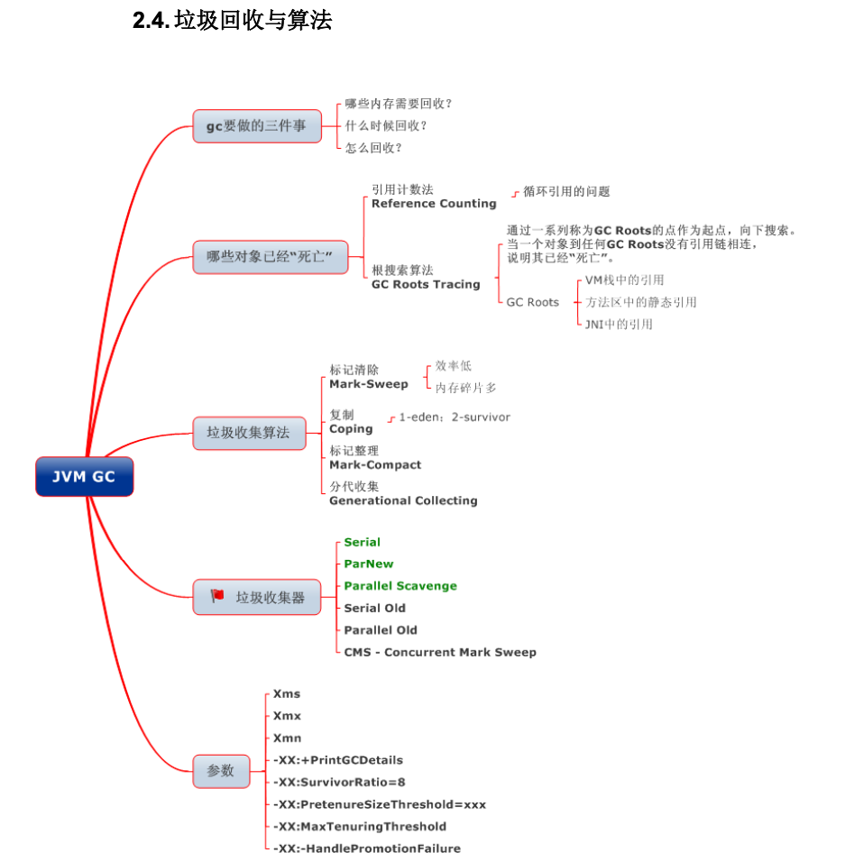
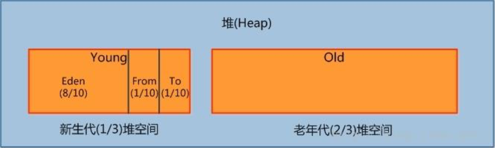

## 垃圾回收

### 如何确定垃圾

**1. 引用计数法**

**2. 可达性分析**：

为了解决引用计数法的循环引用问题，Java 使用了可达性分析的方法。通过一系列的“GC roots”

对象作为起点搜索。如果在“GC roots”和一个对象之间没有可达路径，则称该对象是不可达的。

要注意的是，不可达对象不等价于可回收对象，不可达对象变为可回收对象至少要经过两次标记过程。两次标记后仍然是可回收对象，则将面临回收。

> 可作为GC Roots的对象：
>
> - 当前各线程执行方法中的局部变量（包括形参）引用的对象
> - 已被加载的类的 static 域引用的对象
> - 方法区中常量引用的对象
> - JNI 引用

### 垃圾回收算法

**1. 标记-清理算法**

过程：标记阶段标记出所有需要回收的对象，清除阶段回收被标记的对象所占用的空间。

缺点：碎片化严重。

**2. 复制算法**

过程：按内存容量将内存划分为等大小 的两块。每次只使用其中一块，当这一块内存满后将尚存活的对象复制到另一块上去，把已使用的内存清掉。

缺点：可用内存被压缩到了原本的一半。且存活对象增多的话，效率会大大降低。

**3. 标记-整理算法**

过程：和标记-清理差不多，只是在清理时将存活的对象移向内存的一端。然后清除端边界外的对象。

**4. 分代收集算法**

分代收集法是目前大部分 JVM 所采用的方法，其核心思想是根据对象存活的不同生命周期将内存 划分为不同的域，一般情况下将 GC 堆划分为老年代(Tenured/Old Generation)和新生代(Young Generation)。老生代的特点是每次垃圾回收时只有少量对象需要被回收，新生代的特点是每次垃圾回收时都有大量垃圾需要被回收，因此可以根据不同区域选择不同的算法。

**新生代复制算法**

一般将新生代 划分为一块较大的 Eden 空间和两个较小的 Survivor 空间(From Space, To Space)，每次使用其中较大的Eden和一块Survivor空间，回收时，将两块空间中存活的帝乡复制到另一块Survivor中。

**老年代标记-整理算法**

1. 对象的内存分配主要在新生代的 Eden Space 和 Survivor Space 的 From Space(Survivor 目前存放对象的那一块)，少数情况会直接分配到老生代。

2. 当新生代的 Eden Space 和 From Space 空间不足时就会发生一次 GC，进行 GC 后，Eden Space 和 From Space 区的存活对象会被挪到 To Space，然后将 Eden Space 和 From Space 进行清理。

3. 如果 To Space 无法足够存储某个对象，则将这个对象存储到老生代。
4. 当对象在 Survivor 区躲过一次 GC 后，其年龄就会+1。默认情况下年龄到达 15 的对象会被 移到老生代中。

## 垃圾收集器

https://www.javadoop.com/post/jvm-memory-management

### Serial垃圾收集器

单线程收集器，stop the world。简单高效，在单CPU上省去了线程交互的开销，最高的单线程垃圾收集效率。因此 Serial垃圾收集器依然是 java 虚拟机运行在 **Client 模式下**默认的新生代垃圾收集器。

新生代采用复制算法，老年代采用标记-整理算法。

### ParNew垃圾收集器(Serial+多线程)

Serial的多线程版本。ParNew 收集器默认开启和 CPU 数目相同的线程数，可以通过-XX:ParallelGCThreads 参数来限制垃圾收集器的线程数，ParNew 垃圾收集器是很多 java 虚拟机运行在**Server 模式**下新生代的默认垃圾收集器。

新生代采用复制算法，老年代采用标记-整理算法。

### CMS垃圾收集器（多线程标记-清理算法）

hotspot虚拟机真正意义上的并发收集器。

### G1（Garbage-First）垃圾收集器

G1与CMS的优势在于以下几点：
1、并行与并发：G1能够更充分利用多CPU、多核环境运行
2、分代收集：G1虽然也用了分代概念，但相比其他收集器需要配合不同收集协同工作，但G1收集器能够独立管理整个堆
3、空间管理：与CMS的标记一清理算法不同，G1从整体上基于标记一整理算法，将整个Java堆划分为多个大小相等的独立区域（Region）,这种算法能够在运行过程中不产生内存碎片
4、可预测的停顿：降低停顿时间是G1和CMS共同目标，但是G1追求低停顿外，还能建立可预测的停顿时间模型，能让使用者明确指定一个长度为M毫秒的时间片段内，消耗在垃圾收集器上的时间不得超过N毫秒。

## 再谈引用

无论是通过引用计数法判断对象引用数量，还是通过可达性分析法判断对象的引用链是否可达，判定对象的存活都与“引用”有关。

JDK1.2之前，Java中引用的定义很传统：如果reference类型的数据存储的数值代表的是另一块内存的起始地址，就称这块内存代表一个引用。

JDK1.2以后，Java对引用的概念进行了扩充，将引用分为强引用、软引用、弱引用、虚引用四种（引用强度逐渐减弱）

**1．强引用**

以前我们使用的大部分引用实际上都是强引用，这是使用最普遍的引用。如果一个对象具有强引用，那就类似于必不可少的生活用品，垃圾回收器绝不会回收它。当内存空 间不足，Java虚拟机宁愿抛出OutOfMemoryError错误，使程序异常终止，也不会靠随意回收具有强引用的对象来解决内存不足问题。

**2．软引用（SoftReference）**

如果一个对象只具有软引用，那就类似于可有可无的生活用品。如果内存空间足够，垃圾回收器就不会回收它，如果内存空间不足了，就会回收这些对象的内存。只要垃圾回收器没有回收它，该对象就可以被程序使用。软引用可用来实现内存敏感的高速缓存。

软引用可以和一个引用队列（ReferenceQueue）联合使用，如果软引用所引用的对象被垃圾回收，JAVA虚拟机就会把这个软引用加入到与之关联的引用队列中。

**3．弱引用（WeakReference）**

如果一个对象只具有弱引用，那就类似于可有可无的生活用品。弱引用与软引用的区别在于：只具有弱引用的对象拥有更短暂的生命周期。在垃圾回收器线程扫描它 所管辖的内存区域的过程中，一旦发现了只具有弱引用的对象，不管当前内存空间足够与否，都会回收它的内存。不过，由于垃圾回收器是一个优先级很低的线程， 因此不一定会很快发现那些只具有弱引用的对象。

弱引用可以和一个引用队列（ReferenceQueue）联合使用，如果弱引用所引用的对象被垃圾回收，Java虚拟机就会把这个弱引用加入到与之关联的引用队列中。

**4．虚引用（PhantomReference）**

"虚引用"顾名思义，就是形同虚设，与其他几种引用都不同，虚引用并不会决定对象的生命周期。如果一个对象仅持有虚引用，那么它就和没有任何引用一样，在任何时候都可能被垃圾回收。

虚引用主要用来跟踪对象被垃圾回收的活动。

虚引用与软引用和弱引用的一个区别在于： 虚引用必须和引用队列（ReferenceQueue）联合使用。当垃 圾回收器准备回收一个对象时，如果发现它还有虚引用，就会在回收对象的内存之前，把这个虚引用加入到与之关联的引用队列中。程序可以通过判断引用队列中是 否已经加入了虚引用，来了解被引用的对象是否将要被垃圾回收。程序如果发现某个虚引用已经被加入到引用队列，那么就可以在所引用的对象的内存被回收之前采取必要的行动。

特别注意，在程序设计中一般很少使用弱引用与虚引用，使用软引用的情况较多，这是因为软引用可以加速JVM对垃圾内存的回收速度，可以维护系统的运行安全，防止内存溢出（OutOfMemory）等问题的产生。

## 垃圾回收过程

垃圾回收主要是回收堆内存。从GC角度，堆内存细分为：**新生代**(Eden 区、From Survivor 区和 To Survivor 区)和**老年代**。

因为新生代会频繁创建对象，所以新生代会触发频繁的**MinorGC**。

1. **Eden区**：Java中新对象的出生地。如果新创建的对象占用内存很大，则直接分配到老 年代。当 Eden 区内存不够的时候就会触发 MinorGC，对新生代区进行 一次垃圾回收。

2. **From Survivor 区**：上一次GC的幸存者，作为下一次GC的被扫描者。

3. **To Survive区**：保留了一次MinorGC过程中的幸存者。

   

### 新生代垃圾回收采用复制算法

 步骤是复制->清空->互换：

1. eden、servicorFrom 复制到 ServicorTo，年龄+1。

   把 Eden 和 ServivorFrom 区域中存活的对象复制到 ServicorTo 区域(如果有对象的年龄以及达到了老年的标准，则赋值到老年代区)，同时把这些对象的年龄+1(如果 ServicorTo 不 够位置了就放到老年区);

2. 清空 eden、servicorFrom 

    清空 Eden 和 ServicorFrom 中的对象。

3. ServicorTo 和 ServicorFrom 互换。

   原 ServicorTo 成为下一次 GC 时的 ServicorFrom区。

###  老年代采用标记-整理算法

老年代存放生命周期长的对象，比较稳定，只需要回收少量对象，所以MajorGC不会频繁触发，在触发时，通常会伴随着一次MinorGC。老年代垃圾回收采用标记-清除算法或者标记-整理算法：

首先扫描一次所有老年代，标记出存活的对象，然后回收没有标记的对象。MajorGC 的耗时比较长，因为要扫描再回收。MajorGC 会产生内存碎片，为了减少内存损耗，我们一般需要进行合并或者标记出来方便下次直接分配。当老年代也满了装不下的 时候，就会抛出 OOM(Out of Memory)异常。

### 运行时常量池

运行时常量池主要回收的是废弃的常量。假如常量池中存在字符串“abc”，如果当前没有任何String对象引用该常量，则说明是废弃的。

### 方法区（元空间）

方法区主要回收无用的类，即Class。

1. 该类所有的实例都被回收，即Java堆中不存在该类的任何实例。
2. 加载该类的ClassLoader已经被回收。
3. 该类对应的java.lang.Class对象在任何地方都没有引用，无法通过反射访问该类的方法。

## 什么时候发生GC

1、当 Eden 区的空间耗尽了怎么办？这个时候 Java虚拟机便会触发一次 **Minor GC**来收集新生代的垃圾，存活下来的对象，则会被送到 Survivor区。

2、major gc很多参考资料指的是等价于full gc，我们也可以发现很多性能监测工具中只有minor gc和full gc。
一般情况下，一次full gc将会对年轻代、老年代以及元空间、堆外内存进行垃圾回收。而触发Full GC的原因有很多：
a、当年轻代晋升到老年代的对象大小比目前老年代剩余的空间大小还要大时，此时会触发Full GC；
b、当老年代的空间使用率超过某阈值时，此时会触发Full GC;
c、当元空间不足时（JDK1.7永久代不足），也会触发Full GC;
d、当调用System.gc()也会安排一次Full GC;

## Full GC 的触发条件

对于 Minor GC，其触发条件非常简单，当 Eden 空间满时，就将触发一次 Minor GC。而 Full GC 则相对复杂，有以下条件：

1. 调用 System.gc()

只是建议虚拟机执行 Full GC，但是虚拟机不一定真正去执行。不建议使用这种方式，而是让虚拟机管理内存。

2. 老年代空间不足

老年代空间不足的常见场景为前文所讲的大对象直接进入老年代、长期存活的对象进入老年代等。

为了避免以上原因引起的 Full GC，应当尽量不要创建过大的对象以及数组。除此之外，可以通过 -Xmn 虚拟机参数调大新生代的大小，让对象尽量在新生代被回收掉，不进入老年代。还可以通过 -XX:MaxTenuringThreshold 调大对象进入老年代的年龄，让对象在新生代多存活一段时间。

3. 空间分配担保失败

使用复制算法的 Minor GC 需要老年代的内存空间作担保，如果担保失败会执行一次 Full GC。具体内容请参考上面的第 5 小节。

4. JDK 1.7 及以前的永久代空间不足

在 JDK 1.7 及以前，HotSpot 虚拟机中的方法区是用永久代实现的，永久代中存放的为一些 Class 的信息、常量、静态变量等数据。

当系统中要加载的类、反射的类和调用的方法较多时，永久代可能会被占满，在未配置为采用 CMS GC 的情况下也会执行 Full GC。如果经过 Full GC 仍然回收不了，那么虚拟机会抛出 java.lang.OutOfMemoryError。

为避免以上原因引起的 Full GC，可采用的方法为增大永久代空间或转为使用 CMS GC。

5. Concurrent Mode Failure

执行 CMS GC 的过程中同时有对象要放入老年代，而此时老年代空间不足（可能是 GC 过程中浮动垃圾过多导致暂时性的空间不足），便会报 Concurrent Mode Failure 错误，并触发 Full GC。

## 堆内存中对象分配的基本策略

Minor GC 和 Full GC

- Minor GC：回收新生代，因为新生代对象存活时间很短，因此 Minor GC 会频繁执行，执行的速度一般也会比较快。
- Full GC：回收老年代和新生代，老年代对象其存活时间长，因此 Full GC 很少执行，执行速度会比 Minor GC 慢很多。

## 内存分配策略

1. 对象优先在 Eden 分配

大多数情况下，对象在新生代 Eden 上分配，当 Eden 空间不够时，发起 Minor GC。

2. 大对象直接进入老年代

大对象是指需要连续内存空间的对象，最典型的大对象是那种很长的字符串以及数组。

经常出现大对象会提前触发垃圾收集以获取足够的连续空间分配给大对象。

-XX:PretenureSizeThreshold，大于此值的对象直接在老年代分配，避免在 Eden 和 Survivor 之间的大量内存复制。

3. 长期存活的对象进入老年代

为对象定义年龄计数器，对象在 Eden 出生并经过 Minor GC 依然存活，将移动到 Survivor 中，年龄就增加 1 岁，增加到一定年龄则移动到老年代中。

-XX:MaxTenuringThreshold 用来定义年龄的阈值。

4. 动态对象年龄判定

虚拟机并不是永远要求对象的年龄必须达到 MaxTenuringThreshold 才能晋升老年代，如果在 Survivor 中相同年龄所有对象大小的总和大于 Survivor 空间的一半，则年龄大于或等于该年龄的对象可以直接进入老年代，无需等到 MaxTenuringThreshold 中要求的年龄。

5. 空间分配担保

在发生 Minor GC 之前，虚拟机先检查老年代最大可用的连续空间是否大于新生代所有对象总空间，如果条件成立的话，那么 Minor GC 可以确认是安全的。

如果不成立的话虚拟机会查看 HandlePromotionFailure 的值是否允许担保失败，如果允许那么就会继续检查老年代最大可用的连续空间是否大于历次晋升到老年代对象的平均大小，如果大于，将尝试着进行一次 Minor GC；如果小于，或者 HandlePromotionFailure 的值不允许冒险，那么就要进行一次 Full GC。