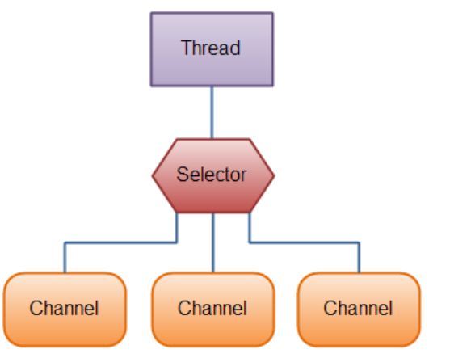
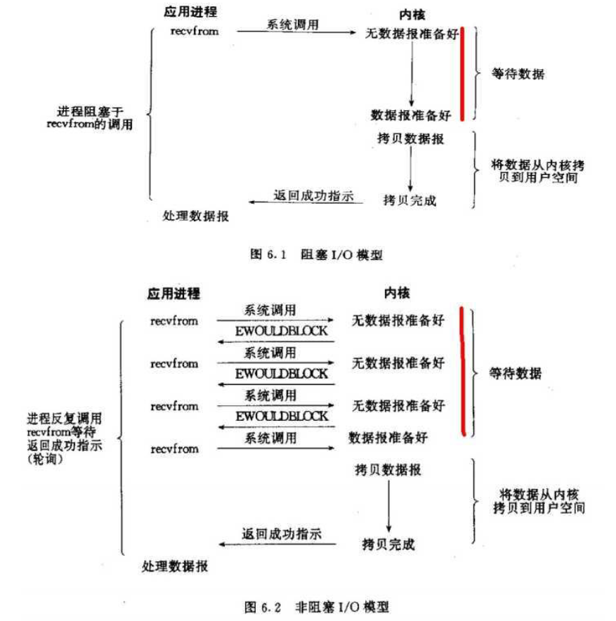

## 通信模型

网络通信的本质是网络间的数据 IO。只要有 IO，就会有阻塞或非阻塞的问 题，无论这个 IO 是网络的，还是硬盘的。原因在于程序是运行在系统之上的， 任何形式的 IO 操作发起都需要系统的支持。

### BIO（阻塞式IO）

BIO 即 blocking IO,是一种阻塞式的 IO。jdk1.4 版本之前 Socket 即 BIO 模式。
BIO 的问题在于 accept()、read()的操作点都是被阻塞的。 服务器线程发起一个 accept 动作，询问操作系统是否有新的 socket 信息从端口 X 发送过来。注意，是询问操作系统。如果操作系统没有发现有 socket 从 指定的端口 X 来，那么操作系统就会等待。这样 serverSocket.accept()方法就 会一直等待。这就是为什么 accept()方法为什么会阻塞。

如果想让 BIO 同时处理多个客户端请求，就必须使用多线程，即每次 accept 阻塞等待来自客户端请求，一旦收到连接请求就建立通信，同时开启一个新的线 程来处理这个套接字的数据读写请求，然后立刻又继续 accept 等待其他客户端 连接请求，即为每一个客户端连接请求都创建一个线程来单独处理。

### NIO（非阻塞式IO）

NIO 即 non-blocking IO,是一种非阻塞式的 IO。jdk1.4 之后提供。
 NIO 三大核心部分:Channel(通道)，Buffer(缓冲区), Selector(选择器)。 

**Buffer:容器对象：**包含一些要写入或者读出的数据。在 NIO 库，所有数据都是用缓冲区处理的。在读取数据时，它是直接读到缓冲区中的;在写入数据时， 也是写入到缓冲区中。任何时候访问 NIO 中的数据，都是通过缓冲区进行操作。

**Channel:通道对象**：对数据的读取和写入要通过 Channel，它就像水管一 样。通道不同于流的地方就是通道是双向的，可以用于读、写和同时读写操作。Channel 不会直接处理字节数据，而是通过 Buffer 对象来处理数据。

**Selector:多路复用器**：选择器。提供选择已经就绪的任务的能力。Selector会不断轮询注册在其上的 Channel，如果某个 Channel 上面发生读或者写事件， 这个 Channel 就处于就绪状态，会被 Selector 轮询出来，进行后续的 I/O 操作。 这样服务器只需要一两个线程就可以进行多客户端通信。

### 阻塞与非阻塞

阻塞 IO 和非阻塞 IO 这两个概念是程序级别的。

主要描述的是程序请求操作 系统 IO 操作后，如果 IO 资源没有准备好，那么程序该如何处理的问题:

前者等待；后者继续执行(并且使用线程一直轮询，直到有 IO 资源准备好了)。

### 同步和非同步

同步 IO 和非同步 IO，这两个概念是操作系统级别的。

主要描述的是操作系 统在收到程序请求 IO 操作后，如果 IO 资源没有准备好，该如何响应程序的问 题:前者不响应，直到 IO 资源准备好以后;后者返回一个标记(好让程序和自 己知道以后的数据往哪里通知)，当 IO 资源准备好以后，再用事件机制返回给程序。