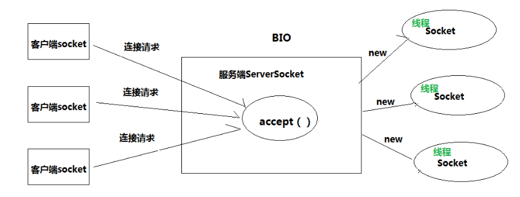
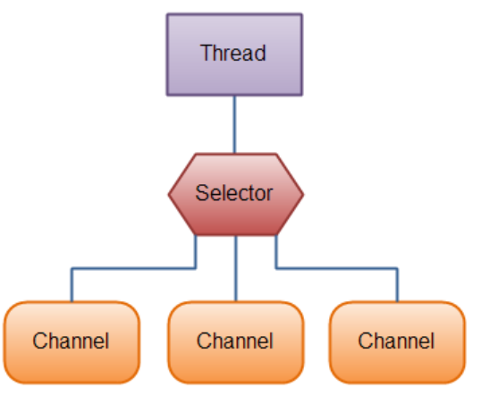
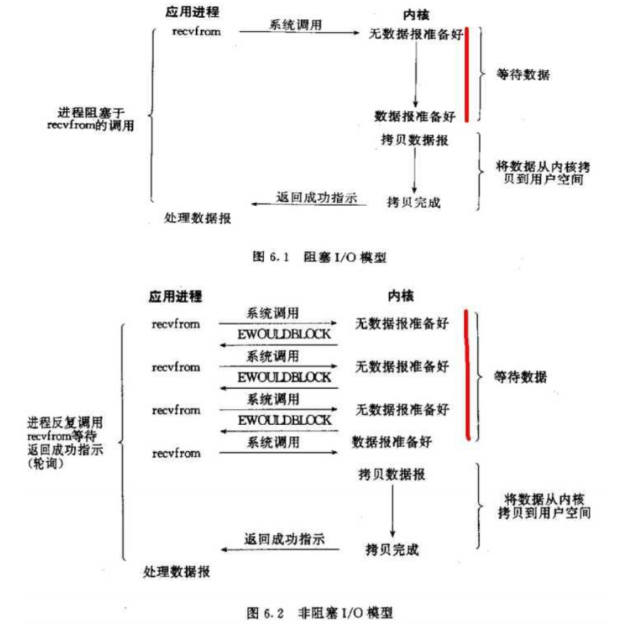

## 通信模型

网络通信的本质是网络间的数据 IO。只要有 IO，就会有阻塞或非阻塞的问 题，无论这个 IO 是网络的，还是硬盘的。原因在于程序是运行在系统之上的， 任何形式的 IO 操作发起都需要系统的支持。

### BIO（阻塞式IO）

BIO 即 blocking IO,是一种阻塞式的 IO。jdk1.4 版本之前 Socket 即 BIO 模式。
BIO 的问题在于 accept()、read()和write()的操作点都是被阻塞的。 服务器线程发起一个 accept 动作，询问操作系统是否有新的 socket 信息从端口 X 发送过来。注意，是询问操作系统。如果操作系统没有发现有 socket 从 指定的端口 X 来，那么操作系统就会等待。这样 serverSocket.accept()方法就 会一直等待。这就是为什么 accept()方法为什么会阻塞。

如果想让 BIO 同时处理多个客户端请求，就必须使用多线程，即每次 accept 阻塞等待来自客户端请求，一旦收到连接请求就建立通信，同时开启一个新的线 程来处理这个套接字的数据读写请求，然后立刻又继续 accept 等待其他客户端 连接请求，即为每一个客户端连接请求都创建一个线程来单独处理。



### NIO（非阻塞式IO）

NIO 即 non-blocking IO,是一种非阻塞式的 IO。jdk1.4 之后提供。
 NIO 三大核心部分:Channel(通道)，Buffer(缓冲区), Selector(选择器)。 

**Buffer:容器对象：**包含一些要写入或者读出的数据。在 NIO 库，所有数据都是用缓冲区处理的。在读取数据时，它是直接读到缓冲区中的;在写入数据时， 也是写入到缓冲区中。任何时候访问 NIO 中的数据，都是通过缓冲区进行操作。

**Channel:通道对象**：对数据的读取和写入要通过 Channel，它就像水管一 样。通道不同于流的地方就是通道是双向的，可以用于读、写和同时读写操作。Channel 不会直接处理字节数据，而是通过 Buffer 对象来处理数据。

**Selector:多路复用器**：选择器。提供选择已经就绪的任务的能力。Selector会不断轮询注册在其上的 Channel，如果某个 Channel 上面发生读或者写事件， 这个 Channel 就处于就绪状态，会被 Selector 轮询出来，进行后续的 I/O 操作。 这样服务器只需要一两个线程就可以进行多客户端通信。




### IO多路复用


### 阻塞与非阻塞

阻塞 IO 和非阻塞 IO 这两个概念是程序级别的。

主要描述的是程序请求操作 系统 IO 操作后，如果 IO 资源没有准备好，那么程序该如何处理的问题:

前者等待；后者继续执行(并且使用线程一直轮询，直到有 IO 资源准备好了)。



### 同步和非同步

同步 IO 和非同步 IO，这两个概念是操作系统级别的。

主要描述的是操作系统在收到程序请求 IO 操作后，如果 IO 资源没有准备好，该如何响应程序的问 题:前者不响应，直到 IO 资源准备好以后;后者返回一个标记(好让程序和自 己知道以后的数据往哪里通知)，当 IO 资源准备好以后，再用事件机制返回给程序。


## 结合事件模型利用NIO

**最简单的Reactor模式**

NIO的读写函数可以立刻返回，这就给了我们不开线程利用CPU的最好机会：如果一个连接不能读写（socket.read()返回0或者socket.write()返回0），我们可以把这件事记下来，记录的方式通常是在Selector上注册标记位，然后切换到其它就绪的连接（channel）继续进行读写。

下面具体看下如何利用事件模型单线程处理所有I/O请求：

NIO的主要事件有几个：读就绪、写就绪、有新连接到来。

我们首先需要注册当这几个事件到来的时候所对应的处理器。然后在合适的时机告诉事件选择器：我对这个事件感兴趣。对于写操作，就是写不出去的时候对写事件感兴趣；对于读操作，就是完成连接和系统没有办法承载新读入的数据的时；对于accept，一般是服务器刚启动的时候；而对于connect，一般是connect失败需要重连或者直接异步调用connect的时候。

其次，用一个死循环选择就绪的事件，会执行系统调用（Linux 2.6之前是select、poll，2.6之后是epoll，Windows是IOCP），还会阻塞的等待新事件的到来。新事件到来的时候，会在selector上注册标记位，标示可读、可写或者有连接到来。

注意，select是阻塞的，无论是通过操作系统的通知（epoll）还是不停的轮询(select，poll)，这个函数是阻塞的。所以你可以放心大胆地在一个while(true)里面调用这个函数而不用担心CPU空转。

```java
   interface ChannelHandler{
      void channelReadable(Channel channel);
      void channelWritable(Channel channel);
   }
   class Channel{
     Socket socket;
     Event event;//读，写或者连接
   }
   //IO线程主循环:
   class IoThread extends Thread{
   public void run(){
   Channel channel;
   while(channel=Selector.select()){//选择就绪的事件和对应的连接
      if(channel.event==accept){
         registerNewChannelHandler(channel);//如果是新连接，则注册一个新的读写处理器
      }
      if(channel.event==write){
         getChannelHandler(channel).channelWritable(channel);//如果可以写，则执行写事件
      }
      if(channel.event==read){
          getChannelHandler(channel).channelReadable(channel);//如果可以读，则执行读事件
      }
    }
   }
   Map<Channel，ChannelHandler> handlerMap;//所有channel的对应事件处理器
  }
```


## AIO 异步IO

