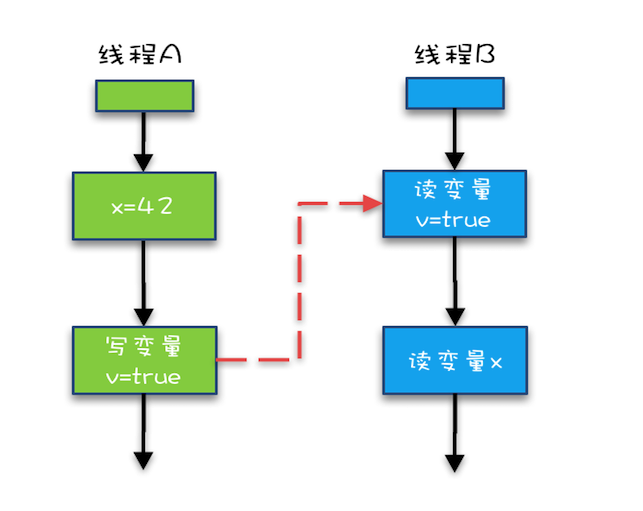

> Java Memory Model   Java内存模型

## 并发三问题

导致并发程序难写的原因就是：有序性，内存可见性和原子性

### 有序性

导致有序性问题的原因就是**指令重排序**。

一般来说，重排序由以下几种机制引起：

1. 编译器优化：对于没有数据依赖关系的操作，编译器在编译的过程中会进行一定程度的重排。

   > 编译器是可以将 a = 1 和 x = b 换一下顺序的，因为它们之间没有数据依赖关系。

2. 指令重排序：CPU 优化行为，也是会对不存在数据依赖关系的指令进行一定程度的重排。

   > 这个和编译器优化差不多，就算编译器不发生重排，CPU 也可以对指令进行重排，这个就不用多说了。

3. 内存系统重排序：内存系统没有重排序，但是由于有缓存的存在，使得程序整体上会表现出乱序的行为。

   > 假设不发生编译器重排和指令重排，线程 1 修改了 a 的值，但是修改以后，a 的值可能还没有写回到主存中，那么线程 2 得到 a == 0 就是很自然的事了。同理，线程 2 对于 b 的赋值操作也可能没有及时刷新到主存中。

### 内存可见性

线程间的对于共享变量的可见性问题不是直接由多核引起的，而是由多缓存引起的。如果每个核心共享同一个缓存，那么也就不存在内存可见性问题了。

现代多核 CPU 中每个核心拥有自己的一级缓存或一级缓存加上二级缓存等，问题就发生在每个核心的独占缓存上。每个核心都会将自己需要的数据读到独占缓存中，数据修改后也是写入到缓存中，然后等待刷入到主存中。所以会导致有些核心读取的值是一个**过期**的值。

Java 作为高级语言，屏蔽了这些底层细节，用 JMM 定义了一套读写内存数据的规范，虽然我们不再需要关心一级缓存和二级缓存的问题，但是，JMM 抽象了主内存和本地内存的概念。

所有的共享变量存在于主内存中，**每个线程有自己的本地内存**，线程读写共享数据也是通过本地内存交换的，所以可见性问题依然是存在的。这里说的本地内存并不是真的是一块给每个线程分配的内存，而是 JMM 的一个抽象，是对于寄存器、一级缓存、二级缓存等的抽象。

### 原子性

## Java对并发的规范约束

### Happens-before Order

前面一个操作的结果对后续操作是可见的。就像有心灵感应的两个人，虽然远隔千里，一个人心之所想，另一个人都看得到。Happens-Before 规则就是要保证线程之间的这种“心灵感应”。

所以比较正式的说法是：Happens-Before 约束了编译器的优化行为，虽允许编译器优化，但是要求编译器优化后一定遵守 Happens-Before 规则。

1. **程序的顺序性规则**

   这条规则是指在一个线程中，按照程序顺序，前面的操作 Happens-Before 于后续的任意操作。

2. **volatile 变量规则**

   这条规则是指对一个 volatile 变量的写操作， Happens-Before 于后续对这个 volatile 变量的读操作。

   这个就有点费解了，对一个 volatile 变量的写操作相对于后续对这个 volatile 变量的读操作可见，这怎么看都是禁用缓存的意思啊，貌似和 1.5 版本以前的语义没有变化啊？如果单看这个规则，的确是这样，但是如果我们关联一下规则 3，就有点不一样的感觉了。

3. **管程锁定规则**

   这条规则是指对一个锁的解锁 Happens-Before 于后续对这个锁的加锁。

   要理解这个规则，就首先要了解“管程指的是什么”。管程是一种通用的同步原语，在 Java 中指的就是 synchronized，synchronized 是 Java 里对管程的实现。

   管程中的锁在 Java 里是隐式实现的，例如下面的代码，在进入同步块之前，会自动加锁，而在代码块执行完会自动释放锁，加锁以及释放锁都是编译器帮我们实现的

   ```java
   synchronized (this) { //此处自动加锁
     // x是共享变量,初始值=10
     if (this.x < 12) {
       this.x = 12; 
     }  
   } //此处自动解锁
   ```

​      	可以这样理解：假设 x 的初始值是 10，线程 A 执行完代码块后 x 的值会变成 12（执行完自动释放锁），线程 B 进入代码块时，能够看到线程 A 对 x 的写操作，也就是线程 B 能够看到 x==12。

4. **线程启动规则**

   它是指主线程 A 启动子线程 B 后，子线程 B 能够看到主线程在启动子线程 B 前的操作。

6. **线程的终止规则**

   它是指主线程 A 等待子线程 B 完成（主线程 A 通过调用子线程 B 的 join() 方法实现），当子线程 B 完成后（主线程 A 中 join() 方法返回），主线程能够看到子线程的操作。当然所谓的“看到”，指的是对共享变量的操作。

7. **线程中断规则**

   对线程interrupt()方法的调用happens-before于被中断线程代码检测中断。既可以通过Thread.interrupt()检测到是否被中断。

8. **传递特性**

这条规则是指如果 A Happens-Before B，且 B Happens-Before C，那么 A Happens-Before C。

```java
//实例代码
class VolatileExample {
  int x = 0;
  volatile boolean v = false;
  public void writer() {
    x = 42;
    v = true;
  }
  public void reader() {
    if (v == true) {
      // 这里x会是多少呢？
    }
  }
}
```



1. “x=42” Happens-Before 写变量 “v=true” ，这是规则 1 的内容；

2. 写变量“v=true” Happens-Before 读变量 “v=true”，这是规则 2 的内容 。

再根据这个传递性规则，我们得到结果：“x=42” Happens-Before 读变量“v=true”。这意味着什么呢？如果线程 B 读到了“v=true”，那么线程 A 设置的“x=42”对线程 B 是可见的。


## Synchronized 关键字

一个线程在获取到监视器锁以后才能进入 synchronized 控制的代码块，一旦进入代码块，首先，该线程对于共享变量的缓存就会失效，因此 synchronized 代码块中对于共享变量的读取需要从主内存中重新获取，也就能获取到最新的值。

退出代码块的时候的，会将该线程写缓冲区中的数据刷到主内存中，所以在 synchronized 代码块之前或 synchronized 代码块中对于共享变量的操作随着该线程退出 synchronized 块，会立即对其他线程可见（这句话的前提是其他读取共享变量的线程会从主内存读取最新值）。

线程 a 对于进入 synchronized 块之前或在 synchronized 中对于共享变量的操作，对于后续的持有同一个监视器锁的线程 b 可见。

## 双重检验锁的单例模式

```java
public class Singleton {

    private static Singleton instance = null;   //替换为private static volatile Singleton instance = null;

    public static Singleton getInstance() {
        if (instance == null) { // 1. 第一次检查
            synchronized (Singleton.class) { // 2
                if (instance == null) { // 3. 第二次检查
                    instance = new Singleton(); // 4
                }
            }
        }
        return instance;
    }
}
```

## volatile 关键字

大部分开发者应该都知道怎么使用这个关键字，只是可能不太了解个中缘由。

**如果你下次面试的时候有人问你 volatile 的作用，记住两点：内存可见性和禁止指令重排序。**

### volatile 的内存可见性

我们还是用 JMM 的**主内存**和**本地内存**抽象来描述，这样比较准确。还有，并不是只有 Java 语言才有 volatile 关键字，所以后面的描述一定要建立在 Java 跨平台以后抽象出了内存模型的这个大环境下。

还记得 synchronized 的语义吗？进入 synchronized 时，使得本地缓存失效，synchronized 块中对共享变量的读取必须从主内存读取；退出 synchronized 时，会将进入 synchronized 块之前和 synchronized 块中的写操作刷入到主存中。

volatile 有类似的语义，读一个 volatile 变量之前，需要先使相应的本地缓存失效，这样就必须到主内存读取最新值，写一个 volatile 属性会立即刷入到主内存。所以，volatile 读和 monitorenter 有相同的语义，volatile 写和 monitorexit 有相同的语义。

### volatile 的禁止重排序

大家还记得之前的双重检查的单例模式吧，前面提到，加个 volatile 能解决问题。其实就是利用了 volatile 的禁止重排序功能。

volatile 的禁止重排序并不局限于两个 volatile 的属性操作不能重排序，而且是 volatile 属性操作和它周围的普通属性的操作也不能重排序。

之前 instance = new Singleton() 中，如果 instance 是 volatile 的，那么对于 instance 的赋值操作（赋一个引用给 instance 变量）就不会和构造函数中的属性赋值发生重排序，能保证构造方法结束后，才将此对象引用赋值给 instance。

根据 volatile 的内存可见性和禁止重排序，那么我们不难得出一个推论：线程 a 如果写入一个 volatile 变量，此时线程 b 再读取这个变量，那么此时对于线程 a 可见的所有属性对于线程 b 都是可见的。

### volatile 小结

1. volatile 修饰符适用于以下场景：某个属性被多个线程共享，其中有一个线程修改了此属性，其他线程可以立即得到修改后的值。在并发包的源码中，它使用得非常多。
2. volatile 属性的读写操作都是无锁的，它不能替代 synchronized，因为**它没有提供原子性和互斥性**。因为无锁，不需要花费时间在获取锁和释放锁上，所以说它是低成本的。
3. volatile 只能作用于属性，我们用 volatile 修饰属性，这样 compilers 就不会对这个属性做指令重排序。
4. volatile 提供了可见性，任何一个线程对其的修改将立马对其他线程可见。volatile 属性不会被线程缓存，始终从主存中读取。
5. volatile 提供了 happens-before 保证，对 volatile 变量 v 的写入 happens-before 所有其他线程后续对 v 的读操作。
6. volatile 可以使得 long 和 double 的赋值是原子的，前面在说原子性的时候提到过。