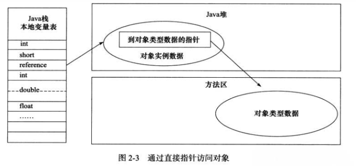

## 内存结构


>  线程私有数据区域生命周期和线程一致，随用户线程的启动/销毁而创建/销毁。
>
>  线程共享数据区域生命周期和虚拟机一致，随虚拟机的启动/关闭而创建/销毁。

### 程序计数器

线程私有。记录当前线程执行的字节码的位置，若是native方法，则为空。无OOM。

### 虚拟机栈

线程私有。栈帧：存储局部变量表，操作数栈，动态链接，方法出口等信息，每一个方法从调用直至执行完成 的过程，就对应着一个栈帧在虚拟机栈中入栈到出栈的过程。栈帧随着方法调用而创建，随着方法结束而销毁。

### 本地方法栈

线程私有，为native方法服务。

### 堆

线程共享。建的对象和数组都保存在 Java 堆内存中，也是垃圾收集器进行垃圾收集的最重要的内存区域。由于现代 VM 采用**分代收集算法**, 因此 Java 堆从 GC 的角度还可以 细分为: **新生代**(Eden 区、From Survivor 区和 To Survivor 区)和**老年代。**

### 方法区（永久代）

> JDK1.8被移除，改为元空间（meta space）。使用直接内存

线程共享。存储**被** **JVM** **加载的类信息**、**常量**、**静 态变量**、**即时编译器编译后的代码**等数据。

HotSpot VM 把 GC 分代收集扩展至方法区, 即**使用** **Java** **堆的永久代来实现方法区**, 这样 HotSpot 的垃圾收集器就可以像管理 Java 堆一样管理这部分内存, 而不必为方法区开发专门的内存管理器(永久带的内存回收的主要目标是针对**常量池的回收**和**类型 的卸载**, 因此收益一般很小)。

**运行时常量池(Runtime Constant Pool)**是方法区的一部分。Class 文件中除了有类的版 本、字段、方法、接口等描述等信息外，还有一项信息是常量池(Constant Pool Table)，用于存放编译期生成的各种字面量和符号引用，这部分内容将在类加 载后存放到方法区的运行时常量池中。


> **JDK1.7及之后版本的 JVM 已经将运行时常量池从方法区中移了出来，在 Java 堆（Heap）中开辟了一块区域存放运行时常量池**。


### 一段话描述JVM的内存结构

程序启动，JVM进程启动，加载class到内存，class加载到JVM的方法区中

JVM通过虚拟机执行引擎执行字节码，入口为main方法，为main方法创建虚拟机栈，每个虚拟机栈绑定一个线程

字节码执行的进度通过代码计数器保存。

某个线程执行到新方法时便会将该对象压入当前线程的虚拟机栈，保存局部变量到当前方法的栈帧中，方法运行结束栈帧出栈，变量回收。

当创建对象，对象内存会分配到堆上，栈中引用会指向对中对象。


## JVM参数设置

```Java
-Xms 堆内存大小
-Xmx 堆内存最大大小
-Xmn 堆内存中新生代大小，去除它就是老生代的大小
-Xss 线程栈内存大小
-XX:PermSize 永久代 1.7之前
-XX:MaxPermSize 最大永久代 1.7之前
-XX:MetaSpaceSize -XX:MaxMetaSpacesize 1.8之后
```


## 堆内存中对象分配的基本策略

对象优先在Eden区分配。

大对象直接进入老年代。

长期存活的对象（默认15岁）将进入老年代。


## HotSpot虚拟机对象建立全过程


**①类加载检查：** 虚拟机遇到一条 new 指令时，首先将去检查这个指令的参数是否能在常量池中定位到这个类的符号引用，并且检查这个符号引用代表的类是否已被加载过、解析和初始化过。如果没有，那必须先执行相应的类加载过程。

**②分配内存**： 在类加载检查通过后，接下来虚拟机将为新生对象分配内存。对象所需的内存大小在类加载完成后便可确定，为对象分配空间的任务等同于把一块确定大小的内存从 Java 堆中划分出来。分配方式有 “指针碰撞” 和 “空闲列表” 两种，选择那种分配方式由 Java 堆是否规整决定，而Java堆是否规整又由所采用的垃圾收集器是否带有压缩整理功能决定。

**内存分配的两种方式：（补充内容，需要掌握）**

选择以上两种方式中的哪一种，取决于 Java 堆内存是否规整。而 Java 堆内存是否规整，取决于 GC 收集器的算法是"标记-清除"，还是"标记-整理"（也称作"标记-压缩"），值得注意的是，复制算法内存也是规整的。


**内存分配并发问题（补充内容，需要掌握）**

在创建对象的时候有一个很重要的问题，就是线程安全，因为在实际开发过程中，创建对象是很频繁的事情，作为虚拟机来说，必须要保证线程是安全的，通常来讲，虚拟机采用两种方式来保证线程安全：

- **CAS+失败重试：** CAS 是乐观锁的一种实现方式。所谓乐观锁就是，每次不加锁而是假设没有冲突而去完成某项操作，如果因为冲突失败就重试，直到成功为止。虚拟机采用 CAS 配上失败重试的方式保证更新操作的原子性。
- **TLAB：** 为每一个线程预先在Eden区分配一块儿内存，JVM在给线程中的对象分配内存时，首先在TLAB分配，当对象大于TLAB中的剩余内存或TLAB的内存已用尽时，再采用上述的CAS进行内存分配。

**③初始化零值：** 内存分配完成后，虚拟机需要将分配到的内存空间都初始化为零值（不包括对象头），这一步操作保证了对象的实例字段在 Java 代码中可以不赋初始值就直接使用，程序能访问到这些字段的数据类型所上对应的零值。

**④设置对象头：** 初始化零值完成之后，虚拟机要对对象进行必要的设置，例如这个对象是那个类的实例、如何才能找到类的元数据信息、对象的哈希吗、对象的 GC 分代年龄等信息。 这些信息存放在对象头中。 另外，根据虚拟机当前运行状态的不同，如是否启用偏向锁等，对象头会有不同的设置方式。

**⑤执行 init 方法：** 在上面工作都完成之后，从虚拟机的视角来看，一个新的对象已经产生了，但从 Java 程序的视角来看，对象创建才刚开始，<init> 方法还没有执行，所有的字段都还为零。所以一般来说，执行 new 指令之后会接着执行 <init> 方法，把对象按照程序员的意愿进行初始化，这样一个真正可用的对象才算完全产生出来。


**对象的访问定位**

建立对象就是为了使用对象，我们的Java程序通过栈上的 reference 数据来操作堆上的具体对象。对象的访问方式有虚拟机实现而定，目前主流的访问方式有①使用句柄和②直接指针两种：

**1. 句柄：** 如果使用句柄的话，那么Java堆中将会划分出一块内存来作为句柄池，reference 中存储的就是对象的句柄地址，而句柄中包含了对象实例数据与类型数据各自的具体地址信息； 


**2. 直接指针：** 如果使用直接指针访问，那么 Java 堆对象的布局中就必须考虑如何放置访问类型数据的相关信息，而reference 中存储的直接就是对象的地址。



这两种对象访问方式各有优势。使用句柄来访问的最大好处是 reference 中存储的是稳定的句柄地址，在对象被移动时只会改变句柄中的实例数据指针，而 reference 本身不需要修改。使用直接指针访问方式最大的好处就是速度快，它节省了一次指针定位的时间开销。

