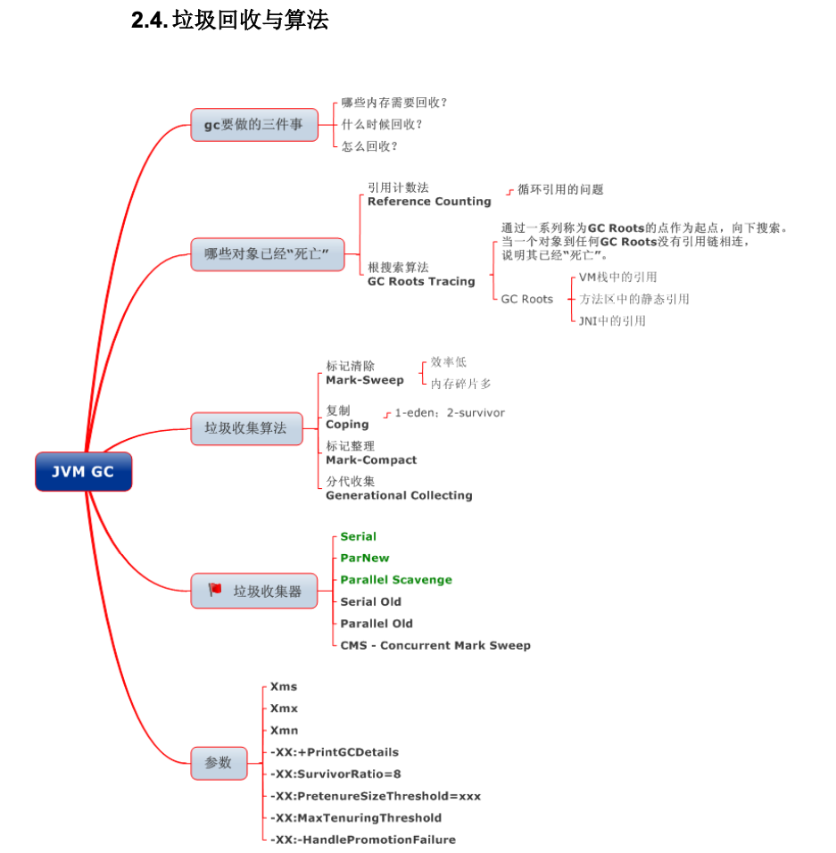

## 内存结构

>  线程私有数据区域生命周期和线程一致，随用户线程的启动/销毁而创建/销毁。
>
>  线程共享数据区域生命周期和虚拟机一致，随虚拟机的启动/关闭而创建/销毁。

### 程序计数器

线程私有。记录当前线程执行的字节码的位置，若是native方法，则为空。无OOM。

### 虚拟机栈

线程私有。栈帧：存储局部变量表，操作数栈，动态链接，方法出口等信息，每一个方法从调用直至执行完成 的过程，就对应着一个栈帧在虚拟机栈中入栈到出栈的过程。栈帧随着方法调用而创建，随着方法结束而销毁。

### 本地方法栈

线程私有，为native方法服务。

### 堆

线程共享。建的对象和数组都保存在 Java 堆内存中，也是垃圾收集器进行 垃圾收集的最重要的内存区域。由于现代 VM 采用**分代收集算法**, 因此 Java 堆从 GC 的角度还可以 细分为: **新生代**(Eden 区、From Survivor 区和 To Survivor 区)和**老年代。**

### 方法区（永久代）

> JDK1.8被移除，改为元空间（meta space）。使用直接内存

线程共享。存储**被** **JVM** **加载的类信息**、**常量**、**静 态变量**、**即时编译器编译后的代码**等数据。

HotSpot VM 把 GC 分代收集扩展至方法区, 即**使用** **Java** **堆的永久代来实现方法区**, 这样 HotSpot 的垃圾收集器就可以像管理 Java 堆一样管理这部分内存, 而不必为方法区开发专门的内存管理器(永久带的内存回收的主要目标是针对**常量池的回收**和**类型 的卸载**, 因此收益一般很小)。

**运行时常量池(Runtime Constant Pool)**是方法区的一部分。Class 文件中除了有类的版 本、字段、方法、接口等描述等信息外，还有一项信息是常量池(Constant Pool Table)，用于存放编译期生成的各种字面量和符号引用，这部分内容将在类加 载后存放到方法区的运行时常量池中。

> **JDK1.7及之后版本的 JVM 已经将运行时常量池从方法区中移了出来，在 Java 堆（Heap）中开辟了一块区域存放运行时常量池**。

### 堆内存细分

从GC角度，堆内存细分为：**新生代**(Eden 区、From Survivor 区和 To Survivor 区)和**老年代**。

因为新生代会频繁创建对象，所以新生代会触发频繁的**MinorGC**。

1. **Eden区**：Java中新对象的出生地。如果新创建的对象占用内存很大，则直接分配到老 年代。当 Eden 区内存不够的时候就会触发 MinorGC，对新生代区进行 一次垃圾回收。

2. **From Survivor 区**：上一次GC的幸存者，作为下一次GC的被扫描者。

3. **To Survive区**：保留了一次MinorGC过程中的幸存者。

   

- 新生代垃圾回收采用**复制算法**，步骤是**复制**->**清空**->**互换**：

​        **1**: **eden**、**servicorFrom** 复制到 **ServicorTo**，年龄**+1**

​         首先，把 Eden 和 ServivorFrom 区域中存活的对象复制到 ServicorTo 区域(如果有对象的年龄以及达到了老      年的标准，则赋值到老年代区)，同时把这些对象的年龄+1(如果 ServicorTo 不 够位置了就放到老年区);

​       **2**: 清空 **eden**、**servicorFrom** 

​          然后，清空 Eden 和 ServicorFrom 中的对象;

​		**3**: **ServicorTo** 和 **ServicorFrom** 互换
​          最后，ServicorTo 和 ServicorFrom 互换，原 ServicorTo 成为下一次 GC 时的 ServicorFrom区。

- 老年代存放生命周期长的对象，比较稳定，只需要回收少量对象，所以MajorGC不会频繁触发，在触发时，通常会伴随着一次MinorGC。老年代垃圾回收采用**标记-清除算法或者标记-整理算法**：

首先扫描一次所有老年代，标记出存活的对象，然后回收没有标记的对象。MajorGC 的耗时比较长，因为要扫描再回收。MajorGC 会产生内存碎片，为了减少内存损耗，我们一般需要进行合并或者标记出来方便下次直接分配。当老年代也满了装不下的 时候，就会抛出 OOM(Out of Memory)异常。

- **运行时常量池**

  运行时常量池主要回收的是废弃的常量。假如常量池中存在字符串“abc”，如果当前没有任何String对象引用该常量，则说明是废弃的。

- **方法区（元空间）**

  方法区主要回收无用的类，即Class

  1. 该类所有的实例都被回收，即Java堆中不存在该类的任何实例。
  2. 加载该类的ClassLoader已经被回收。
  3. 该类对应的java.lang.Class对象在任何地方都没有引用，无法通过反射访问该类的方法。

## 垃圾回收

### 如何确定垃圾

**1. 引用计数法**

**2. 可达性分析**：

为了解决引用计数法的循环引用问题，Java 使用了可达性分析的方法。通过一系列的“GC roots”

对象作为起点搜索。如果在“GC roots”和一个对象之间没有可达路径，则称该对象是不可达的。

要注意的是，不可达对象不等价于可回收对象，不可达对象变为可回收对象至少要经过两次标记过程。两次标记后仍然是可回收对象，则将面临回收。

### 垃圾回收算法

**1. 标记-清理算法**

过程：标记阶段标记出所有需要回收的对象，清除阶段回收被标记的对象所占用的空间。

缺点：碎片化严重。

**2. 复制算法**

过程：按内存容量将内存划分为等大小 的两块。每次只使用其中一块，当这一块内存满后将尚存活的对象复制到另一块上去，把已使用的内存清掉。

缺点：可用内存被压缩到了原本的一半。且存活对象增多的话，效率会大大降低。

**3. 标记-整理算法**

过程：和标记-清理差不多，只是在清理时将存活的对象移向内存的一端。然后清除端边界外的对象。

**4. 分代收集算法**

分代收集法是目前大部分 JVM 所采用的方法，其核心思想是根据对象存活的不同生命周期将内存 划分为不同的域，一般情况下将 GC 堆划分为老年代(Tenured/Old Generation)和新生代(Young Generation)。老生代的特点是每次垃圾回收时只有少量对象需要被回收，新生代的特点是每次垃圾回收时都有大量垃圾需要被回收，因此可以根据不同区域选择不同的算法。

**新生代复制算法**

一般将新生代 划分为一块较大的 Eden 空间和两个较小的 Survivor 空间(From Space, To Space)，每次使用其中较大的Eden和一块Survivor空间，回收时，将两块空间中存活的帝乡复制到另一块Survivor中。

**老年代标记-整理算法**

1. 对象的内存分配主要在新生代的 Eden Space 和 Survivor Space 的 From Space(Survivor 目前存放对象的那一块)，少数情况会直接分配到老生代。

2. 当新生代的 Eden Space 和 From Space 空间不足时就会发生一次 GC，进行 GC 后，Eden Space 和 From Space 区的存活对象会被挪到 To Space，然后将 Eden Space 和 From Space 进行清理。

3. 如果 To Space 无法足够存储某个对象，则将这个对象存储到老生代。
4. 当对象在 Survivor 区躲过一次 GC 后，其年龄就会+1。默认情况下年龄到达 15 的对象会被 移到老生代中。

## 引用

无论是通过引用计数法判断对象引用数量，还是通过可达性分析法判断对象的引用链是否可达，判定对象的存活都与“引用”有关。

JDK1.2之前，Java中引用的定义很传统：如果reference类型的数据存储的数值代表的是另一块内存的起始地址，就称这块内存代表一个引用。

JDK1.2以后，Java对引用的概念进行了扩充，将引用分为强引用、软引用、弱引用、虚引用四种（引用强度逐渐减弱）

**1．强引用**

以前我们使用的大部分引用实际上都是强引用，这是使用最普遍的引用。如果一个对象具有强引用，那就类似于必不可少的生活用品，垃圾回收器绝不会回收它。当内存空 间不足，Java虚拟机宁愿抛出OutOfMemoryError错误，使程序异常终止，也不会靠随意回收具有强引用的对象来解决内存不足问题。

**2．软引用（SoftReference）**

如果一个对象只具有软引用，那就类似于可有可无的生活用品。如果内存空间足够，垃圾回收器就不会回收它，如果内存空间不足了，就会回收这些对象的内存。只要垃圾回收器没有回收它，该对象就可以被程序使用。软引用可用来实现内存敏感的高速缓存。

软引用可以和一个引用队列（ReferenceQueue）联合使用，如果软引用所引用的对象被垃圾回收，JAVA虚拟机就会把这个软引用加入到与之关联的引用队列中。

**3．弱引用（WeakReference）**

如果一个对象只具有弱引用，那就类似于可有可无的生活用品。弱引用与软引用的区别在于：只具有弱引用的对象拥有更短暂的生命周期。在垃圾回收器线程扫描它 所管辖的内存区域的过程中，一旦发现了只具有弱引用的对象，不管当前内存空间足够与否，都会回收它的内存。不过，由于垃圾回收器是一个优先级很低的线程， 因此不一定会很快发现那些只具有弱引用的对象。

弱引用可以和一个引用队列（ReferenceQueue）联合使用，如果弱引用所引用的对象被垃圾回收，Java虚拟机就会把这个弱引用加入到与之关联的引用队列中。

**4．虚引用（PhantomReference）**

"虚引用"顾名思义，就是形同虚设，与其他几种引用都不同，虚引用并不会决定对象的生命周期。如果一个对象仅持有虚引用，那么它就和没有任何引用一样，在任何时候都可能被垃圾回收。

虚引用主要用来跟踪对象被垃圾回收的活动。

虚引用与软引用和弱引用的一个区别在于： 虚引用必须和引用队列（ReferenceQueue）联合使用。当垃 圾回收器准备回收一个对象时，如果发现它还有虚引用，就会在回收对象的内存之前，把这个虚引用加入到与之关联的引用队列中。程序可以通过判断引用队列中是 否已经加入了虚引用，来了解被引用的对象是否将要被垃圾回收。程序如果发现某个虚引用已经被加入到引用队列，那么就可以在所引用的对象的内存被回收之前采取必要的行动。

特别注意，在程序设计中一般很少使用弱引用与虚引用，使用软引用的情况较多，这是因为软引用可以加速JVM对垃圾内存的回收速度，可以维护系统的运行安全，防止内存溢出（OutOfMemory）等问题的产生。

## 堆内存中对象分配的基本策略

对象优先在Eden区分配。

大对象直接进入老年代。

长期存活的对象（默认15岁）将进入老年代。

## HotSpot虚拟机对象建立全过程

**①类加载检查：** 虚拟机遇到一条 new 指令时，首先将去检查这个指令的参数是否能在常量池中定位到这个类的符号引用，并且检查这个符号引用代表的类是否已被加载过、解析和初始化过。如果没有，那必须先执行相应的类加载过程。

**②分配内存**： 在类加载检查通过后，接下来虚拟机将为新生对象分配内存。对象所需的内存大小在类加载完成后便可确定，为对象分配空间的任务等同于把一块确定大小的内存从 Java 堆中划分出来。分配方式有 “指针碰撞” 和 “空闲列表” 两种，选择那种分配方式由 Java 堆是否规整决定，而Java堆是否规整又由所采用的垃圾收集器是否带有压缩整理功能决定。

**内存分配的两种方式：（补充内容，需要掌握）**

选择以上两种方式中的哪一种，取决于 Java 堆内存是否规整。而 Java 堆内存是否规整，取决于 GC 收集器的算法是"标记-清除"，还是"标记-整理"（也称作"标记-压缩"），值得注意的是，复制算法内存也是规整的。

**内存分配并发问题（补充内容，需要掌握）**

在创建对象的时候有一个很重要的问题，就是线程安全，因为在实际开发过程中，创建对象是很频繁的事情，作为虚拟机来说，必须要保证线程是安全的，通常来讲，虚拟机采用两种方式来保证线程安全：

- **CAS+失败重试：** CAS 是乐观锁的一种实现方式。所谓乐观锁就是，每次不加锁而是假设没有冲突而去完成某项操作，如果因为冲突失败就重试，直到成功为止。虚拟机采用 CAS 配上失败重试的方式保证更新操作的原子性。
- **TLAB：** 为每一个线程预先在Eden区分配一块儿内存，JVM在给线程中的对象分配内存时，首先在TLAB分配，当对象大于TLAB中的剩余内存或TLAB的内存已用尽时，再采用上述的CAS进行内存分配。

**③初始化零值：** 内存分配完成后，虚拟机需要将分配到的内存空间都初始化为零值（不包括对象头），这一步操作保证了对象的实例字段在 Java 代码中可以不赋初始值就直接使用，程序能访问到这些字段的数据类型所上对应的零值。

**④设置对象头：** 初始化零值完成之后，虚拟机要对对象进行必要的设置，例如这个对象是那个类的实例、如何才能找到类的元数据信息、对象的哈希吗、对象的 GC 分代年龄等信息。 这些信息存放在对象头中。 另外，根据虚拟机当前运行状态的不同，如是否启用偏向锁等，对象头会有不同的设置方式。

**⑤执行 init 方法：** 在上面工作都完成之后，从虚拟机的视角来看，一个新的对象已经产生了，但从 Java 程序的视角来看，对象创建才刚开始，<init> 方法还没有执行，所有的字段都还为零。所以一般来说，执行 new 指令之后会接着执行 <init> 方法，把对象按照程序员的意愿进行初始化，这样一个真正可用的对象才算完全产生出来。

**对象的访问定位**

建立对象就是为了使用对象，我们的Java程序通过栈上的 reference 数据来操作堆上的具体对象。对象的访问方式有虚拟机实现而定，目前主流的访问方式有①使用句柄和②直接指针两种：

**1. 句柄：** 如果使用句柄的话，那么Java堆中将会划分出一块内存来作为句柄池，reference 中存储的就是对象的句柄地址，而句柄中包含了对象实例数据与类型数据各自的具体地址信息； 

**2. 直接指针：** 如果使用直接指针访问，那么 Java 堆对象的布局中就必须考虑如何放置访问类型数据的相关信息，而reference 中存储的直接就是对象的地址。

这两种对象访问方式各有优势。使用句柄来访问的最大好处是 reference 中存储的是稳定的句柄地址，在对象被移动时只会改变句柄中的实例数据指针，而 reference 本身不需要修改。使用直接指针访问方式最大的好处就是速度快，它节省了一次指针定位的时间开销。

## 垃圾收集器

### Serial垃圾收集器

单线程收集器，stop the world。简单高效，在单CPU上省去了线程交互的开销，最高的单线程垃圾收集效率。因此 Serial垃圾收集器依然是 java 虚拟机运行在 **Client 模式下**默认的新生代垃圾收集器。

新生代采用复制算法，老年代采用标记-整理算法。

### ParNew垃圾收集器(Serial+多线程)

Serial的多线程版本。ParNew 收集器默认开启和 CPU 数目相同的线程数，可以通过-XX:ParallelGCThreads 参数来限制垃圾收集器的线程数，ParNew 垃圾收集器是很多 java 虚拟机运行在**Server 模式**下新生代的默认垃圾收集器。

新生代采用复制算法，老年代采用标记-整理算法。

### CMS垃圾收集器（多线程标记-清理算法）

hotspot虚拟机真正意义上的并发收集器。

### G1（Garbage-First）垃圾收集器

