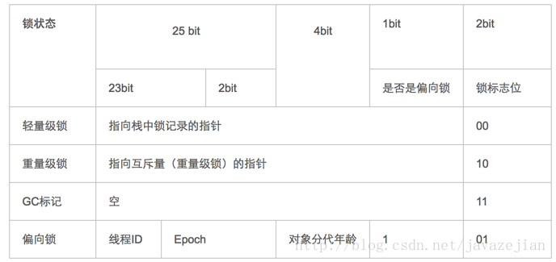

> Java中线程同步用得最多的应该就是Synchronized关键字，同时它也是面试必问的知识点，关于Synchronized的基础使用在此不再赘述。

## Synchronized的作用

在多线程编程中，导致我们的程序在并发环境下出现各种各样的问题的原因有三：**原子性，可见性和有序性**。

而Synchronized就是用来解决**原子性和可见性**。

**原子性**：程序在执行临界代码时，必须先获取一把互斥锁，获取到了就可以执行，未获取到则进入阻塞状态。需要注意的是保证原子性并不是指在CPU执行的过程中一定会把整段临界代码执行完，CPU依然可以在中途切换时间片，调度其他线程，只是保证这个中间态对外是不可见的。

**可见性**：Synchronized可以保证在释放锁之后，对共享变量的更改，在其他线程获取到锁之后是可见的。

## Synchronized实现原理

对于同步代码块，在通过Javap命令查看编译的代码，会发现在临界代码块的开始和结束处显式地插入了monitor.enter和monitor.exit的字节码指令。而我们使用得更多的同步方法，则是通过在方法常量池的方法结构表中的**ACC_SYNCHRONIZED**来标识方法该方法为同步方法，需要执行相应的同步调用。

无论是显式还是隐式地同步，都是通过Monitor（管程）来支持的。

### 对象头

在hotspot JVM中，对象在堆内存中的布局分为三块区域：对象头，实例数据和对齐填充。

>1. 实例数据部分是对象真正存储的有效信息，也是在程序中所定义的各种类型的字段内容。
>2. 对齐填充部分不是必然存在的，也没有什么特别的含义，仅仅起占位作用。 因为Hotspot虚拟机的自动内存管理系统要求对象起始地址必须是8字节的整数倍，换句话说就是对象的大小必须是8字节的整数倍。而对象头部分正好是8字节的倍数（1倍或2倍），因此，当对象实例数据部分没有对齐时，就需要通过对齐填充来补全。

对象头区域又分为两个部分：

1. Mark Word：存储对象的hashCode、锁信息或分代年龄或GC标志等信息。
2. Class Metadata Address：类型指针指向对象的类的元数据，JVM通过这个指针确定该对象是哪个类的实例。

> 一般情况下，在32位的hot spot虚拟机中Mark Word的32bit空间中25bit用户存储HashCode，4bit存储对象分代年龄，2bit用来存储锁标志位，1bit固定为0。

在默认情况（无锁）下：MarkWord的结构如下：

| 锁状态   | 25bit        | 4bit         | 2bit 锁标志位 | 1bit固定位为0 |
| -------- | ------------ | ------------ | ------------- | ------------- |
| 无锁状态 | 对象HashCode | 对象分代年龄 | 01            | 0             |

在其余标记情况下：

当线程获取到一个对象的重量级锁之后，锁的标识位是10，其指针就指向Monitor对象。每个对象都存在着一个 monitor 与之关联，当一个 monitor 被某个线程持有后，它便处于锁定状态。

## JDK对Synchronized的优化

锁的状态分为：无锁 ->偏向锁 ->轻量级锁 ->重量级锁，随着竞争的激烈，锁的程度也会升级。

### 无锁

### 偏向锁

在大多数情况下，锁不仅不存在竞争，而且总是由同一个线程获得，所以偏向锁的核心思想是：

> 如果一个线程获得了锁，那么锁就进入偏向模式，此时Mark Word 的结构也变为偏向锁结构，当这个线程再次请求锁时，无需再做任何同步操作，即获取锁的过程，这样就省去了大量有关锁申请的操作，从而也就提高了程序的性能。

具体步骤为：

当虚拟机开启了偏向锁之后，当锁对象第一次被线程获取到时，虚拟机会将对象头的锁标志位标识为”01“，即偏向模式，再通过CAS的方式将这个线程的ID写入对象头的Mark Word。之后。

当有另一个线程尝试获取锁时，偏向模式宣告结束，当到达全局安全点（safe point）时，获得偏向锁的线程被挂起，升级到轻量级锁状态，然后阻塞在安全点的线程继续往下执行同步代码。注意：如果是需要撤销偏向锁到无锁状态则可能出现stop the world。

> 注意：第四步中到达安全点safepoint也会导致stop the word，时间很短。

### 轻量级锁

轻量级锁能够提升程序性能的依据是“对绝大部分的锁，在整个同步周期内都不存在竞争”，注意这是经验数据。

具体操作步骤为：当有线程尝试获取锁时，如果锁对象处于“未锁定01”状态，虚拟机首先在当前线程的栈帧中建立一个名为“Lock Record”的空间用于存储锁对象当前的Mark Word的拷贝，即Displaced Mark Word。然后虚拟机使用CAS的方式将锁对象Mark Word中的指针更新为指向Lock Record的指针，更新成功即加锁成功，Mark Word的锁标志位更新位00，轻量级锁定。

若更新失败，则将检查锁对象的Mark Word是否指向当前线程的栈帧，若是，则表示已经加锁成功，直接执行。否则，表示有至少两个线程在竞争，锁将会膨胀成重量级锁。

### 自旋锁和适应性自旋

让线程喝一杯咖啡，等待一会

### 锁消除

### 锁粗化

