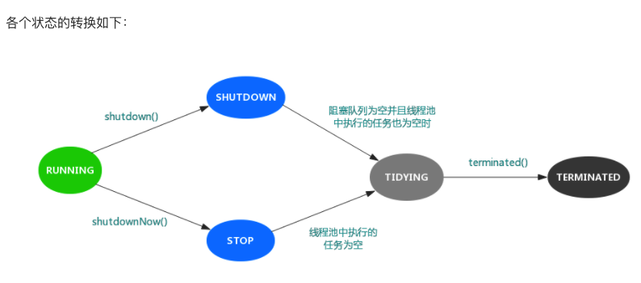

> 线程池的工作原理和生产者-消费者模式很像，我们的程序作为生产者，不断地向线程池提交任务，任务可能会被马上执行，也可能被放置到阻塞队列中；而线程池中的工作线程则不断地从阻塞队列中拉取任务来执行。

## 线程池核心参数

本文意在分析原理，对一些常见的配置参数不再赘述。

```java
public class ThreadPoolExecutor extends AbstractExecutorService {
  //放置任务的阻塞队列
 private final BlockingQueue<Runnable> workQueue;
  
 //工作线程
 private final HashSet<Worker> workers = new HashSet<Worker>();
  
  //封装了Thread的内部类
  private final class Worker implements Runnable{
     //工作线程
     final Thread thread; 
     Runnable firstTask;
  }
}
```

其中，内部类Worker实现了Runnable接口，并封装了Thread对象，来看看重写了Runnable接口中的run()方法

```java
     @override
      public void run() {
            runWorker(this);
        }
        
    final void runWorker(Worker w) {
        Thread wt = Thread.currentThread();
        Runnable task = w.firstTask;
        w.firstTask = null;
        w.unlock(); // allow interrupts
        boolean completedAbruptly = true;
        try {
           //直接执行任务或者从阻塞队列中获取任务
            while (task != null || (task = getTask()) != null) {
                w.lock();
                if ((runStateAtLeast(ctl.get(), STOP) ||
                     (Thread.interrupted() &&
                      runStateAtLeast(ctl.get(), STOP))) &&
                    !wt.isInterrupted())
                    wt.interrupt();
                try {
                    beforeExecute(wt, task);
                    Throwable thrown = null;
                    try {
                        task.run();
                    } catch (RuntimeException x) {
                        thrown = x; throw x;
                    } catch (Error x) {
                        thrown = x; throw x;
                    } catch (Throwable x) {
                        thrown = x; throw new Error(x);
                    } finally {
                        afterExecute(task, thrown);
                    }
                } finally {
                    task = null;
                    w.completedTasks++;
                    w.unlock();
                }
            }
            completedAbruptly = false;
        } finally {
            processWorkerExit(w, completedAbruptly);
        }
    }
```

其中最关键的代码就是while循环，作用是不断从WorkQueue中拉取Runnable任务，并调用其中的run()方法。

此处需要注意的是：看下内部Worker类的构造方法：

```java
 	private final class Worker extends AbstractQueuedSynchronizer
        implements RunnableWorker(Runnable firstTask) {
            setState(-1); // inhibit interrupts until runWorker
            this.firstTask = firstTask;
            this.thread = getThreadFactory().newThread(this); //将Worker类本身传递给thread
        }
```

将Worker类传递给thread，所以在submit()中提交任务时，通过调用work中的thread的start()方法实际上就会执行上面的run()方法。

而Worker内部类中的runnable的名字firstTask，指的是这个工作线程执行的第一个任务，肯定会被封装到Worker中。

## 向线程池提交任务

当我们调用submit()或者execute()方法时：

```java
public void execute(Runnable command) {
        if (command == null)
            throw new NullPointerException();
 
       //1. 当前线程数<核心线程数，直接新建一个线程执行
        int c = ctl.get();
        if (workerCountOf(c) < corePoolSize) {
            if (addWorker(command, true))
                return;
            c = ctl.get();
        }
        
        //2. 当前线程数>=核心线程数，把任务放到阻塞队列中
        if (isRunning(c) && workQueue.offer(command)) {
            int recheck = ctl.get();
            if (! isRunning(recheck) && remove(command))
                reject(command);
            else if (workerCountOf(recheck) == 0)
                addWorker(null, false);
        //3. 放入阻塞队列失败，新建一个线程，并将任务(command)添加到该线程中，启动该线程从而执行任务。
        }else if (!addWorker(command, false))
        //4. 新建线程失败，执行拒绝策略
        reject(command);
    }
```


其中，核心的addWorker()方法，会将任务封装成Worker对象，并添加进workers这个Set里，添加成功后，会调用start()方法，开启线程，即执行之前不断从workQueue中拉取任务执行的逻辑。

## 线程池的拒绝策略

当线程池中的线程数超过最大线程数，并且等待队列也无法继续添加任务时，会执行拒绝策略。

JDK中默认的拒绝策略：

1. ThreadPoolExecutor.AbortPolicy：直接抛出异常来拒绝新任务。
2. ThreadPoolExecutor.CallerRunsPolicy：只要线程池还未关闭，该策略直接在调用者线程中运行当前被丢弃的任务，可能导致线程池性能极具下降。
3. ThreadPoolExecutor.DiscardOldestPolicy：丢弃最老的任务，即即将被执行的任务，并尝试再次添加当前任务。
4. DiscardPolicy：直接丢弃任务，不做任何处理。

以上策略都实现了RejectedExecutionHandler接口，若不能满足，可以自己拓展。

## 线程池状态

线程池同样有五种状态：Running, SHUTDOWN, STOP, TIDYING, TERMINATED。

```java
 private final AtomicInteger ctl = new AtomicInteger(ctlOf(RUNNING, 0));
    private static final int COUNT_BITS = Integer.SIZE - 3;
    private static final int CAPACITY   = (1 << COUNT_BITS) - 1;

    // runState is stored in the high-order bits
    private static final int RUNNING    = -1 << COUNT_BITS;//对应的高3位值是111
    private static final int SHUTDOWN   =  0 << COUNT_BITS;//对应的高3位值是000
    private static final int STOP       =  1 << COUNT_BITS;//对应的高3位值是001
    private static final int TIDYING    =  2 << COUNT_BITS;//对应的高3位值是010
    private static final int TERMINATED =  3 << COUNT_BITS;//对应的高3位值是011

    // Packing and unpacking ctl
    private static int runStateOf(int c)     { return c & ~CAPACITY; }
    private static int workerCountOf(int c)  { return c & CAPACITY; }
    private static int ctlOf(int rs, int wc) { return rs | wc; }
```

变量**ctl**定义为AtomicInteger ，记录了“线程池中的任务数量”和“线程池的状态”两个信息。共32位，其中高3位表示”线程池状态”，低29位表示”线程池中的任务数量”。

- RUNNING：处于RUNNING状态的线程池能够接受新任务，以及对新添加的任务进行处理。
- SHUTDOWN：处于SHUTDOWN状态的线程池不可以接受新任务，但是可以对已添加的任务进行处理。
- STOP：处于STOP状态的线程池不接收新任务，不处理已添加的任务，并且会中断正在处理的任务。
- TIDYING：当所有的任务已终止，ctl记录的”任务数量”为0，线程池会变为TIDYING状态。当线程池变为TIDYING状态时，会执行钩子函数terminated()。terminated()在ThreadPoolExecutor类中是空的，若用户想在线程池变为TIDYING时，进行相应的处理；可以通过重载terminated()函数来实现。
- TERMINATED：线程池彻底终止的状态。

状态转换：



## 阻塞队列

### ArrayBlockingQueue 

是最典型的的有界队列，其内部以 final 的数组保存数据，数组的大小就决定了队列的边界，所以我们在创建 ArrayBlockingQueue 时，都要指定容量，如public ArrayBlockingQueue(int capacity, boolean fair)

### LinkedBlockingQueue

容易被误解为无边界，但其实其行为和内部代码都是基于有界的逻辑实现的，只不过如果我们没有在创建队列时就指定容量，那么其容量限制就自动被设置为 Integer.MAX_VALUE，成为了无界队列。

### SynchronousQueue

这是一个非常奇葩的队列实现，每个删除操作都要等待插入操作，反之每个插入操作也都要等待删除动作。那么这个队列的容量是多少呢？是 1 吗？其实不是的，其内部容量是 0。

### PriorityBlockingQueue 

是无边界的优先队列，虽然严格意义上来讲，其大小总归是要受系统资源影响。

### DelayedQueue 和 LinkedTransferQueue 

同样是无边界的队列。对于无边界的队列，有一个自然的结果，就是 put 操作永远也不会发生其他 BlockingQueue 的那种等待情况。

