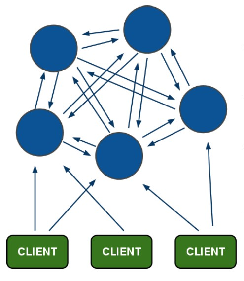

## Redis读写分离

### 搭建环境

在Redis的配置文件中添加：```slaveof host port```

在主服务器进行写操作，从服务器会从主服务器同步数据信息。

当尝试向从服务器写入时，会报错：```(error) READONLY You can't write against a read only slave.```

### 同步原理

主从复制中的主从服务器双方的数据库将保存相同的数据，概念上将这种现象称作**数据库状态一致**。

Redis数据库持久化有两种方式：**RDB**全量持久化和**AOF**增量持久化。

#### 同步步骤

1. **redis2.8版本之前使用旧版复制功能SYNC，这是一个非常耗费资源的操作**。

- 主服务器需要执行BGSAVE命令来生成RDB文件，这个生成操作会耗费主服务器大量量的的CPU、内存和磁盘读写资源。
- 主服务器将RDB文件发送给从服务器，这个发送操作会耗费主从服务器大量的网络带宽和流量，并对主服务器响应命令
- 请求的时间产生影响：接收到RDB文件的从服务器在载入文件的过程是阻塞的，无法处理命令请求

2. **2.8之后使用PSYNC，具有完整重同步和部分重同步两种模式部分重同步两种模式。**

   - 完整重同步

     

   - 部分重同步

     

   核心功能：

一、当`master`服务器与`slave`服务器正常连接时，`master`服务器会发送数据命令流给`slave`服务器,将自身数据的改变复制到`slave`服务器。

二、当因为各种原因`master`服务器与`slave`服务器断开后，`slave`服务器在重新连上`maste`r服务器时会尝试重新获取断开后未同步的数据即部分同步，或者称为部分复制。

三、如果无法部分同步(比如初次同步)，则会请求进行全量同步，这时`master`服务器会将自己的`rdb`文件发送给`slave`服务器进行数据同步，并记录同步期间的其他写入，再发送给`slave`服务器，以达到完全同步的目的，这种方式称为全量复制。

#### 全量复制的步骤

Redis通过psync命令进行全量复制的过程如下：

（1）从节点判断无法进行部分复制，向主节点发送全量复制的请求；或从节点发送部分复制的请求，但主节点判断无法进行部分复制；

（2）主节点收到全量复制的命令后，执行bgsave，在后台生成RDB文件，并使用一个缓冲区（称为复制缓冲区）记录从现在开始执行的所有写命令

（3）主节点的bgsave执行完成后，将RDB文件发送给从节点；**从节点首先清除自己的旧数据，然后载入接收的RDB文件**，将数据库状态更新至主节点执行bgsave时的数据库状态

（4）主节点将前述复制缓冲区中的所有写命令发送给从节点，从节点执行这些写命令，将数据库状态更新至主节点的最新状态

（5）如果从节点开启了AOF，则会触发bgrewriteaof的执行，从而保证AOF文件更新至主节点的最新状态

通过全量复制的过程可以看出，全量复制是非常重型的操作：

（1）主节点通过bgsave命令fork子进程进行RDB持久化，该过程是非常消耗CPU、内存(页表复制)、硬盘IO的；

（2）主节点通过网络将RDB文件发送给从节点，对主从节点的带宽都会带来很大的消耗

（3）从节点清空老数据、载入新RDB文件的过程是阻塞的，无法响应客户端的命令；如果从节点执行bgrewriteaof，也会带来额外的消耗。

### 部分复制

由于全量复制在主节点数据量较大时效率太低，因此Redis2.8开始提供部分复制，用于处理网络中断时的数据同步。

部分复制的实现，依赖于三个重要的概念：复制偏移量，复制积压缓冲区，服务器运行ID

#### 复制偏移量

主节点和从节点分别维护一个复制偏移量（offset），代表的是**主节点向从节点传递的字节数**；主节点每次向从节点传播N个字节数据时，主节点的offset增加N；从节点每次收到主节点传来的N个字节数据时，从节点的offset增加N。

offset用于判断主从节点的数据库状态是否一致：如果二者offset相同，则一致；如果offset不同，则不一致，此时可以根据两个offset找出从节点缺少的那部分数据。例如，如果主节点的offset是1000，而从节点的offset是500，那么部分复制就需要将offset为501-1000的数据传递给从节点。而offset为501-1000的数据存储的位置，就是下面要介绍的复制积压缓冲区。

#### 复制积压缓冲区

复制积压缓冲区是由主节点维护的、固定长度的、先进先出(FIFO)队列，默认大小1MB；当主节点开始有从节点时创建，其作用是备份主节点最近发送给从节点的数据。注意，无论主节点有一个还是多个从节点，都只需要一个复制积压缓冲区。

在命令传播阶段，主节点除了将写命令发送给从节点，还会发送一份给复制积压缓冲区，作为写命令的备份；除了存储写命令，复制积压缓冲区中还存储了其中的每个字节对应的复制偏移量（offset）。由于复制积压缓冲区定长且是先进先出，所以它保存的是主节点最近执行的写命令；时间较早的写命令会被挤出缓冲区。

由于该缓冲区长度固定且有限，因此可以备份的写命令也有限，当主从节点offset的差距过大超过缓冲区长度时，将无法执行部分复制，只能执行全量复制。反过来说，为了提高网络中断时部分复制执行的概率，可以根据需要增大复制积压缓冲区的大小(通过配置repl-backlog-size)；例如如果网络中断的平均时间是60s，而主节点平均每秒产生的写命令(特定协议格式)所占的字节数为100KB，则复制积压缓冲区的平均需求为6MB，保险起见，可以设置为12MB，来保证绝大多数断线情况都可以使用部分复制。

从节点将offset发送给主节点后，主节点根据offset和缓冲区大小决定能否执行部分复制：

- 如果offset偏移量之后的数据，仍然都在复制积压缓冲区里，则执行部分复制；
- 如果offset偏移量之后的数据已不在复制积压缓冲区中（数据已被挤出），则执行全量复制。

#### 服务器运行ID(runid)

每个Redis节点(无论主从)，在启动时都会自动生成一个随机ID(每次启动都不一样)，由40个随机的十六进制字符组成；

runid用来唯一识别一个Redis节点。**通过info Server命令，可以查看节点的runid。**

主从节点初次复制时，主节点将自己的runid发送给从节点，从节点将这个runid保存起来；当断线重连时，从节点会将这个runid发送给主节点；主节点根据runid判断能否进行部分复制：

- 如果从节点保存的runid与主节点现在的runid相同，说明主从节点之前同步过，主节点会继续尝试使用部分复制(到底能不能部分复制还要看offset和复制积压缓冲区的情况)；
- 如果从节点保存的runid与主节点现在的runid不同，说明从节点在断线前同步的Redis节点并不是当前的主节点，只能进行全量复制。

## Redis高可用(Sentinel哨兵)模式

### 高可用

高可用是分布式系统架构设计中必须考虑的因素之一，它是通过架构设计减少系统不能提供服务的时间。保证高可用通常遵循下面几点：

1. 单点是系统高可用的大敌，应该尽量在系统设计的过程中避免单点。
2. 通过架构设计而保证系统高可用的，其核心准则是：冗余。
3. 每次出现故障需要人工介入恢复，会增加系统不可用的时间，实现自动故障转移。

 

我们现在已经给Redis实现了主从复制，可将主节点数据同步给从节点，从节点此时有两个作用：

1. 从节点扩展主节点的读能力，分担主节点读压力。
2. 一旦主节点宕机，从节点作为主节点的备份可以随时顶上来。（高可用）

### 手动主从切换

当主服务器宕机后，手动把该机器下线，变更从服务器成主服务器。

### Sentinel自动主从切换

#### Sentinel工作模式


#### Sentinel安装

Sentinel在Redis的安装包中已经存在src目录中，直接使用即可。修改配置Sentinel配置文件:

```java
# 外部可以访问
bind 0.0.0.0
sentinel monitor mymaster 192.168.200.128 6379 1
sentinel down-after-milliseconds mymaster 10000
sentinel failover-timeout mymaster 60000
sentinel parallel-syncs mymaster 1
```

参数说明：

- sentinel monitor mymaster 192.168.200.129 6379 1

  `mymaster` 主节点名,可以任意起名，但必须和后面的配置保持一致。

  `192.168.200.129 6379` 主节点连接地址。

  `1` 将主服务器判断为失效需要投票，这里设置至少需要 1个 Sentinel 同意。

  > 注意：当配置的Sentinel都认为master宕机，在failover主备切换真正被触发后，failover并不会马上进行，还需要sentinel中的**大多数**sentinel授权后才可以进行failover。
  > 当ODOWN时，failover被触发。failover一旦被触发，尝试去进行failover的sentinel会去获得“大多数”sentinel的授权（如果票数比大多数还要大的时候，则询问更多的sentinel)

- sentinel down-after-milliseconds mymaster 10000

  设置Sentinel认为服务器已经断线所需的毫秒数。

- sentinel failover-timeout mymaster 60000

  设置failover（故障转移）的过期时间。当failover开始后，在此时间内仍然没有触发任何failover操作，当前 sentinel 会认为此次failover失败。

- sentinel parallel-syncs mymaster 1

  设置在执行故障转移时， 最多可以有多少个从服务器同时对新的主服务器进行同步， 这个数字越小，表示同时进行同步的从服务器越少，那么完成故障转移所需的时间就越长。

  如果从服务器允许使用过期数据集， 那么我们可能不希望所有从服务器都在同一时间向新的主服务器发送同步请求， 因为从服务器在载入主服务器发来的RDB文件时， 会造成从服务器在一段时间内不能处理命令请求。如果全部从服务器一起对新的主服务器进行同步， 那么就可能会造成所有从服务器在短时间内全部不可用的情况出现。

#### 故障自动转移原理

1. 哨兵定时监控

   每个哨兵节点每**10秒**会向主节点和从节点发送**info**命令获取最拓扑结构图，哨兵配置时只要配置对主节点的监控即可，通过向主节点发送info，获取从节点的信息，并当有新的从节点加入时可以马上感知到。

2. 每2秒每个sentinel节点通过master节点的channel（**sentinel**:hello）交换信息。**（基于pub/sub模式）**

3. 每隔1秒每个哨兵会向主节点、从节点及其余哨兵节点发送一次ping命令做一次心跳检测，这个也是哨兵用来判断节点是否正常的重要依据。

Sentinel主要是监控服务器的状态，并决定是否进行故障转移。那么Sentinel是如何判断服务是否下线呢，主要分为主观下线和客观下线：

-    **主观下线**：

  - 概念：

    主观下线（Subjectively Down， 简称 SDOWN）指的是单个 Sentinel 实例对服务器做出的下线判断

  - 特点：

    如果一个服务器没有在 master-down-after-milliseconds 选项所指定的时间内， 对向它发送 PING 命令的 Sentinel 返回一个有效回复， 那么 Sentinel 就会将这个服务器标记为主观下线。 

-   **客观下线**

  - 概念：

    多个 Sentinel 实例在对同一个服务器做出 SDOWN 判断， 并且通过 SENTINEL is-master-down-by-addr 命令互相交流之后， 得出的服务器下线判断ODOWN。 （一个Sentinel 可以通过向另一个 Sentinel 发送命令来询问对方是否认为给定的服务器已下线）

  - 特点：

    从主观下线状态切换到客观下线状态并没有使用严格的法定人数算法（strong quorum algorithm），而是使用了流言传播（Gossip）： 如果Sentinel在给定的时间范围内， 从其他Sentinel那里接收到了足够数量的主服务器下线报告， 那么 Sentinel 就会将主服务器的状态从主观下线改变为客观下线。

  - 注意点：

    客观下线条件只适用于主服务器，对于其他类型的 Redis 实例， Sentinel 在将它们判断为下线前不不需要进行协商， 所以从服务器或者其他 Sentinel 不会达到客观下线条件。 只要一个 Sentinel 发现某个主服务器进入了客观下线状态， 这个Sentinel就可能会被其他 Sentinel 推选出，并对失效的主服务器执行自动故障迁移操作。

**更新主从状态**

通过slaveof no one命令，让选出来的从节点成为主节点；并通过slaveof命令让其他节点成为其从节点。

将已下线的主节点设置成新的主节点的从节点，当其回复正常时，复制新的主节点，变成新的主节点的从节点

同理，当已下线的服务重新上线时，sentinel会向其发送slaveof命令，让其成为新主的从节点。

#### 小结

**Sentinel三大工作任务**：

- 监控（Monitoring）： Sentinel 会不断地检查你的主服务器和从服务器是否运作正常。

- 提醒（Notification）： 当被监控的某个 Redis 服务器出现问题时， Sentinel 可以通过API向管理员或者其他应用程序发送通知。

- 自动故障迁移（Automatic failover）： 当一个主服务器不能正常工作时，Sentinel会开始一次自动故障转移操作， 它会将失效主服务器的其中一个从服务器升级为新的主服务器， 并通过**发布订阅模式**通知让失效主服务器的其他从服务器改为复制新的主服务器。

  当客户端试图连接失效的主服务器时， 集群也会向客户端返回新主服务器的地址，使得集群可以使用新主服务器代替失效服务器。

#### Sentinel集群

为了避免Sentinel单点，Sentinel也支持部署集群。

> 强烈建议使用Redis2.8以上自带的Sentinel2版本，因为Sentinel1版本有很多bug。


### 几个问题

#### Sentinel有多个，如何选出一个作为执行故障转移的机器？

多个 sentinel 会选出一个 leader，具体的选举机制是依据 Raft 分布式一致性协议。

如果主节点被判定为客观下线之后，就要选取一个哨兵节点来完成后面的故障转移工作，选举出一个leader的流程如下:

a)每个在线的哨兵节点都可以成为领导者，当一个哨兵确认主节点下线时，会向其它哨兵发is-master-down-by-addr命令，征求判断并要求将自己设置为领导者，由领导者处理故障转移；

> 此处和判断 主节点是否客观下线是用一个命令。

b)当其它哨兵收到此命令时，可以同意或者拒绝它成为领导者；

c)如果哨兵3发现自己在选举的票数大于等于num(sentinels)/2+1时，将成为领导者，如果没有超过，继续选举…

   #### salve有多个，如何选出一个作为master？

1. 在从节点列表中选出一个节点作为新的主节点Master，选择方法为：

- 过滤：“不健康”（主观下线、断线）、5秒内没回复Sentinel节点ping响应、与主节点失联超过down-after-milliseconds*10秒；
- 选择slave-priority（从节点优先级）最高的从节点列表，如果存在则返回，不存在则继续选择；
- 选择复制偏移量最大的从节点（复制最完整的从节点），如果存在则返回，不存在则继续选择；
- 选择runid最小的从节点。

**quorum 和 majority**

每次一个哨兵要做主备切换，首先需要 quorum 数量的哨兵认为 odown，然后选举出一个哨兵来做切换，这个哨兵还需要得到 majority 哨兵的授权，才能正式执行切换。
如果 quorum < majority，比如 5 个哨兵，majority 就是 3，quorum 设置为 2，那么就 3 个哨兵授权就可以执行切换。
但是如果 quorum >= majority，那么必须 quorum 数量的哨兵都授权，比如 5 个哨兵，quorum 是 5，那么必须 5 个哨兵都同意授权，才能执行切换。

## Redis-cluster Redis原生集群模式

Redis-Cluster采用无中心结构，每个节点保存数据和整个集群状态,每个节点都和其他所有节点连接。

### 集群架构图



**架构特点:**

1. 所有的redis节点彼此互联(PING-PONG机制)，内部使用二进制协议优化传输速度和带宽。
2. 节点的fail是通过集群中超过半数的master节点检测失效时才生效。
3. 客户端与redis节点直连，不需要连接集群所有节点，只需要连接集群中任意可用节点即可。
4. 集群把所有的物理节点映射到[0-16383]slot上,cluster 负责维护node<>slot<>key关系

### 集群数据分配

在前面的特点中，最后一个node<>slot<>key关系是什么意思呢？这里是说数据是如何放到集群的节点中。

Redis 集群有16384个哈希槽,每个key通过CRC16校验后对16384取模来决定放置哪个槽.集群的每个节点负责一部分哈希槽。可以使用命令查看集群信息：

```
./redis-cli -p 7001 cluster nodes | grep master
```

结果：

```java
192.168.200.129:7003@17003 master - 0 1560315648000 3 connected 10923-16383
192.168.200.129:7001@17001 myself,master - 0 1560315647000 1 connected 0-5460
192.168.200.129:7002@17002 master - 0 1560315648324 2 connected 5461-10922
```


**哈希槽的使用：**

1. 集群搭建的时候分配哈希槽到节点上
2. 使用集群的时候，先对数据key进行CRC16的计算
3. 对计算的结果求16384的余数，得到的数字范围是0~16383
4. 根据余数找到对应的节点（余数对应的哈希槽在哪个节点）
5. 跳转到对应的节点，执行命令

这种结构很容易添加或者删除节点。比如果我想新添加节点node4, 我需要从节点 node1, node2, node3中得部分槽到node4上. 如果我想移除节点node1,需要将node1中的槽移到node2和node3节点上,然后将没有任何槽的node1节点从集群中移除即可。

由于从一个节点将哈希槽移动到另一个节点并不会停止服务,所以无论添加删除或者改变某个节点的哈希槽的数量都不不会造成集群不可用的状态。

**Redis 集群的主从复制模型**

为了使部分节点失败或者大部分节点无法通信的情况下集群仍然可用，所以集群使用了主从复制模型,每个节点都会有一个或多个复制品。

在我们例子中具有 node1, node2, node3三个节点的集群，在没有复制模型的情况下，如果节点node2失败了，那么整个集群就会以为缺少5461-10922这个范围的槽而不可用。Redis集群做主从备份解决了了这个问题。

**Redis一致性保证**

主节点对命令的复制工作发生在返回命令回复之后， 因为如果主节点每次处理命令请求都需要等待复制操作完成的话， 那么主节点处理命令请求的速度将极大地降低 。

当然现在这种情况也是有问题的，当主节点执行完命令，返回命令回复之后宕机了，并没有完成复制操作，这个时候就有主从的数据不一致的问题。

redis这样设计，就是在性能和一致性之间做出的权衡。

### 集群维护

很多时候，我们需要对集群进行维护，调整数据的存储，其实就是对slot哈希槽和节点的调整。Redis内置的集群支持动态调整，可以在集群不停机的情况下，改变slot、添加或删除节点。

#### 分片重hash

Redis集群节点分片重哈希，调整哈希槽和节点的关系，执行以下命令：

```java
# 分片重哈希，可以连接任意节点
./redis-trib.rb reshard 192.168.200.129:7001

# 执行命令，提示需要移动多少个hash槽，直接输入要移动的hash槽数量即可，例如我们移动1000个
How many slots do you want to move (from 1 to 16384)?1000

# 提示接受的节点id是多少，我们使用7002接受1000个hash槽，填写对应节点的id
What is the receiving node ID? 0eba44418d7e88f4d819f89f90da2e6e0be9c680

# 提示移出hash槽的节点id，all表示所有节点都移出插槽，也可以填写单独节点id，最后键入done
# 我们测试填写all
Please enter all the source node IDs.
  Type 'all' to use all the nodes as source nodes for the hash slots.
  Type 'done' once you entered all the source nodes IDs.
Source node #1:all

# 最后，要我们确认是否确认这样进行重哈希，填写yes
Do you want to proceed with the proposed reshard plan (yes/no)? yes
```

#### 移除节点

移除节点命令的第一个参数是任意节点的地址，第二个节点是想要移除的节点id：

```
./redis-trib.rb del-node 192.168.200.129:7001 cbd415973b3e85d6f3ad967441f6bcb5b7da506a
>>> Removing node cbd415973b3e85d6f3ad967441f6bcb5b7da506a from cluster 192.168.200.129:7001
>>> Sending CLUSTER FORGET messages to the cluster...
>>> SHUTDOWN the node.
```

- 移除主节点：
  - 在移除主节点前，需要确保这个主节点是空的。如果不是空的,需要将这个节点的数据重新分片到其他主节点上
  - 替代移除主节点的方法是手动执行故障恢复，被移除的主节点会作为一个从节点存在，不过这种情况下不会减少集群节点的数量，也需要重新分片数据

- 移除从节点，直接移除成功

#### 添加节点

添加节点前需要保证新的节点是一个干净的，空的redis，主要就是要删除持久化文件和节点配置文件：

```java
rm -rf appendonly.aof 
rm -rf dump.rdb 
rm -rf nodes.conf  
```

添加新的主节点

```
./redis-trib.rb add-node 192.168.200.129:7005 192.168.200.129:7001
```

添加的新节点默认是没有哈希槽的，需要手动分配哈希槽

添加新的从节点

```
./redis-trib.rb add-node --slave 192.168.200.129:7005 192.168.200.129:7001
```

添加的新的从节点，集群默认自动分配对应的主节点。

### redis集群拓展

我们要对redis集群现在使用的情况进行分析。

1. 集群使用现状

   Redis Cluster内置集群，在Redis3.0才推出的实现方案。在3.0之前是没有这个内置集群的。但是在3.0之前，有很多公司都有自己的一套Redis高可用集群方案。虽然现在有内置集群，但是因为历史原因，很多公司都没有切换到内置集群方案，而其原理就是集群方案的核心，这也是很多大厂为什么要问原理的的原因。

2. 网络通信问题

   Redis Cluster是无中心节点的集群架构，依靠Gossip协议（谣言传播）协同自动化修复集群的状态。但Gossip有消息延时和消息冗余的问题，在集群节点数量过多的时候，节点之间需要不断进行PING/PANG通讯，不必须要的流量占用了大量的网络资源。虽然Redis4.0对此进行了优化，但这个问题仍然存在。

3. 数据迁移问题

   Redis Cluster可以进行节点的动态扩容缩容，在扩缩容的时候，就需要进行数据迁移。而Redis 为了保证迁移的一致性， 迁移所有操作都是同步操作，执行迁移时，两端的 Redis 均会进入时长不等的 阻塞状态。对于小 Key，该时间可以忽略不计，但如果一旦 Key 的内存使用过大，严重的时候会接触发集群内的故障转移，造成不必要的切换。

以上原因说明只是学习Redis Cluster并不够，我们还需要学习新的集群方案。

```java
Gossip 的缺陷
- 消息的延迟
    由于 Gossip 协议中，节点只会随机向少数几个节点发送消息，消息最终是通过多个轮次的散播而到达全网的。
    因此使用 Gossip 协议会造成不可避免的消息延迟。不适合用在对实时性要求较高的场景下。
- 消息冗余
    Gossip 协议规定，节点会定期随机选择周围节点发送消息，而收到消息的节点也会重复该步骤。
    因此存在消息重复发送给同一节点的情况，造成了消息的冗余，同时也增加了收到消息的节点的处理压力。
    而且，由于是定期发送而且不反馈，因此即使节点收到了消息，还是会反复收到重复消息，加重了消息的冗余。
```

## twemproxy实现hash分片的Redis集群方案

当redis-cluster中节点数过多时