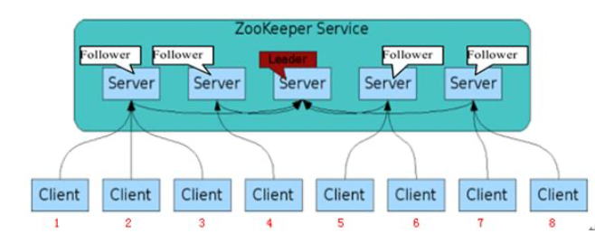
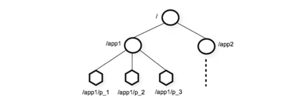
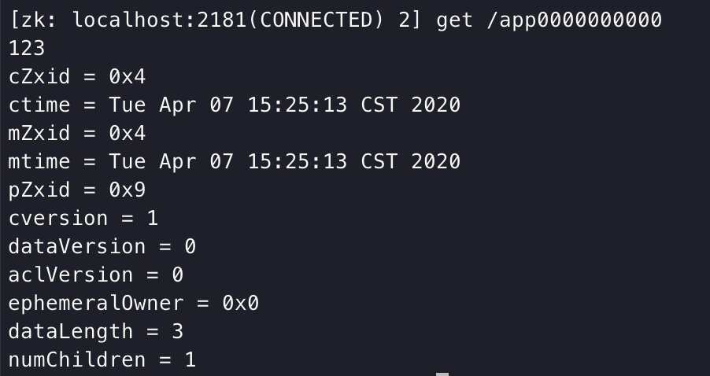
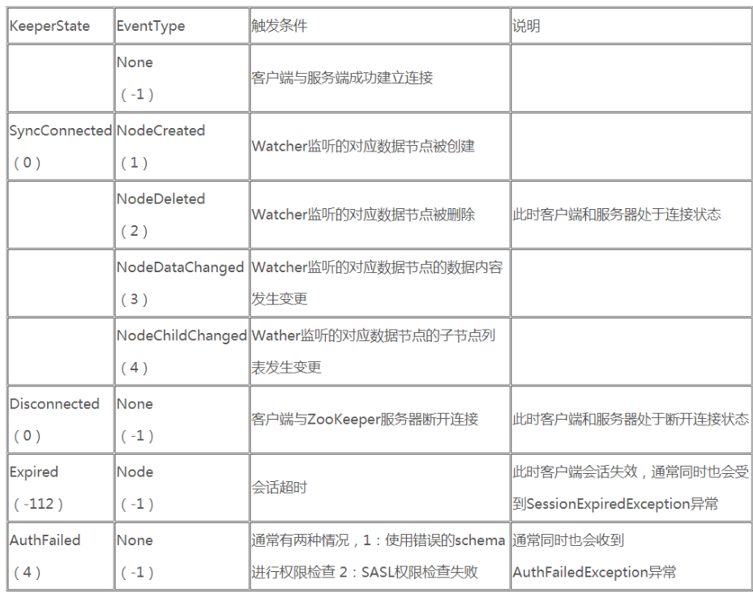
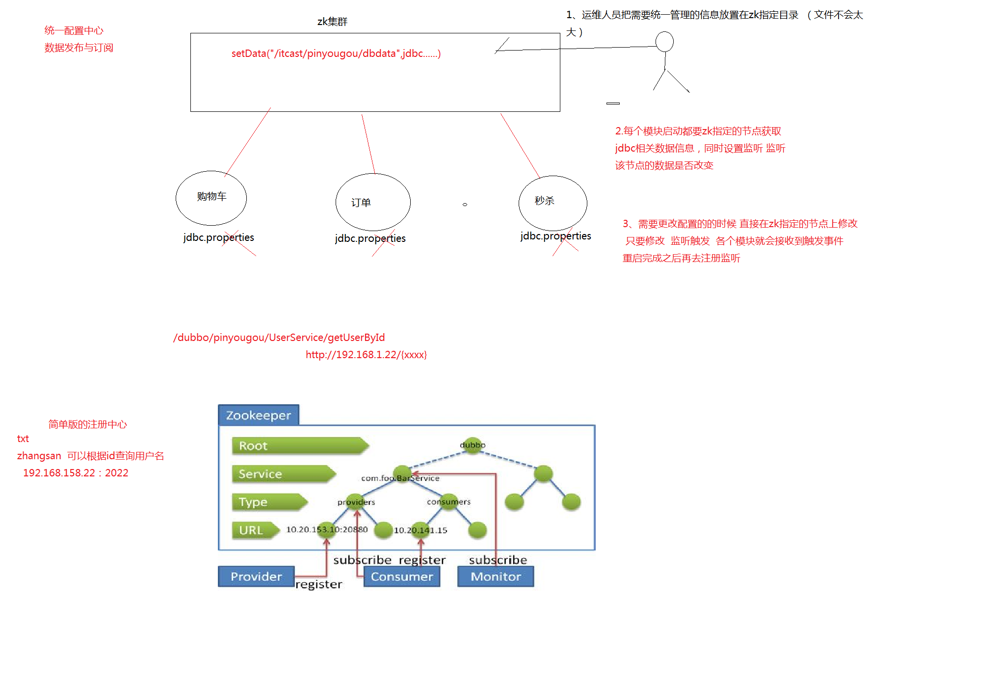

## Zookeeper概述

Zookeeper 是一个分布式协调服务的开源框架。主要用来解决分布式集群中应用系统的一致性问题，例如：怎样避免同时操作同一数据造成脏读的问题。

ZooKeeper 本质上是一个分布式的小文件存储系统。提供基于类似于文件系统的目录树方式的数据存储，并且可以对树中的节点进行有效管理。从而用来维护和监控你存储的数据的状态变化。通过监控这些数据状态的变化，从而可以达 到基于数据的集群管理。诸如:统一命名服务、分布式配置管理、分布式消息队列、分布式锁、分布式协调等功能。

### Zookeeper的特性

1. **全局数据一致**：集群中每个服务器保存一份相同的数据副本，client 无 论连接到哪个服务器，展示的数据都是一致的，这是最重要的特征;
2. **可靠性**：如果消息被其中一台服务器接受，那么将被所有的服务器接受。
3. **顺序性**：包括全局有序和偏序两种:全局有序是指如果在一台服务器上 消息 a 在消息 b 前发布，则在所有的Server 上消息 a 都将在消息 b 前被 发布;偏序是指如果一个消息 b 在消息 a 后被同一个发送者发布，a 必将排在 b 前面。
4. **数据更新原子性**一次数据更新要么成功(半数以上节点成功)，要么失败，不存在中间状态。
5. **实时性** ：Zookeeper 保证客户端将在一个时间间隔范围内获得服务器的更新信息，或者服务器失效的信息。

### Zookeeper集群中的角色分类

1. **Leader:**Zookeeper 集群工作的核心

   事务请求(写操作)的唯一调度和处理者，保证集群事务处理的顺序性; 集群内部各个服务器的调度者。
   对于 create，setData，delete 等有写操作的请求，则需要统一转发给leader 处理，leader 需要决定编号、 执行操作，这个过程称为一个事务。

2. **Follower：**

   处理客户端非事务(读操作)请求。

   转发事务请求给 Leader; 参与集群 Leader 选举投票。

3. 此外，针对访问量较大的集群，可增加**Observer**（观察者）角色：

   观察者角色，观察 Zookeeper 集群的最新状态变化并将这些状态同步过来，其对于非事务请求可以进行独立处理，对于事务请求，则会转发给 Leader 服务器进行处理。

   不会参与任何形式的投票只提供非事务服务，通常用于在不影响集群事务处理能力的前提下提升集群的非事务处理能力。

   > 为什么不增加Server呢？Server增多，投票阶段延迟增大，影响性能，而增加Observer并不参与到投票中，又增加了系统的吞吐量。

### Zookeeper集群搭建

通常由**2N+1(奇数)**台Server组成，为了保证多台机器之间的写数据一致性，Zookeeper使用参考了Paxos 协议开发的ZAB(ZooKeeper Atomic Broadcast )一致性协议。

> 关于ZAB一致性协议，在分布式模块中会详细讲述。

## Zookeeper Shell

客户端连接。

## Zookeeper数据模型

ZooKeeper 的数据模型，在结构上和标准文件系统的非常相似，拥有一个层次的命名空间，都是采用树形层次结构，ZooKeeper 树中的每个节点被称为— Znode。和文件系统的目录树一样，ZooKeeper 树中的每个节点可以拥有子节点。 但也有不同之处:

1. Znode 兼具文件和目录两种特点。既像文件一样维护着数据、元信息、ACL、 时间戳等数据结构，又像目录一样可以作为路径标识的一部分，并可以具有 子 Znode。用户对 Znode 具有增、删、改、查等操作(权限允许的情况下)。

2. Znode 具有原子性操作，读操作将获取与节点相关的所有数据，写操作也将 替换掉节点的所有数据。另外，每一个节点都拥有自己的 ACL(访问控制列表)，这个列表规定了用户的权限，即限定了特定用户对目标节点可以执行的 操作。

3. Znode 存储数据大小有限制。ZooKeeper 虽然可以关联一些数据，但并没有 被设计为常规的数据库或者大数据存储，相反的是，它用来管理调度数据， 比如分布式应用中的配置文件信息、状态信息、汇集位置等等。这些数据的 共同特性就是它们都是很小的数据，通常以 KB 为大小单位。ZooKeeper 的服 务器和客户端都被设计为严格检查并限制每个 Znode 的数据大小至多 1M，当时常规使用中应该远小于此值。
4.  Znode 通过路径引用，如同 Unix 中的文件路径。路径必须是绝对的，因此他们必须由斜杠字符来开头。除此以外，他们必须是唯一的，也就是说每一个路径只有一个表示，因此这些路径不能改变。在 ZooKeeper 中，路径由 Unicode 字符串组成，并且有一些限制。字符串"/zookeeper"用以保存管理 信息，比如关键配额信息。

### 模型结构

图中的每个节点称为一个 Znode。 每个 Znode 由 3 部分组成: 

1.  **stat**：此为状态信息, 描述该 Znode 的版本, 权限等信息 。

2.  **data**:   与该 Znode 关联的数据。

3. **children**:该 Znode 下的子节点。

### 节点类型

1. **临时节点**

   生命周期依赖创建他们的会话，一旦会话结束，临时节点将会被删除，也可以手动删除。**临时节点不允许有子节点**。

2. **永久节点**

   生命周期不依赖会话，只有在显式执行了删除命令才会被删除。

  此外，Zookeeper还有一个**序列化**的特性，如果创建的时候指定的话，该 Znode 的名字后面会自动追加一个不断增加的序列号。**序列号对于此节点的父节点来说是唯一 的**，这样便会记录每个子节点创建的先后顺序。它的格式为“%10d”(10 位数字， 没有数值的数位用 0 补充，例如“0000000001”)。

> 这样便会存在四种类型的 Znode 节点:
>
> PERSISTENT:永久节点
>
> EPHEMERAL:临时节点
>
> PERSISTENT_SEQUENTIAL:永久节点、序列化
>
> EPHEMERAL_SEQUENTIAL:临时节点、序列化
>
> 在SHELL中操作时：通过-s和-e参数来指定是顺序节点和临时节点，若不指定，默认为永久节点。
>
> 

### 节点属性

通过get命令查看某个节点的属性：

**dataVersion: ** 数据版本号，每次对节点进行 set 操作，dataVersion 的值都 会增加 1(即使设置的是相同的数据)，可有效避免了数据更新时出现的先后顺 序问题。

**cversion :** 子节点的版本号。当 znode 的子节点有变化时，cversion 的值 就会增加 1。

**aclVersion** : ACL 的版本号。

**cZxid **:  Znode 创建的事务 id。

**mZxid **: Znode 被修改的事务 id，即每次对 znode 的修改都会更新 mZxid。

> 对于 zk 来说，每次的变化都会产生一个唯一的事务 id，zxid(ZooKeeperTransaction Id)。通过 zxid，可以确定更新操作的先后顺序。例如，如果 zxid1 小于 zxid2，说明 zxid1 操作先于 zxid2 发生，zxid 对于整个 zk 都是唯一的， 即使操作的是不同znode。
>
> 在 ZAB 协议的事务编号 Zxid 设计中，Zxid 是一个 64 位的数字，其中低 32 位是一个简单的单调递增的计数器，针对客户端每一个事务请求，计数器加 1；而高 32 位则代表 Leader 周期 epoch 的编号，每个当选产生一个新的 Leader 服务器，就会从这个 Leader 服务器上取出其本地日志中最大事务的ZXID，并从中读取 epoch 值，然后加 1，以此作为新的 epoch，并将低 32 位从 0 开始计数。
>
> epoch：可以理解为当前集群所处的年代或者周期，每个 leader 就像皇帝，都有自己的年号，所以每次改朝换代，leader 变更之后，都会在前一个年代的基础上加 1。这样就算旧的 leader 崩溃恢复之后，也没有人听他的了，因为 follower 只听从当前年代的 leader 的命令。

**ctime**:  节点创建时的时间戳。

**mtime**: 节点最新一次更新发生时的时间戳。

**ephemeralOwner**:  如果该节点为临时节点, ephemeralOwner 值表示与该节点 绑定的 session id. 如果不是, ephemeralOwner 值为 0。

在 client 和 server 通信之前,首先需要建立连接,该连接称为 session。连接建立后,如果发生连接超时、授权失败,或者显式关闭连接,连接便处于 CLOSED 状态, 此时 session 结束。

## Zookeeper Watcher(监听)机制

ZooKeeper 提供了分布式数据发布/订阅功能，一个典型的发布/订阅模型系 统定义了一种一对多的订阅关系，能让多个订阅者同时监听某一个主题对象，当 这个主题对象自身状态变化时，会通知所有订阅者，使他们能够做出相应的处理。

ZooKeeper 中，引入了 Watcher 机制来实现这种分布式的通知功能。 ZooKeeper 允许客户端向服务端注册一个 Watcher 监听，当服务端的一些事件触 发了这个 Watcher，那么就会向指定客户端发送一个事件通知来实现分布式的通 知功能。

触发事件种类很多，如:节点创建，节点删除，节点改变，子节点改变等。

> 总体说来有两类watch：
>
> 1. DataWatches：基于Znode节点的数据变更而触发，例如：`getData()`、`exists()`、`setData()`、 `create()`。
> 2. ChildWatches：基于Znode节点的子节点发生变更而触发，例如：`getChildren()`、 `create()`。

总的来说可以概括 Watcher 为以下三个过程:客户端向服务端注册 Watcher、 服务端事件发生触发 Watcher、客户端回调 Watcher 得到触发事件情况。

### Watch机制的特点

**1. 一次性触发**

事件发生触发监听，一个watcher event就会被发送到设置监听的客户端， 这种效果是一次性的，后续再次发生同样的事件，不会再次触发。

**2. 事件封装**

ZooKeeper 使用 WatchedEvent 对象来封装服务端事件并传递。 

WatchedEvent 包含了每一个事件的三个基本属性: 

- 通知状态(keeperState)

- 事件类型(EventType)

- 节点路径(path)

**3.event 异步发送**

watcher 的通知事件从服务端发送到客户端是异步的。

**4. 先注册再触发**

Zookeeper 中的 watch 机制，必须客户端先去服务端注册监听，这样事件发 送才会触发监听，通知给客户端。

### 通知状态和事件类型

同一个事件类型在不同的通知状态中代表的含义有所不同，下表列举了常见的通知状态和事件类型：

  其中连接状态事件(type=None, path=null)不需要客户端注册，客户端直接处理就行了。

## Zookeeper-投票选举

zookeeper 投票默认的算法是 **FastLeaderElection**，采用投票数大于半数则胜出的逻辑。

### 概念

**1. 服务器 ID**

比如有三台服务器，编号分别是 1,2,3。编号越大在选择算法中的权重越大。

**2.选举状态**

LOOKING，竞选状态.

FOLLOWING，随从状态，同步 leader 状态，参与投票。 

OBSERVING，观察状态，同步 leader 状态，不参与投票。

LEADING，领导者状态。

**3.数据 ID**

服务器中存放的最新数据 version。值越大说明数据越新，在选举算法中数据越新权重越大。

**4.逻辑时钟**

也叫投票的次数，同一轮投票过程中的逻辑时钟值是相同的。每投完一次票 这个数据就会增加，然后与接收到的其它服务器返回的投票信息中的数值相比， 根据不同的值做出不同的判断。

### 全新集群选举

每台机器均没有历史数据，编号分别是1，2，3，4，5，依次启动。选举过程如下：

- 服务器 1 启动，给自己投票，然后发投票信息，由于其它机器还没有启 动所以它收不到反馈信息，服务器 1 的状态一直属于 Looking。

- 服务器 2 启动，给自己投票，同时与之前启动的服务器 1 交换结果，由 于服务器 2 的编号大所以服务器 2 胜出，但此时投票数没有大于半数， 所以两个服务器的状态依然是 LOOKING。
- 服务器 3 启动，给自己投票，同时与之前启动的服务器 1,2 交换信息， 由于服务器 3 的编号最大所以服务器 3 胜出，此时投票数正好大于半数，所以服务器 3 成为领导者，服务器 1,2 成为小弟。
- 服务器 4 启动，给自己投票，同时与之前启动的服务器 1,2,3 交换信息， 尽管服务器 4 的编号大，但之前服务器 3 已经胜出，所以服务器 4 只能 成为小弟。
- 服务器 5 启动，后面的逻辑同服务器 4 成为小弟。

> 要点：
>
> 1. 每台机器都是自私的，会投自己一票。
> 2. 比较服务器id，编号大的权重大。
> 3. 票数过半，选举结束。
> 4. 按照顺序启动的话，Leader就是中间刚过半的那台机器。

### 非全新集群选举

对于运行正常的 zookeeper 集群，中途有机器 down 掉，需要重新选举时， 选举过程就需要加入数据 ID、服务器 ID 和逻辑时钟。

数据 ID:数据新的 version 就大，数据每次更新都会更新 version。

服务器 ID:   就是我们配置的 myid 中的值，每个机器一个。 

逻辑时钟:这个值从 0 开始递增,每次选举对应一个值。 如果在同一次选举中,这个值是一致的。

 这样选举的标准就变成:

1、逻辑时钟小的选举结果被忽略，重新投票; 

2、统一逻辑时钟后，数据 id 大的胜出; 

3、数据 id 相同的情况下，服务器 id 大的胜出;

根据这个规则选出 leader。

>总结：优中选优，选择数据最新的，状态最好的，一次毛病有没出过的。

## Zookeeper的典型应用

### 数据发布与订阅（配置中心）

发布与订阅模型，即所谓的配置中心，顾名思义就是发布者将数据发布到 ZK 节点上，供订阅者动态获取数据，实现配置信息的集中式管理和动态更新。

应用在启动的时候会主动来获取一次配置，同时，在节点上注册一个 Watcher， 这样一来，以后每次配置有更新的时候，都会实时通知到订阅的客户端，从来达到获取最新配置信息的目的。比如:

分布式搜索服务中，索引的元信息和服务器集群机器的节点状态存放在 ZK 的一些指定节点，供各个客户端订阅使用。

> 适合数据量很小的场景，这样数据更新可能会比较快。

### 命名服务（Name Service）

在分布式系统中，通过使用命名服务，客户端应用能够根据指定名字来获取 资源或服务的地址，提供者等信息。被命名的实体通常可以是集群中的机器，提 供的服务地址，远程对象等等——这些我们都可以统称他们为名字(Name)。其 中较为常见的就是一些分布式服务框架中的服务地址列表。通过调用 ZK 提供的 创建节点的 API，能够很容易创建一个全局唯一的 path，这个 path 就可以作为 一个名称。

阿里巴巴集团开源的分布式服务框架 Dubbo 中使用 ZooKeeper 来作为其命名服务，维护全局的服务地址列表。

 ### 分布式锁

分布式锁，这个主要得益于 ZooKeeper 保证了数据的强一致性。锁服务可以 分为两类，一个是保持独占，另一个是控制时序。

**1. 保持独占**：就是所有试图来获取这个锁的客户端，最终只有一个可以成 功获得这把锁。通常的做法是把 zk 上的一个 znode 看作是一把锁，通过 create znode 的方式来实现。所有客户端都去创建 /distribute_lock 节点，最终成功 创建的那个客户端也即拥有了这把锁。

**2. 控制时序**：就是所有试图来获取这个锁的客户端，最终都是会被安排执行， 只是有个全局时序了。做法和上面基本类似，只是这里 /distribute_lock 已经 预先存在，客户端在它下面创建临时有序节点(这个可以通过节点的属性控制: CreateMode.EPHEMERAL_SEQUENTIAL 来指定)。Zk 的父节点(/distribute_lock) 维持一份 sequence,保证子节点创建的时序性，从而也形成了每个客户端的全局 时序。

## ZAB（ZooKeeper Atomic Broadcast ）一致性协议

为了保证写操作的一致性与可用性，Zookeeper专门设计了一种名为原子广播（ZAB）的支持崩溃恢复的一致性协议。基于该协议，**Zookeeper实现了一种主从模式的系统架构来保持集群中各个副本之间的数据一致性**。

根据ZAB协议，所有的写操作都必须通过Leader完成，Leader写入本地日志后再复制到所有的Follower节点。

一旦Leader节点无法工作，ZAB协议能够自动从Follower节点中重新选出一个合适的替代者，即新的Leader，该过程即为领导选举。该领导选举过程，是ZAB协议中最为重要和复杂的过程。

### 写Leader

由上图可见，通过Leader进行写操作，主要分为五步：

1. 客户端向Leader发起写请求
2. Leader将写请求以Proposal的形式发给所有Follower并等待ACK（**广播**）
3. Follower收到Leader的Proposal后返回ACK
4. Leader得到过半数的ACK（Leader对自己默认有一个ACK）后向所有的Follower和Observer发送Commmit
5. Leader将处理结果返回给客户端

这里要注意

- Leader并不需要得到Observer的ACK，即Observer无投票权
- Leader不需要得到所有Follower的ACK，只要收到过半的ACK即可，同时Leader本身对自己有一个ACK。上图中有4个Follower，只需其中两个返回ACK即可，因为(2+1) / (4+1) > 1/2
- Observer虽然无投票权，但仍须同步Leader的数据从而在处理读请求时可以返回尽可能新的数据

### 写Follower/Observer

- Follower/Observer均可接受写请求，但不能直接处理，而需要将写请求转发给Leader处理。
- 除了多了一步请求转发，其它流程与直接写Leader无任何区别。

### 读操作

Leader/Follower/Observer都可直接处理读请求，从本地内存中读取数据并返回给客户端即可。

由于处理读请求不需要服务器之间的交互，Follower/Observer越多，整体可处理的读请求量越大，也即读性能越好。

> 但是，如果增加Follower会因要参加投票而增加耗时，所以为了增加读请求的吞吐量，可以增加Observer。

## ZAB协议的四个阶段

#### Phase 0: Leader election（选举阶段）

节点在一开始都处于选举阶段，只要有一个节点得到超半数节点的票数，它就可以当选准 leader。只有到达 Phase 3 准 leader 才会成为真正的 leader。这一阶段的目的是就是为了选出一个准 leader，然后进入下一个阶段。

协议并没有规定详细的选举算法，后面我们会提到实现中使用的 Fast Leader Election。

#### Phase 1: Discovery（发现阶段）

在这个阶段，followers 跟准 leader 进行通信，同步 followers 最近接收的事务提议。这个一阶段的主要目的是发现当前大多数节点接收的最新提议，并且准 leader 生成新的 epoch，让 followers 接受，更新它们的acceptedEpoch。

#### Phase 2: Synchronization（同步阶段）

同步阶段主要是利用 leader 前一阶段获得的最新提议历史，同步集群中所有的副本。只有当 quorum 都同步完成，准 leader 才会成为真正的 leader。follower 只会接收 zxid 比自己的 lastZxid 大的提议。

#### Phase 3: Broadcast（广播阶段）

到了这个阶段，Zookeeper 集群才能正式对外提供事务服务，并且 leader 可以进行消息广播。同时如果有新的节点加入，还需要对新节点进行同步。

值得注意的是，ZAB 提交事务并不像 2PC 一样需要全部 follower 都 ACK，只需要得到 quorum （超过半数的节点）的 ACK 就可以了。

## 协议实现

协议的 Java 版本实现跟上面的定义有些不同，选举阶段使用的是 Fast Leader Election（FLE），它包含了 Phase 1 的发现职责。因为 FLE 会选举拥有最新提议历史的节点作为 leader，这样就省去了发现最新提议的步骤。实际的实现将 Phase 1 和 Phase 2 合并为 Recovery Phase（恢复阶段）。所以，ZAB 的实现只有三个阶段：

- **Fast Leader Election**
- **Recovery Phase**
- **Broadcast Phase**

### Fast Leader Election

前面提到 FLE 会选举拥有最新提议历史（lastZixd最大）的节点作为 leader，这样就省去了发现最新提议的步骤。这是基于拥有最新提议的节点也有最新提交记录的前提。

#### 成为 leader 的条件

1. 选`epoch`最大的
2. `epoch`相等，选 zxid 最大的
3. `epoch`和`zxid`都相等，选择`server id`最大的（就是我们配置`zoo.cfg`中的`myid`）

节点在选举开始都默认投票给自己，ß当接收其他节点的选票时，会根据上面的条件更改自己的选票并重新发送选票给其他节点，当有一个节点的得票超过半数，该节点会设置自己的状态为 leading，其他节点会设置自己的状态为 following。

