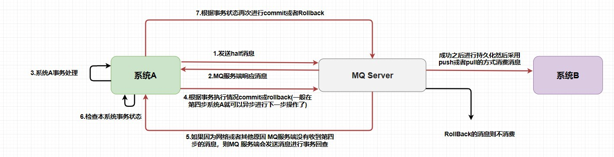

## RocketMQ发送消息

1. **发送同步消息**

   ```java
   public class SyncProducer {
   	public static void main(String[] args) throws Exception {
       	// 实例化消息生产者Producer
           DefaultMQProducer producer = new 	           DefaultMQProducer("please_rename_unique_group_name");
       	// 设置NameServer的地址
       	producer.setNamesrvAddr("localhost:9876");
       	// 启动Producer实例
           producer.start();
       	for (int i = 0; i < 100; i++) {
       	    // 创建消息，并指定Topic，Tag和消息体
       	    Message msg = new Message("TopicTest","TagA" ,
           	("Hello RocketMQ " + i).getBytes(RemotingHelper.DEFAULT_CHARSET));
           	  // 发送消息到一个Broker,并等待发送结果返回
               SendResult sendResult = producer.send(msg);
               // 通过sendResult返回消息是否成功送达
               System.out.printf("%s%n", sendResult);
       	}
       	// 如果不再发送消息，关闭Producer实例。
       	producer.shutdown();
       }
   }
   ```

2. **发送异步消息**

   发送消息耗时较长，但发送者不想等待。

   ```java
   producer.send(msg, new SendCallback() {
         public void onSuccess(SendResult sendResult) {
          }
         public void onException(Throwable throwable) {
         }
   ```

3. **发送单向消息**

   发送不重要的消息，不关心是否发送成功，例如：发送日志。

   ```java
   // 发送单向消息，没有任何返回结果
     producer.sendOneway(msg);
   ```

## RocketMQ消费消息

Rocket支持两种消费方式：

1. **集群消费**：集群中的机器共享消息。
2. **广播消费**：集群中的机器都能收到完整的消息。

发送消息时不做区分，在订阅消息时，可通过如下方式设置消费方式：

```java
consumer.setMessageModel(MessageModel.CLUSTERING);   //集群消费
consumer.setMessageModel(MessageModel.BROADCASTING); //广播消费
```


## 消息的顺序性

RocketMQ是一个先进先出(FIFO)的队列，支持严格的顺序。

### 顺序发送

保证消息的局部顺序，即通过将需要被顺序消费的消息发送到同一个队列中即可。

```java
SendResult sendResult = producer.send(msg, new MessageQueueSelector() {
               @Override
               public MessageQueue select(List<MessageQueue> mqs, Message msg, Object arg) {
                   Long id = (Long) arg;  //根据订单id选择发送queue
                   long index = id % mqs.size();
                   return mqs.get((int) index);
               }
           }, orderList.get(i).getOrderId());//订单id
```

可以同如上的方式，自定义消息的队列，通过消息的唯一标示和队列的个数取模，保证同一个标识下的消息发送到同一个队列中。

### 顺序消费

```java
consumer.registerMessageListener(new MessageListenerConcurrently() {
                 public ConsumeConcurrentlyStatus consumeMessage(List<MessageExt> list, ConsumeConcurrentlyContext Context) {
               
                 }
             }
        );
```

消费者在注册监听器时，传入MessageListenerConcurrently即可，对于同一个Queue，会有同一个消费线程来消费。

## 延迟消息

发送消息时设置延迟等级：

```java
// 设置延时等级3,这个消息将在10s之后发送(现在只支持固定的几个时间,详看delayTimeLevel)
 message.setDelayTimeLevel(3);
```

RocketMQ不支持任意的延迟，现支持如下的等级：

```java
// org/apache/rocketmq/store/config/MessageStoreConfig.java
private String messageDelayLevel = "1s 5s 10s 30s 1m 2m 3m 4m 5m 6m 7m 8m 9m 10m 20m 30m 1h 2h";
```

## 过滤消息

支持两种过滤方式：

1. tag过滤。
2. SQL语法过滤。

## 事务消息

在 `RocketMQ` 中使用的是 **事务消息加上事务反查机制** 来解决分布式事务问题的。



上图说明了事务消息的大致方案，其中分为两个流程：正常事务消息的发送及提交、事务消息的补偿流程。

#### 1）事务消息发送及提交

(1) 发送消息（half消息）。

(2) 服务端响应消息写入结果。

(3) 根据发送结果执行本地事务（如果写入失败，此时half消息对业务不可见，本地逻辑不执行）。

(4) 根据本地事务状态执行Commit或者Rollback（Commit操作生成消息索引，消息对消费者可见）

> 那么，如何做到写入消息但是对用户不可见呢？RocketMQ事务消息的做法是：如果消息是half消息，将备份原消息的主题与消息消费队列，然后 **改变主题** 为RMQ_SYS_TRANS_HALF_TOPIC。由于消费组未订阅该主题，故消费端无法消费half类型的消息，**然后RocketMQ会开启一个定时任务，从Topic为RMQ_SYS_TRANS_HALF_TOPIC中拉取消息进行消费**，根据生产者组获取一个服务提供者发送回查事务状态请求，根据事务状态来决定是提交或回滚消息。

#### 2）事务补偿

(1) 对没有Commit/Rollback的事务消息（pending状态的消息），从服务端发起一次“回查”

(2) Producer收到回查消息，检查回查消息对应的本地事务的状态

(3) 根据本地事务状态，重新Commit或者Rollback

其中，补偿阶段用于解决消息Commit或者Rollback发生超时或者失败的情况。

> 在 `MQ Server` 指向系统B的操作已经和系统A不相关了，也就是说在消息队列中的分布式事务是——**本地事务和存储消息到消息队列才是同一个事务**。这样也就产生了事务的**最终一致性**，因为整个过程是异步的，**每个系统只要保证它自己那一部分的事务就行了**

#### 3）事务消息状态

事务消息共有三种状态，提交状态、回滚状态、中间状态：

* TransactionStatus.CommitTransaction: 提交事务，它允许消费者消费此消息。
* TransactionStatus.RollbackTransaction: 回滚事务，它代表该消息将被删除，不允许被消费。
* TransactionStatus.Unknown: 中间状态，它代表需要检查消息队列来确定状态。