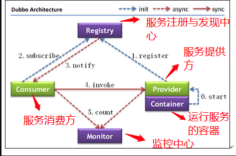

## Dubbo简介

### 什么是 Dubbo?

Apache Dubbo (incubating) |ˈdʌbəʊ| 是一款高性能、轻量级的开源Java RPC 框架，它提供了三大核心能力：面向接口的远程方法调用，智能容错和负载均衡，以及服务自动注册和发现。简单来说 Dubbo 是一个分布式服务框架，致力于提供高性能和透明化的RPC远程服务调用方案，以及SOA服务治理方案。

### 为什么要用 Dubbo?

Dubbo 的诞生和 SOA 分布式架构的流行有着莫大的关系。SOA 面向服务的架构（Service Oriented Architecture），也就是把工程按照业务逻辑拆分成服务层、表现层两个工程。服务层中包含业务逻辑，只需要对外提供服务即可。表现层只需要处理和页面的交互，业务逻辑都是调用服务层的服务来实现。SOA架构中有两个主要角色：服务提供者（Provider）和服务使用者（Consumer）。

**如果你要开发分布式程序，你也可以直接基于 HTTP 接口进行通信，但是为什么要用 Dubbo呢?**

可以从 Dubbo 提供的下面四点特性来说为什么要用 Dubbo：

1. **负载均衡**——同一个服务部署在不同的机器时该调用那一台机器上的服务。
2. **服务调用链路生成**——随着系统的发展，服务越来越多，服务间依赖关系变得错踪复杂，甚至分不清哪个应用要在哪个应用之前启动，架构师都不能完整的描述应用的架构关系。Dubbo 可以为我们解决服务之间互相是如何调用的。
3. **服务访问压力以及时长统计、资源调度和治理**——基于访问压力实时管理集群容量，提高集群利用率。
4. **服务降级**——某个服务挂掉之后调用备用服务。

## Dubbo的架构

### Dubbo架构图解



**上述节点简单说明：**

- **Provider：** 暴露服务的服务提供方
- **Consumer：** 调用远程服务的服务消费方
- **Registry：** 服务注册与发现的注册中心
- **Monitor：** 统计服务的调用次数和调用时间的监控中心
- **Container：** 服务运行容器

**调用关系说明：**

1. 服务容器负责启动，加载，运行服务提供者。
2. 服务提供者在启动时，向注册中心注册自己提供的服务。
3. 服务消费者在启动时，向注册中心订阅自己所需的服务。
4. 注册中心返回服务提供者地址列表给消费者，如果有变更，注册中心将基于长连接推送变更数据给消费者。
5. 服务消费者，从提供者地址列表中，基于软负载均衡算法，选一台提供者进行调用，如果调用失败，再选另一台调用。
6. 服务消费者和提供者，在内存中累计调用次数和调用时间，定时每分钟发送一次统计数据到监控中心。

**重要知识点总结：**

- **注册中心负责服务地址的注册与查找，相当于目录服务，服务提供者和消费者只在启动时与注册中心交互，注册中心不转发请求，压力较小**
- **监控中心负责统计各服务调用次数，调用时间等，统计先在内存汇总后每分钟一次发送到监控中心服务器，并以报表展示**
- **注册中心，服务提供者，服务消费者三者之间均为长连接，监控中心除外**
- **注册中心通过长连接感知服务提供者的存在，服务提供者宕机，注册中心将立即推送事件通知消费者**
- **注册中心和监控中心全部宕机，不影响已运行的提供者和消费者，消费者在本地缓存了提供者列表**
- **注册中心和监控中心都是可选的，服务消费者可以直连服务提供者**
- **服务提供者无状态，任意一台宕掉后，不影响使用**
- **服务提供者全部宕掉后，服务消费者应用将无法使用，并无限次重连等待服务提供者恢复**

### Dubbo的工作原理

待续。。。


## Dubbo的负载均衡

在集群负载均衡时，Dubbo 提供了多种均衡策略，默认为 `random` 随机调用。可以自行扩展负载均衡策略，参见：[负载均衡扩展](https://dubbo.gitbooks.io/dubbo-dev-book/content/impls/load-balance.html)。

#### Random LoadBalance(默认，基于权重的随机负载均衡机制)

- **随机，按权重设置随机概率。**
- 在一个截面上碰撞的概率高，但调用量越大分布越均匀，而且按概率使用权重后也比较均匀，有利于动态调整提供者权重。

#### RoundRobin LoadBalance(不推荐，基于权重的轮询负载均衡机制)

- 轮循，按公约后的权重设置轮循比率。
- 存在慢的提供者累积请求的问题，比如：第二台机器很慢，但没挂，当请求调到第二台时就卡在那，久而久之，所有请求都卡在调到第二台上。

#### LeastActive LoadBalance

- 最少活跃调用数，相同活跃数的随机，活跃数指调用前后计数差。
- 使慢的提供者收到更少请求，因为越慢的提供者的调用前后计数差会越大

####  ConsistentHash LoadBalance

- **一致性 Hash，相同参数的请求总是发到同一提供者。(如果你需要的不是随机负载均衡，是要一类请求都到一个节点，那就走这个一致性hash策略。)**
- 当某一台提供者挂时，原本发往该提供者的请求，基于虚拟节点，平摊到其它提供者，不会引起剧烈变动。
- 算法参见：http://en.wikipedia.org/wiki/Consistent_hashing

## zookeeper宕机与dubbo直连的情况

在实际生产中，假如zookeeper注册中心宕掉，一段时间内服务消费方还是能够调用提供方的服务的，实际上它使用的本地缓存进行通讯，这只是dubbo健壮性的一种体现。

**dubbo的健壮性表现：**

1. 监控中心宕掉不影响使用，只是丢失部分采样数据
2. 数据库宕掉后，注册中心仍能通过缓存提供服务列表查询，但不能注册新服务
3. 注册中心对等集群，任意一台宕掉后，将自动切换到另一台
4. 注册中心全部宕掉后，服务提供者和服务消费者仍能通过本地缓存通讯
5. 服务提供者无状态，任意一台宕掉后，不影响使用
6. 服务提供者全部宕掉后，服务消费者应用将无法使用，并无限次重连等待服务提供者恢复

我们也可以绕过ZK，直接连接服务提供方：

**xml配置方式：**

```java
<dubbo:reference id="userService" interface="com.zang.gmall.service.UserService" url="dubbo://localhost:20880" />
```

**注解方式：**

```java
 @Reference(url = "127.0.0.1:20880")   
 HelloService helloService;
```

