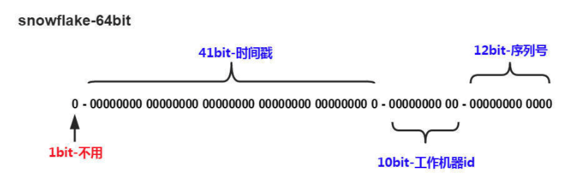

## 数据库自增ID


## 雪花算法(snowflake)

换个角度来对分布式ID进行思考，只要能让负责生成分布式ID的每台机器在每毫秒内生成不一样的ID就行了。

snowflake是twitter开源的分布式ID生成算法，是一种算法。核心思想是：分布式ID固定是一个long型的数字，一个long型占8个字节，也就是64个bit。



- 第一个bit位是标识部分，在java中由于long的最高位是符号位，正数是0，负数是1，一般生成的ID为正数，所以固定为0。
- 时间戳部分占41bit，这个是毫秒级的时间，一般实现上不会存储当前的时间戳，而是时间戳的差值（当前时间-固定的开始时间），这样可以使产生的ID从更小值开始；41位的时间戳可以使用69年，(1L << 41) / (1000L * 60 * 60 * 24 * 365) = 69年
- 工作机器id占10bit，这里比较灵活，比如，可以使用前5位作为数据中心机房标识，后5位作为单机房机器标识，可以部署1024个节点。
- 序列号部分占12bit，支持同一毫秒内同一个节点可以生成4096个ID。

> snowflake算法中最难实践的就是工作机器id，原始的snowflake算法需要人工去为每台机器去指定一个机器id，并配置在某个地方从而让snowflake从此处获取机器id。

### 百度（uid-generator）

### 美团（Leaf）

美团的Leaf也是一个分布式ID生成框架。它非常全面，即支持号段模式，也支持snowflake模式。号段模式这里就不介绍了，和上面的分析类似。

Leaf中的snowflake模式和原始snowflake算法的不同点，也主要在workId的生成，Leaf中workId是基于ZooKeeper的顺序Id来生成的，每个应用在使用Leaf-snowflake时，在启动时都会都在Zookeeper中生成一个顺序Id，相当于一台机器对应一个顺序节点，也就是一个workId。

## Redis自增

利用Redis中的incr命令来实现原子性的自增与返回。

```lua
127.0.0.1:6379> set seq_id 1     // 初始化自增ID为1
OK
127.0.0.1:6379> incr seq_id      // 增加1，并返回
(integer) 2
127.0.0.1:6379> incr seq_id      // 增加1，并返回
(integer) 3
```

使用redis的效率是非常高的，但是要考虑持久化的问题。Redis支持RDB和AOF两种持久化的方式。

RDB持久化相当于定时打一个快照进行持久化，如果打完快照后，连续自增了几次，还没来得及做下一次快照持久化，这个时候Redis挂掉了，重启Redis后会出现ID重复。

AOF持久化相当于对每条写命令进行持久化，如果Redis挂掉了，不会出现ID重复的现象，但是会由于incr命令过得，导致重启恢复数据时间过长。