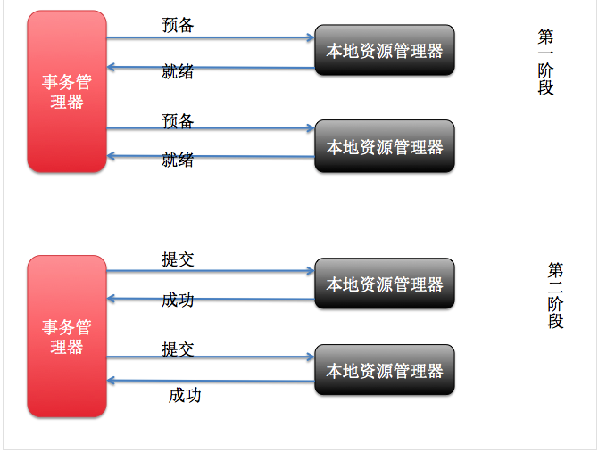

## 分布式事务

分布式事务就是指事务的参与者、支持事务的服务器、资源服务器以及事务管理器分别位于不同的分布式系统的不同节点之上。以上是百度百科的解释，简单的说，就是一次大的操作由不同的小操作组成，这些小的操作分布在不同的服务器上，且属于不同的应用，分布式事务需要保证这些小操作要么全部成功，要么全部失败。本质上来说，分布式事务就是为了保证不同数据库的数据一致性。

## 分布式事务产生的原因

1. 数据库分库分表。
2. 应用SOA化（即将服务拆分成多个微服务）

## 分布式事务的应用场景

1. 支付

   最经典的场景就是支付了，一笔支付，是对买家账户进行扣款，同时对卖家账户进行加钱，这些操作必须在一个事务里执行，要么全部成功，要么全部失败。而对于买家账户属于买家中心，对应的是买家数据库，而卖家账户属于卖家中心，对应的是卖家数据库，对不同数据库的操作必然需要引入分布式事务。

2. 在线下单

   买家在电商平台下单，往往会涉及到两个动作，一个是扣库存，第二个是更新订单状态，库存和订单一般属于不同的数据库，需要使用分布式事务保证数据一致性。

## 解决方案

### 基于XA协议的两阶段提交(2PC)

XA是一个分布式事务协议，由Tuxedo提出。XA中大致分为两部分：事务管理器和本地资源管理器。其中本地资源管理器往往由数据库实现，比如Oracle、DB2这些商业数据库都实现了XA接口，而事务管理器作为全局的调度者，负责各个本地资源的提交和回滚。XA实现分布式事务的原理如下：

XA协议比较简单，而且一旦商业数据库实现了XA协议，使用分布式事务的成本也比较低。但是，XA也有致命的缺点，那就是性能不理想，特别是在交易下单链路，往往并发量很高，XA无法满足高并发场景。XA目前在商业数据库支持的比较理想，在mysql数据库中支持的不太理想，mysql的XA实现，没有记录prepare阶段日志，主备切换回导致主库与备库数据不一致。许多nosql也没有支持XA，这让XA的应用场景变得非常狭隘。

1、应用程序连接两个数据源。
2、应用程序通过事务协调器向两个库发起prepare，两个数据库收到消息分别执行本地事务（记录日志），但不提
交，如果执行成功则回复yes，否则回复no。
3、事务协调器收到回复，只要有一方回复no则分别向参与者发起回滚事务，参与者开始回滚事务。
4、事务协调器收到回复，全部回复yes，此时向参与者发起提交事务。如果参与者有一方提交事务失败则由事务协调器发起回滚事务。
2PC的优点：实现强一致性，部分关系数据库支持（Oracle、MySQL等）。
缺点：整个事务的执行需要由协调者在多个节点之间去协调，增加了事务的执行时间，性能低下。

### 消息事务+最终一致性

所谓的消息事务就是基于消息中间件的两阶段提交，本质上是对消息中间件的一种特殊利用，它是将本地事务和发消息放在了一个分布式事务里，保证要么本地操作成功成功并且对外发消息成功，要么两者都失败，开源的RocketMQ就支持这一特性。以阿里的 RocketMQ 中间件为例，其思路大致为：

第一阶段Prepared消息，会拿到消息的地址。
第二阶段执行本地事务，第三阶段通过第一阶段拿到的地址去访问消息，并修改状态。

也就是说在业务方法内要向消息队列提交两次请求，一次发送消息和一次确认消息。如果确认消息发送失败了RocketMQ会定期扫描消息集群中的事务消息，这时候发现了Prepared消息，它会向消息发送者确认，所以生产方需要实现一个check接口，RocketMQ会根据发送端设置的策略来决定是回滚还是继续发送确认消息。这样就保证了消息发送与本地事务同时成功或同时失败。

基于消息中间件的两阶段提交往往用在高并发场景下，将一个分布式事务拆成一个消息事务（A系统的本地操作+发消息）+B系统的本地操作，其中B系统的操作由消息驱动，只要消息事务成功，那么A操作一定成功，消息也一定发出来了，这时候B会收到消息去执行本地操作，如果本地操作失败，消息会重投，直到B操作成功，这样就变相地实现了A与B的分布式事务。

虽然上面的方案能够完成A和B的操作，但是A和B并不是严格一致的，而是最终一致的，我们在这里牺牲了一致性，换来了性能的大幅度提升。当然，这种玩法也是有风险的，如果B一直执行不成功，那么一致性会被破坏，具体要不要玩，还是得看业务能够承担多少风险。

### TCC编程模型(补偿事务)

所谓的TCC编程模式，也是两阶段提交的一个变种。TCC提供了一个编程框架，将整个业务逻辑分为三块：Try、Confirm和Cancel三个操作。以在线下单为例，Try阶段会去扣库存，Confirm阶段则是去更新订单状态，如果更新订单失败，则进入Cancel阶段，会去恢复库存。总之，TCC就是通过代码人为实现了两阶段提交，不同的业务场景所写的代码都不一样，复杂度也不一样，因此，这种模式并不能很好地被复用。

优点：最终保证数据的一致性，在业务层实现事务控制，灵活性好。XA两阶段提交资源层面的，而TCC实际上把资源层面二阶段提交上提到了业务层面来实现。有效了的避免了XA两阶段提交占用资源锁时间过长导致的性能地下问题。
缺点：开发成本高，每个事务操作每个参与者都需要实现try/confirm/cancel三个接口。
注意：TCC的try/confirm/cancel接口都要实现幂等性，在为在try、confirm、cancel失败后要不断重试;它让多个系统保证了原子性操作,因此成本还是比较高的。

## 使用较多的解决方案

目前比较多的解决方案有几个：
一、结合MQ消息中间件实现的可靠消息最终一致性。
二、TCC补偿性事务解决方案。
三、最大努力通知型方案。

第一种方案：可靠消息最终一致性，需要业务系统结合MQ消息中间件实现，在实现过程中需要保证消息的成功发送及成功消费。即需要通过业务系统控制MQ的消息状态。

第二种方案：TCC补偿性，分为三个阶段TRYING-CONFIRMING-CANCELING。每个阶段做不同的处理。
TRYING阶段主要是对业务系统进行检测及资源预留
CONFIRMING阶段是做业务提交，通过TRYING阶段执行成功后，再执行该阶段。默认如果TRYING阶段执行成功，CONFIRMING就一定能成功。
CANCELING阶段是回对业务做回滚，在TRYING阶段中，如果存在分支事务TRYING失败，则需要调用CANCELING将已预留的资源进行释放。

第三种方案：最大努力通知型，这种方案主要用在与第三方系统通讯时，比如：调用微信或支付宝支付后的支付结果通知。这种方案也是结合MQ进行实现，例如：通过MQ发送http请求，设置最大通知次数。达到通知次数后即不再通知。