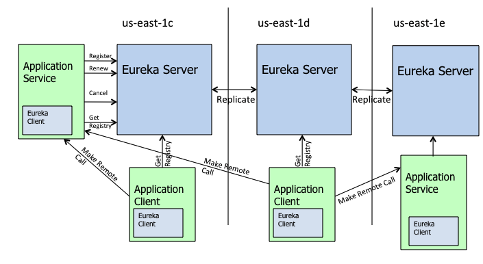

## 什么是Spring cloud

我所理解的 `Spring Cloud` 就是微服务系统架构的一站式解决方案，在平时我们构建微服务的过程中需要做如 **服务发现注册** 、**配置中心** 、**消息总线** 、**负载均衡** 、**断路器** 、**数据监控** 等操作，而 Spring Cloud 为我们提供了一套简易的编程模型，使我们能在 Spring Boot 的基础上轻松地实现微服务项目的构建。

## 服务发现框架——Eureka

### Eureka概念介绍

**服务注册 Register**：当 `Eureka` 客户端向 `Eureka Server` 注册时，它提供自身的元数据，比如IP地址、端口，运行状况指示符URL，主页等。

**服务续约 Renew**：`Eureka` 客户会每隔30秒(默认情况下)发送一次心跳来续约。 通过续约来告知 `Eureka Server` 该 `Eureka` 客户仍然存在，没有出现问题。 正常情况下，如果 `Eureka Server` 在90秒没有收到 `Eureka` 客户的续约，它会将实例从其注册表中删除。

**获取注册列表信息 Fetch Registries**： `Eureka` 客户端从服务器获取注册表信息，并将其缓存在本地。客户端会使用该信息查找其他服务，从而进行远程调用。该注册列表信息定期（每30秒钟）更新一次。每次返回注册列表信息可能与 `Eureka` 客户端的缓存信息不同, `Eureka` 客户端自动处理。如果由于某种原因导致注册列表信息不能及时匹配，`Eureka` 客户端则会重新获取整个注册表信息。 `Eureka` 服务器缓存注册列表信息，整个注册表以及每个应用程序的信息进行了压缩，压缩内容和没有压缩的内容完全相同。`Eureka` 客户端和 `Eureka` 服务器可以使用JSON / XML格式进行通讯。在默认的情况下 `Eureka` 客户端使用压缩 `JSON` 格式来获取注册列表的信息。

**服务下线 Cancel**：Eureka客户端在程序关闭时向Eureka服务器发送取消请求。 发送请求后，该客户端实例信息将从服务器的实例注册表中删除。该下线请求不会自动完成，它需要调用以下内容：`DiscoveryManager.getInstance().shutdownComponent();`

**服务剔除 Eviction**： 在默认的情况下，当Eureka客户端连续90秒(3个续约周期)没有向Eureka服务器发送服务续约，即心跳，Eureka服务器会将该服务实例从服务注册列表删除，即服务剔除。

### Eureka架构



蓝色的 `Eureka Server` 是 `Eureka` 服务器，这三个代表的是集群，而且他们是去中心化的。

绿色的 `Application Client` 是 `Eureka` 客户端，其中可以是**消费者**和**提供者**，最左边的就是典型的提供者，它需要向 `Eureka` 服务器注册自己和发送心跳包进行续约，而其他消费者则通过 `Eureka` 服务器来获取提供者的信息以调用他们。

### 和Zookeeper的区别

- Eureka： **符合AP原则** 为了保证了可用性，`Eureka` 不会等待集群所有节点都已同步信息完成，它会无时无刻提供服务。
- Zookeeper： **符合CP原则** 为了保证一致性，在所有节点同步完成之前是阻塞状态的。

### Eureka 的自我保护机制

当 `Eureka Server` 在某种特定情况下 `Eureka Server` 不会剔除其注册列表中的实例，那就是 `Eureka` 的自我保护时期。

何为自我保护？ 假想一下，当一个 `server` 节点出现了网络分区等不可抗力原因，那么它会因此收不到 `client` 的续约心跳，如果网络波动比较大，也就可能导致 `server` 因为一次网络波动剔除了所有或者绝大部分 `Client` 。这种情况是我们不想看见的。

所以 `Eureka` 会有一种自我保护机制，默认是15分钟内收到的续约低于原来的85%(这是上面的续约配置比例)那么就会开启 自我保护 。这阶段 `Eureka Server` 不会剔除其列表中的实例，即使过了 90秒 也不会。

## 负载均衡——Ribbon

`Ribbon` 是 `Netflix` 公司的一个开源的负载均衡 项目，是一个客户端/进程内负载均衡器，**运行在消费者端**。

其工作原理就是 `Consumer` 端获取到了所有的服务列表之后，在其**内部**使用**负载均衡算法**，进行对多个系统的调用。

### Nginx 和 Ribbon 的对比

提到 **负载均衡** 就不得不提到大名鼎鼎的 `Nignx` 了，而和 `Ribbon` 不同的是，它是一种**集中式**的负载均衡器。

何为集中式呢？简单理解就是 **将所有请求都集中起来，然后再进行负载均衡**， `Nginx` 是接收了所有的请求进行负载均衡的，而对于 `Ribbon` 来说它是在消费者端进行的负载均衡。

> 请注意 `Request` 的位置，在 `Nginx` 中请求是先进入负载均衡器，而在 `Ribbon` 中是先在客户端进行负载均衡才进行请求的。

### Ribbon 的几种负载均衡算法

负载均衡，不管 `Nginx` 还是 `Ribbon` 都需要其算法的支持，如果我没记错的话 `Nginx` 使用的是 轮询和加权轮询算法。而在 `Ribbon` 中有更多的负载均衡调度算法，其默认是使用的 `RoundRobinRule` 轮询策略。

- **`RoundRobinRule`**：轮询策略。`Ribbon` 默认采用的策略。若经过一轮轮询没有找到可用的 `provider`，其最多轮询 10 轮。若最终还没有找到，则返回 `null`。
- **权重轮询**
- **`RandomRule`**: 随机策略，从所有可用的 `provider` 中随机选择一个。
- **`RetryRule`**: 重试策略。先按照 `RoundRobinRule` 策略获取 `provider`，若获取失败，则在指定的时限内重试。默认的时限为 500 毫秒。

```yaml
providerName:
  ribbon:
    NFLoadBalancerRuleClassName: com.netflix.loadbalancer.RandomRule
```

当然，在 `Ribbon` 中你还可以**自定义负载均衡算法**，你只需要实现 `IRule` 接口，然后修改配置文件或者自定义 `Java Config` 类。

## 熔断降级组件——Hystrix

`Hystrix` 是Netflix开源的，能进行 **熔断** 和 **降级** 的库，通过使用它能提高整个系统的弹性。

**熔断** 就是指的 `Hystrix` 中的 **断路器模式** ，你可以使用简单的 `@HystrixCommand` 注解来标注某个方法，这样 `Hystrix` 就会使用 **断路器** 来“包装”这个方法，每当调用时间超过指定时间时(默认为1000ms)，断路器将会中断对这个方法的调用。

```java
@HystrixCommand(
    commandProperties = {@HystrixProperty(name = "execution.isolation.thread.timeoutInMilliseconds",value = "1200")}
)
public List<Xxx> getXxxx() {
    // ...省略代码逻辑
}
```

**降级是为了更好的用户体验，当一个方法调用异常时，通过执行另一种代码逻辑来给用户友好的回复**。这也就对应着 `Hystrix` 的 **后备处理** 模式。

```java
// 指定了后备方法调用
@HystrixCommand(fallbackMethod = "getHystrixNews")
@GetMapping("/get/news")
public News getNews(@PathVariable("id") int id) {
    // 调用新闻系统的获取新闻api 代码逻辑省略
}
// 
public News getHystrixNews(@PathVariable("id") int id) {
    // 做服务降级
    // 返回当前人数太多，请稍后查看
}
```

## 服务调用——Open Feign

通过RestTemplate调用服务非常不方便，能否像Dubbo一样进行服务间的无缝调用呢？

> `OpenFeign` 也是运行在消费者端的，使用 `Ribbon` 进行负载均衡，所以 `OpenFeign` 直接内置了 `Ribbon`。

```java
// 使用 @FeignClient 注解来指定提供者的名字
@FeignClient(value = "eureka-client-provider")
public interface TestClient {
    // 这里一定要注意需要使用的是提供者那端的请求相对路径，这里就相当于映射了
    @RequestMapping(value = "/provider/xxx",
    method = RequestMethod.POST)
    CommonResponse<List<Plan>> getPlans(@RequestBody planGetRequest request);
}
```

在其他项目中就可以方便调用了。

```java
@RestController
public class TestController {
    // 这里就相当于原来自动注入的 Service
    @Autowired
    private TestClient testClient;
    // controller 调用 service 层代码
    @RequestMapping(value = "/test", method = RequestMethod.POST)
    public CommonResponse<List<Plan>> get(@RequestBody planGetRequest request) {
        return testClient.getPlans(request);
    }
}
```

