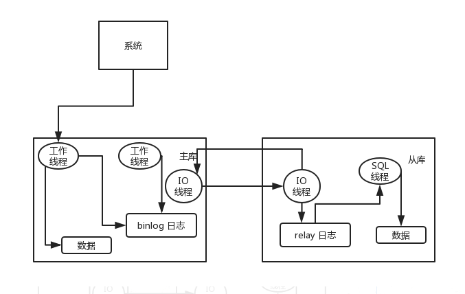

## MySQL的读写分离

### 原理

**基于主从复制架构**。通过数据冗余将数据库的读写操作分散到不同的节点上。

主库将变更写入 binlog 日志，然后从库连接到主库之后，从库有一个 IO 线程，将主库的 binlog 日志拷贝到自己本地，写入一个 relay 中继日志中。接着从库中有一个 SQL 线程会从中继日志读取 binlog，然后执行 binlog 日志中的内容，也就是在自己本地再次执行一遍 SQL，这样就可以保证自己跟主库的数据是一样的。

### 架构图

**适用场景**

- 并发量大，单机已经不能承受该数量的并发。
- 读操作远大于写操作的场景。
- 数据实时性要求不那么严格的业务

**读写分离不是银弹，并不是一有性能问题就上读写分离**，而是应该先优化，例如优化慢查询，调整不合理的业务逻辑，引入缓存查询等只有确定系统没有优化空间后才考虑读写分离集群

### 读写分离引入的系统复杂度问题

**主从复制延迟**

数据写入主服务器后，由于主数据库服务器的数据同步到从机需要一定的时间，因此有一定的延迟，导致从机读取不到最新的数据。

解决方案：

- 写操作后路由读请求

​          写操作后的读操作指定发送给数据库主服务器。业务强绑定，侵入业务代码，可维护性差

- 重试读请求

​          读取从机失败后，再读一次主机。方案简单，实现代价小。如果有很多二次读取，大大增加主机的压力

- 按业务路由读操作

​         关键业务读写操作全部指定主机，非关键业务采用读写分离。

一般来说，如果主从延迟较为严重，有以下解决方案：

- 分库，将一个主库拆分为多个主库，每个主库的写并发就减少了几倍，此时主从延迟可以忽略不计。
- 打开 MySQL 支持的并行复制，多个库并行复制。如果说某个库的写入并发就是特别高，单库写并发达到了 2000/s，并行复制还是没意义。
- 重写代码，写代码的同学，要慎重，插入数据时立马查询可能查不到。
- 如果确实是存在必须先插入，立马要求就查询到，然后立马就要反过来执行一些操作，对这个查询设置直连主库。不推荐这种方法，你要是这么搞，读写分离的意义就丧失了。

**数据丢失问题**

如果主库突然宕机，然后恰好数据还没同步到从库，那么有些数据可能在从库上是没有的，有些数据可能就丢失了。

所以 MySQL 实际上在这一块有两个机制，一个是半同步复制，用来解决主库数据丢失问题；一个是并行复制，用来解决主从同步延时问题。

这个所谓半同步复制，也叫 semi-sync 复制，指的就是主库写入 binlog 日志之后，就会将强制此时立即将数据同步到从库，从库将日志写入自己本地的 relay log 之后，接着会返回一个 ack 给主库，主库接收到至少一个从库的 ack 之后才会认为写操作完成了。

所谓并行复制，指的是从库开启多个线程，并行读取 relay log 中不同库的日志，然后并行重放不同库的日志，这是库级别的并行。