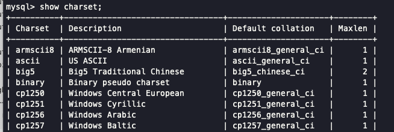

## 存在字符集

- `ASCII`字符集

  共收录128个字符，包括空格、标点符号、数字、大小写字母和一些不可见字符。由于总共才128个字符，所以可以使用1个字节来进行编码，我们看一些字符的编码方式：

  ```
  'L' ->  01001100（十六进制：0x4C，十进制：76）
  'M' ->  01001101（十六进制：0x4D，十进制：77）
  ```

- `ISO 8859-1`字符集

  共收录256个字符，是在`ASCII`字符集的基础上又扩充了128个西欧常用字符(包括德法两国的字母)，也可以使用1个字节来进行编码。这个字符集也有一个别名`latin1`。

- `GB2312`字符集

  收录了汉字以及拉丁字母、希腊字母、日文平假名及片假名字母、俄语西里尔字母。其中收录汉字6763个，其他文字符号682个。同时这种字符集又兼容`ASCII`字符集，所以在编码方式上显得有些奇怪：

  - 如果该字符在`ASCII`字符集中，则采用1字节编码。
  - 否则采用2字节编码。

  这种表示一个字符需要的字节数可能不同的编码方式称为`变长编码方式`。比方说字符串`'爱u'`，其中`'爱'`需要用2个字节进行编码，编码后的十六进制表示为`0xB0AE`，`'u'`需要用1个字节进行编码，编码后的十六进制表示为`0x75`，所以拼合起来就是`0xB0AE75`。

  > 小贴士： 我们怎么区分某个字节代表一个单独的字符还是代表某个字符的一部分呢？别忘了`ASCII`字符集只收录128个字符，使用0～127就可以表示全部字符，所以如果某个字节是在0～127之内的，就意味着一个字节代表一个单独的字符，否则就是两个字节代表一个单独的字符。

- `GBK`字符集

  `GBK`字符集只是在收录字符范围上对`GB2312`字符集作了扩充，编码方式上兼容`GB2312`。

- `utf8`字符集

  收录地球上能想到的所有字符，而且还在不断扩充。这种字符集兼容`ASCII`字符集，采用变长编码方式，编码一个字符需要使用1～4个字节，比方说这样：

  ```
  'L' ->  01001100（十六进制：0x4C）
  '啊' ->  111001011001010110001010（十六进制：0xE5958A）
  ```

  > 小贴士： 其实准确的说，utf8只是Unicode字符集的一种编码方案，Unicode字符集可以采用utf8、utf16、utf32这几种编码方案，utf8使用1～4个字节编码一个字符，utf16使用2个或4个字节编码一个字符，utf32使用4个字节编码一个字符。更详细的Unicode和其编码方案的知识不是本书的重点，大家上网查查哈～ MySQL中并不区分字符集和编码方案的概念，所以后边唠叨的时候把utf8、utf16、utf32都当作一种字符集对待。

对于同一个字符，不同字符集也可能有不同的编码方式。比如对于汉字`'我'`来说，`ASCII`字符集中根本没有收录这个字符，`utf8`和`gb2312`字符集对汉字`我`的编码方式如下：

```
utf8编码：111001101000100010010001 (3个字节，十六进制表示是：0xE68891)
gb2312编码：1011000010101110 (2个字节，十六进制表示是：0xB0AE)
```


## MySQL支持的编码

### MySQL中的utf8和utf8mb4

我们上边说`utf8`字符集表示一个字符需要使用1～4个字节，但是我们常用的一些字符使用1～3个字节就可以表示了。而在`MySQL`中字符集表示一个字符所用最大字节长度在某些方面会影响系统的存储和性能，所以设计`MySQL`的大叔偷偷的定义了两个概念：

- `utf8mb3`：阉割过的`utf8`字符集，只使用1～3个字节表示字符。
- `utf8mb4`：正宗的`utf8`字符集，使用1～4个字节表示字符。

有一点需要大家十分的注意，在`MySQL`中`utf8`是`utf8mb3`的别名，所以之后在`MySQL`中提到`utf8`就意味着使用1~3个字节来表示一个字符，如果大家有使用4字节编码一个字符的情况，比如存储一些emoji表情啥的，那请使用`utf8mb4`。

使用 `show charset` 查看MySQL支持的字符串和比较规则。



> 最后一列 `Maxlen`，它代表该种字符集表示一个字符最多需要几个字节。

使用 `SHOW COLLATION LIKE 'utf8\_%';` 查看字符集对应的比较规则。

```
mysql> SHOW COLLATION LIKE 'utf8\_%';
+--------------------------+---------+-----+---------+----------+---------+
| Collation                | Charset | Id  | Default | Compiled | Sortlen |
+--------------------------+---------+-----+---------+----------+---------+
| utf8_general_ci          | utf8    |  33 | Yes     | Yes      |       1 |
| utf8_bin                 | utf8    |  83 |         | Yes      |       1 |
| utf8_unicode_ci          | utf8    | 192 |         | Yes      |       8 |
| utf8_icelandic_ci        | utf8    | 193 |         | Yes      |       8 |
| utf8_latvian_ci          | utf8    | 194 |         | Yes      |       8 |
| utf8_romanian_ci         | utf8    | 195 |         | Yes      |       8 |
| utf8_slovenian_ci        | utf8    | 196 |         | Yes      |       8 |
| utf8_polish_ci           | utf8    | 197 |         | Yes      |       8 |
| utf8_estonian_ci         | utf8    | 198 |         | Yes      |       8 |
| utf8_spanish_ci          | utf8    | 199 |         | Yes      |       8 |
| utf8_swedish_ci          | utf8    | 200 |         | Yes      |       8 |
| utf8_turkish_ci          | utf8    | 201 |         | Yes      |       8 |
| utf8_czech_ci            | utf8    | 202 |         | Yes      |       8 |
| utf8_danish_ci           | utf8    | 203 |         | Yes      |       8 |
| utf8_lithuanian_ci       | utf8    | 204 |         | Yes      |       8 |
| utf8_slovak_ci           | utf8    | 205 |         | Yes      |       8 |
| utf8_spanish2_ci         | utf8    | 206 |         | Yes      |       8 |
| utf8_roman_ci            | utf8    | 207 |         | Yes      |       8 |
| utf8_persian_ci          | utf8    | 208 |         | Yes      |       8 |
| utf8_esperanto_ci        | utf8    | 209 |         | Yes      |       8 |
| utf8_hungarian_ci        | utf8    | 210 |         | Yes      |       8 |
| utf8_sinhala_ci          | utf8    | 211 |         | Yes      |       8 |
| utf8_german2_ci          | utf8    | 212 |         | Yes      |       8 |
| utf8_croatian_ci         | utf8    | 213 |         | Yes      |       8 |
| utf8_unicode_520_ci      | utf8    | 214 |         | Yes      |       8 |
| utf8_vietnamese_ci       | utf8    | 215 |         | Yes      |       8 |
| utf8_general_mysql500_ci | utf8    | 223 |         | Yes      |       1 |
+--------------------------+---------+-----+---------+----------+---------+
27 rows in set (0.00 sec)
```

名称后缀意味着该比较规则是否区分语言中的重音、大小写啥的，具体可以用的值如下：

|  后缀  |       英文释义       |       描述       |
| :----: | :------------------: | :--------------: |
| `_ai`  | `accent insensitive` |    不区分重音    |
| `_as`  |  `accent sensitive`  |     区分重音     |
| `_ci`  |  `case insensitive`  |   不区分大小写   |
| `_cs`  |   `case sensitive`   |    区分大小写    |
| `_bin` |       `binary`       | 以二进制方式比较 |

