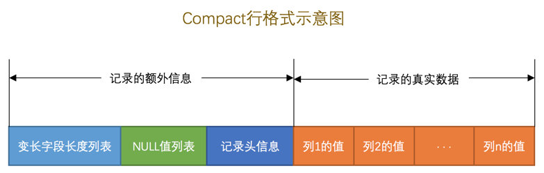
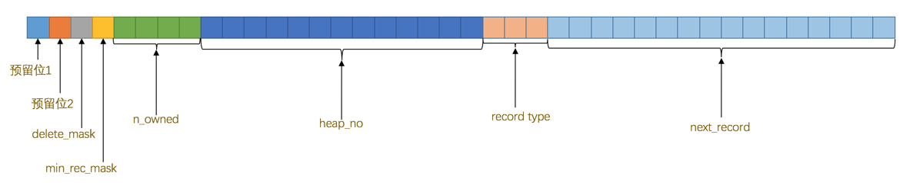

`MySQL`服务器上负责对表中数据的读取和写入工作的部分是`存储引擎`，而服务器又支持不同类型的存储引擎，比如`InnoDB`、`MyISAM`、`Memory`啥的，不同的存储引擎一般是由不同的人为实现不同的特性而开发的，真实数据在不同存储引擎中存放的格式一般是不同的，甚至有的存储引擎比如`Memory`都不用磁盘来存储数据，也就是说关闭服务器后表中的数据就消失了。

## InnoDB页简介

`InnoDB`是一个将表中的数据存储到磁盘上的存储引擎，所以即使关机后重启我们的数据还是存在的。而真正处理数据的过程是发生在内存中的，所以需要把磁盘中的数据加载到内存中，如果是处理写入或修改请求的话，还需要把内存中的内容刷新到磁盘上。而我们知道读写磁盘的速度非常慢，和内存读写差了几个数量级，所以当我们想从表中获取某些记录时，`InnoDB`存储引擎需要一条一条的把记录从磁盘上读出来么？不，那样会慢死，`InnoDB`采取的方式是：将数据划分为若干个页，以页作为磁盘和内存之间交互的基本单位，InnoDB中页的大小一般为 ***16*** KB。也就是在一般情况下，一次最少从磁盘中读取16KB的内容到内存中，一次最少把内存中的16KB内容刷新到磁盘中

## InnoDB行格式

我们平时是以记录为单位来向表中插入数据的，这些记录在磁盘上的存放方式也被称为`行格式`或者`记录格式`。设计`InnoDB`存储引擎的大叔们到现在为止设计了4种不同类型的`行格式`，分别是`Compact`、`Redundant`、`Dynamic`和`Compressed`行格式，随着时间的推移，他们可能会设计出更多的行格式，但是不管怎么变，在原理上大体都是相同的。

### COMPACT行格式

一条记录数据在数据库中的真实结构：

比较重点的就是记录头信息：

**记录头信息**

除了`变长字段长度列表`、`NULL值列表`之外，还有一个用于描述记录的`记录头信息`，它是由固定的`5`个字节组成。`5`个字节也就是`40`个二进制位，不同的位代表不同的意思。

|      名称      | 大小（单位：bit） |                             描述                             |
| :------------: | :---------------: | :----------------------------------------------------------: |
|   `预留位1`    |        `1`        |                           没有使用                           |
|   `预留位2`    |        `1`        |                           没有使用                           |
| `delete_mask`  |        `1`        |                     标记该记录是否被删除                     |
| `min_rec_mask` |        `1`        |        B+树的每层非叶子节点中的最小记录都会添加该标记        |
|   `n_owned`    |        `4`        |                   表示当前记录拥有的记录数                   |
|   `heap_no`    |       `13`        |                表示当前记录在记录堆的位置信息                |
| `record_type`  |        `3`        | 表示当前记录的类型，`0`表示普通记录，`1`表示B+树非叶子节点记录，`2`表示最小记录，`3`表示最大记录 |
| `next_record`  |       `16`        |                   表示下一条记录的相对位置                   |

**记录的真实数据**

`记录的真实数据`除了我们自己定义的列的数据以外，`MySQL`会为每个记录默认的添加一些列（也称为`隐藏列`），具体的列如下：

|       列名       | 是否必须 | 占用空间 |          描述          |
| :--------------: | :------: | :------: | :--------------------: |
|     `row_id`     |    否    | `6`字节  | 行ID，唯一标识一条记录 |
| `transaction_id` |    是    | `6`字节  |         事务ID         |
|  `roll_pointer`  |    是    | `7`字节  |        回滚指针        |

> 实际上这几个列的真正名称其实是：DB_ROW_ID、DB_TRX_ID、DB_ROLL_PTR
>
> 我们为了美观才写成了row_id、transaction_id和roll_pointer。

提一下`InnoDB`表对主键的生成策略：优先使用用户自定义主键作为主键，如果用户没有定义主键，则选取一个`Unique`键作为主键，如果表中连`Unique`键都没有定义的话，则`InnoDB`会为表默认添加一个名为`row_id`的隐藏列作为主键。所以我们从上表中可以看出：InnoDB存储引擎会为每条记录都添加 ***transaction_id*** 和 ***roll_pointer*** 这两个列，但是 ***row_id*** 是可选的（在没有自定义主键以及Unique键的情况下才会添加该列）。这些隐藏列的值不用我们操心，`InnoDB`存储引擎会自己帮我们生成的。

