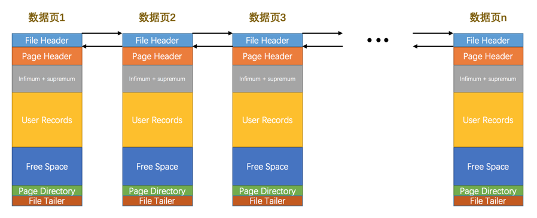

页是InnoDB管理存储空间的基本单位，一个页的大小一般是`16KB`。

官方设计了很多不同种类的页，存放记录的页被称为“索引页”。

|         名称         |       中文名       | 占用空间大小 |         简单描述         |
| :------------------: | :----------------: | :----------: | :----------------------: |
|    `File Header`     |      文件头部      |   `38`字节   |     页的一些通用信息     |
|    `Page Header`     |      页面头部      |   `56`字节   |   数据页专有的一些信息   |
| `Infimum + Supremum` | 最小记录和最大记录 |   `26`字节   |     两个虚拟的行记录     |
|    `User Records`    |      用户记录      |    不确定    |   实际存储的行记录内容   |
|     `Free Space`     |      空闲空间      |    不确定    |    页中尚未使用的空间    |
|   `Page Directory`   |      页面目录      |    不确定    | 页中的某些记录的相对位置 |
|    `File Trailer`    |      文件尾部      |   `8`字节    |      校验页是否完整      |

### 记录在页中的存储

在页的7个组成部分中，我们自己存储的记录会按照我们指定的`行格式`存储到`User Records`部分。但是在一开始生成页的时候，其实并没有`User Records`这个部分，每当我们插入一条记录，都会从`Free Space`部分，也就是尚未使用的存储空间中申请一个记录大小的空间划分到`User Records`部分，当`Free Space`部分的空间全部被`User Records`部分替代掉之后，也就意味着这个页使用完了，如果还有新的记录插入的话，就需要去申请新的页了。

**每条记录结构有一些记录头信息：其中很重要的就是`next-record`**

这玩意儿非常重要，它表示从当前记录的真实数据到下一条记录的真实数据的地址偏移量。比方说第一条记录的`next_record`值为`32`，意味着从第一条记录的真实数据的地址处向后找`32`个字节便是下一条记录的真实数据。如果你熟悉数据结构的话，就立即明白了，这其实是个`链表`，可以通过一条记录找到它的下一条记录。但是需要注意注意再注意的一点是，`下一条记录`指得并不是按照我们插入顺序的下一条记录，**而是按照主键值由小到大的顺序的下一条记录**。而且规定 ***Infimum记录（也就是最小记录）*** 的下一条记录就是本页中主键值最小的用户记录，而本页中主键值最大的用户记录的下一条记录就是 ***Supremum记录（也就是最大记录）*** ，为了更形象的表示一下这个`next_record`起到的作用，我们用箭头来替代一下`next_record`中的地址偏移量：

在一个页中，用户记录数根据ID值，从小到大通过`next-record`字段构成链表。

> 当数据页中存在多条被删除掉的记录时，这些记录的next_record属性将会把这些被删除掉的记录组成一个垃圾链表，以备之后重用这部分存储空间。

### Page Directory（页目录)

如何查找一条记录呢？根据链表从`Infimum`往后一条一条遍历吗？在数据量较小时是可行的。但是在数据量较大时效率很低。

所以设计了页目录部分来快速查找一条记录：

1. 将所有正常的记录（包括最大和最小记录，不包括标记为已删除的记录）划分为几个组。
2. 每个组的最后一条记录（也就是组内最大的那条记录）的头信息中的`n_owned`属性表示该记录拥有多少条记录，也就是该组内共有几条记录。
3. 将每个组的最后一条记录的地址偏移量单独提取出来按顺序存储到靠近`页`的尾部的地方，这个地方就是所谓的`Page Directory`，也就是`页目录`（此时应该返回头看看页面各个部分的图）。页面目录中的这些地址偏移量被称为`槽`（英文名：`Slot`），所以这个页面目录就是由`槽`组成的。

- 现在`页目录`部分中有两个槽，也就意味着我们的记录被分成了两个组，`槽1`中的值是`112`，代表最大记录的地址偏移量（就是从页面的0字节开始数，数112个字节）；`槽0`中的值是`99`，代表最小记录的地址偏移量。
- 注意最小和最大记录的头信息中的`n_owned`属性
  - 最小记录的`n_owned`值为`1`，这就代表着以最小记录结尾的这个分组中只有`1`条记录，也就是最小记录本身。
  - 最大记录的`n_owned`值为`5`，这就代表着以最大记录结尾的这个分组中只有`5`条记录，包括最大记录本身还有我们自己插入的`4`条记录。

分组的规则如下：

对于最小记录所在的分组只能有 ***1*** 条记录，最大记录所在的分组拥有的记录条数只能在 ***1~8*** 条之间，剩下的分组中记录的条数范围只能在是 ***4~8*** 条之间。所以分组是按照下边的步骤进行的：

- 初始情况下一个数据页里只有最小记录和最大记录两条记录，它们分属于两个分组。
- 之后每插入一条记录，都会从`页目录`中找到主键值比本记录的主键值大并且差值最小的槽，然后把该槽对应的记录的`n_owned`值加1，表示本组内又添加了一条记录，直到该组中的记录数等于8个。
- 在一个组中的记录数等于8个后再插入一条记录时，会将组中的记录拆分成两个组，一个组中4条记录，另一个5条记录。这个过程会在`页目录`中新增一个`槽`来记录这个新增分组中最大的那条记录的偏移量。

**所以在一个数据页中查找指定主键值的记录的过程分为两步：**

1. 通过二分法确定该记录所在的槽，并找到该槽所在分组中主键值最小的那条记录。

   > 小贴士：
   >
   > 假如确定主键值为`6`的记录在`槽2`对应的组中。此刻我们需要找到`槽2`中主键值最小的那条记录，然后沿着单向链表遍历`槽2`中的记录。但是我们前边又说过，每个槽对应的记录都是该组中主键值最大的记录，这里`槽2`对应的记录是主键值为`8`的记录，怎么定位一个组中最小的记录呢？别忘了各个槽都是挨着的，我们可以很轻易的拿到`槽1`对应的记录（主键值为`4`），该条记录的下一条记录就是`槽2`中主键值最小的记录，该记录的主键值为`5`。所以我们可以从这条主键值为`5`的记录出发，遍历`槽2`中的各条记录，直到找到主键值为`6`的那条记录即可。由于一个组中包含的记录条数只能是1~8条，所以遍历一个组中的记录的代价是很小的。

2. 通过记录的`next_record`属性遍历该槽所在的组中的各个记录。

### File Header（文件头部）

其中比较重要的就是 FIL_PAGE_PRE和FIL_PAGE_NEXT

我们前边强调过，`InnoDB`都是以页为单位存放数据的，有时候我们存放某种类型的数据占用的空间非常大（比方说一张表中可以有成千上万条记录），`InnoDB`可能不可以一次性为这么多数据分配一个非常大的存储空间，如果分散到多个不连续的页中存储的话需要把这些页关联起来，`FIL_PAGE_PREV`和`FIL_PAGE_NEXT`就分别代表本页的上一个和下一个页的页号。这样通过建立一个双向链表把许许多多的页就都串联起来了，而无需这些页在物理上真正连着。需要注意的是，并不是所有类型的页都有上一个和下一个页的属性，不过我们本集中唠叨的`数据页`（也就是类型为`FIL_PAGE_INDEX`的页）是有这两个属性的，所以所有的数据页其实是一个双链表，就像这样：

### 总结

1. InnoDB为了不同的目的而设计了不同类型的页，我们把用于存放记录的页叫做`数据页`。
2. 一个数据页可以被大致划分为7个部分，分别是
   - `File Header`，表示页的一些通用信息，占固定的38字节。
   - `Page Header`，表示数据页专有的一些信息，占固定的56个字节。
   - `Infimum + Supremum`，两个虚拟的伪记录，分别表示页中的最小和最大记录，占固定的`26`个字节。
   - `User Records`：真实存储我们插入的记录的部分，大小不固定。
   - `Free Space`：页中尚未使用的部分，大小不确定。
   - `Page Directory`：页中的某些记录相对位置，也就是各个槽在页面中的地址偏移量，大小不固定，插入的记录越多，这个部分占用的空间越多。
   - `File Trailer`：用于检验页是否完整的部分，占用固定的8个字节。
3. 每个记录的头信息中都有一个`next_record`属性，从而使页中的所有记录串联成一个`单链表`。
4. `InnoDB`会把页中的记录划分为若干个组，每个组的最后一个记录的地址偏移量作为一个`槽`，存放在`Page Directory`中，所以在一个页中根据主键查找记录是非常快的，分为两步：
   - 通过二分法确定该记录所在的槽。
   - 通过记录的next_record属性遍历该槽所在的组中的各个记录。
5. 每个数据页的`File Header`部分都有上一个和下一个页的编号，所以所有的数据页会组成一个`双链表`。
6. 为保证从内存中同步到磁盘的页的完整性，在页的首部和尾部都会存储页中数据的校验和和页面最后修改时对应的`LSN`值，如果首部和尾部的校验和和`LSN`值校验不成功的话，就说明同步过程出现了问题。

