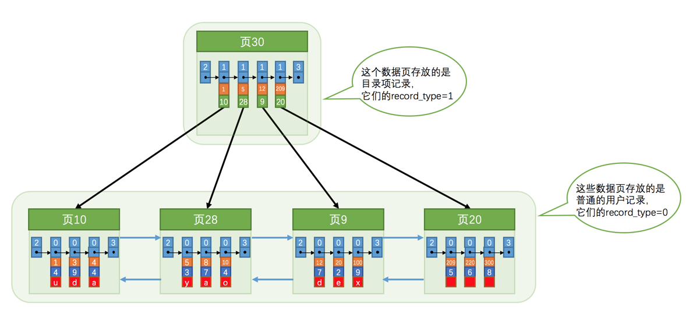
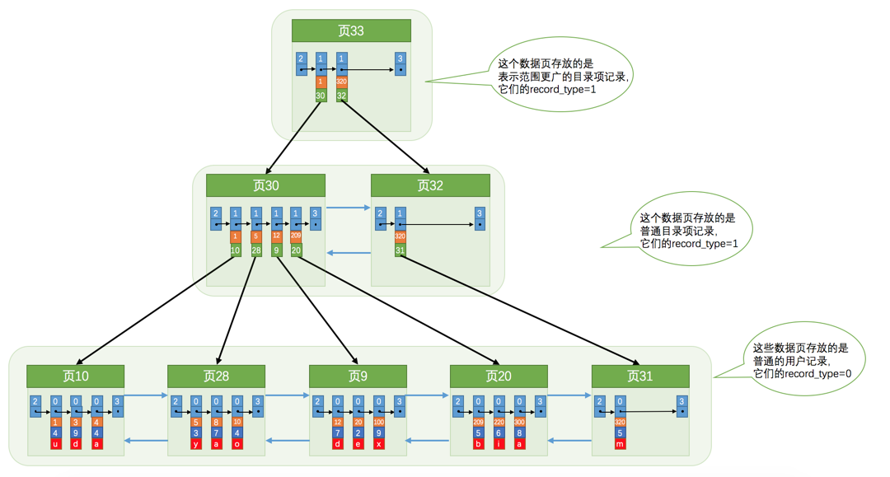

### InnoDB中的索引方案

我们新分配了一个编号为`30`的页来专门存储`目录项记录`。这里再次强调一遍`目录项记录`和普通的`用户记录`的不同点：

- `目录项记录`的`record_type`值是1，而普通用户记录的`record_type`值是0。
- `目录项记录`只有主键值(每个子页最小的主键值)和页的编号两个列，而普通的用户记录的列是用户自己定义的，可能包含很多列，另外还有`InnoDB`自己添加的隐藏列。
- 还记得我们之前在唠叨记录头信息的时候说过一个叫`min_rec_mask`的属性么，只有在存储`目录项记录`的页中的主键值最小的`目录项记录`的`min_rec_mask`值为`1`，其他别的记录的`min_rec_mask`值都是`0`。

#### 多级目录

#### 在B+树中的查找

以ID为条件的查找：

1. 先到存储`目录项记录`的页，也就是页`30`中通过二分法快速定位到对应目录项，因为`12 < 20 < 209`，所以定位到对应的记录所在的页就是`页9`。
2. 再到存储用户记录的`页9`中根据二分法快速定位到主键值为`20`的用户记录。

### 聚簇索引

我们上边介绍的`B+`树本身就是一个目录，或者说本身就是一个索引。它有两个特点：

1. 使用记录主键值的大小进行记录和页的排序，这包括三个方面的含义：

   - 页内的记录是按照主键的大小顺序排成一个单向链表。
   - 各个存放用户记录的页也是根据页中用户记录的主键大小顺序排成一个双向链表。
   - 存放目录项记录的页分为不同的层次，在同一层次中的页也是根据页中目录项记录的主键大小顺序排成一个双向链表。

2. `B+`树的叶子节点存储的是完整的用户记录。

   所谓完整的用户记录，就是指这个记录中存储了所有列的值（包括隐藏列）。

我们把具有这两种特性的`B+`树称为`聚簇索引`，所有完整的用户记录都存放在这个`聚簇索引`的叶子节点处。这种`聚簇索引`并不需要我们在`MySQL`语句中显式的使用`INDEX`语句去创建（后边会介绍索引相关的语句），`InnoDB`存储引擎会自动的为我们创建聚簇索引。另外有趣的一点是，在`InnoDB`存储引擎中，`聚簇索引`就是数据的存储方式（所有的用户记录都存储在了`叶子节点`），也就是所谓的索引即数据，数据即索引。

### 二级索引

需要回表查询。