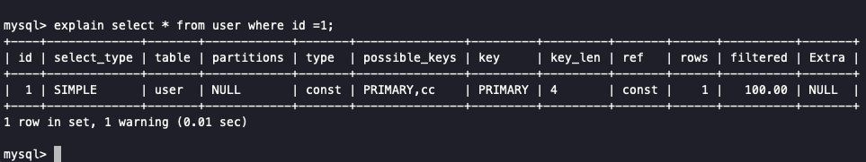

EXPLAIN + 要执行的SQL

- type列，连接类型。一个好的sql语句至少要达到range级别。杜绝出现all级别
- key列，使用到的索引名。如果没有选择索引，值是NULL。可以采取强制索引方式
- key_len列，索引长度
- rows列，扫描行数。该值是个预估值
- extra列，详细说明。注意常见的不太友好的值有：Using filesort, Using temporary

