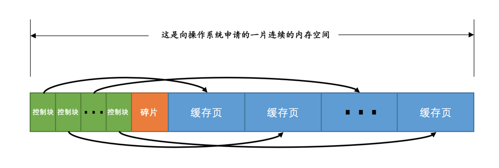
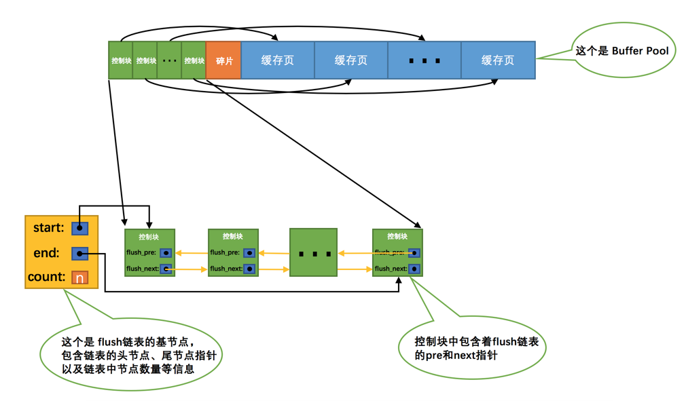

`InnoDB`存储引擎在处理客户端的请求时，当需要访问某个页的数据时，就会把完整的页的数据全部加载到内存中，也就是说即使我们只需要访问一个页的一条记录，那也需要先把整个页的数据加载到内存中。将整个页加载到内存中后就可以进行读写访问了，在进行完读写访问之后并不着急把该页对应的内存空间释放掉，而是将其`缓存`起来，这样将来有请求再次访问该页面时，就可以省去磁盘`IO`的开销了。

## InnoDB的Buffer Pool

在`MySQL`服务器启动的时候就向操作系统申请了一片连续的内存，他们给这片内存起了个名，叫做`Buffer Pool`（中文名是`缓冲池`）。那它有多大呢？这个其实看我们机器的配置，如果你是土豪，你有`512G`内存，你分配个几百G作为`Buffer Pool`也可以啊，当然你要是没那么有钱，设置小点也行呀～ 默认情况下`Buffer Pool`只有`128M`大小。当然如果你嫌弃这个`128M`太大或者太小，可以在启动服务器的时候配置`innodb_buffer_pool_size`参数的值，它表示`Buffer Pool`的大小。

```
[server]
innodb_buffer_pool_size = 268435456
```

其中，`268435456`的单位是字节，也就是我指定`Buffer Pool`的大小为`256M`。需要注意的是，`Buffer Pool`也不能太小，最小值为`5M`(当小于该值时会自动设置成`5M`)。

### Buffer Pool内部组成

`Buffer Pool`中默认的缓存页大小和在磁盘上默认的页大小是一样的，都是`16KB`。为了更好的管理这些在`Buffer Pool`中的缓存页，设计`InnoDB`的大叔为每一个缓存页都创建了一些所谓的`控制信息`，这些控制信息包括该页所属的表空间编号、页号、缓存页在`Buffer Pool`中的地址、链表节点信息、一些锁信息以及`LSN`信息（锁和`LSN`我们之后会具体唠叨，现在可以先忽略），当然还有一些别的控制信息，我们这就不全唠叨一遍了，挑重要的说嘛～

每个缓存页对应的控制信息占用的内存大小是相同的，我们就把每个页对应的控制信息占用的一块内存称为一个`控制块`吧，控制块和缓存页是一一对应的，它们都被存放到 Buffer Pool 中，其中控制块被存放到 Buffer Pool 的前边，缓存页被存放到 Buffer Pool 后边，所以整个`Buffer Pool`对应的内存空间看起来就是这样的：



### free链表的管理

我们要在某个地方记录一下Buffer Pool中哪些缓存页是可用的，这个时候缓存页对应的`控制块`就派上大用场了，我们可以把所有空闲的缓存页对应的控制块作为一个节点放到一个链表中，这个链表也可以被称作`free链表`（或者说空闲链表）。刚刚完成初始化的`Buffer Pool`中所有的缓存页都是空闲的，所以每一个缓存页对应的控制块都会被加入到`free链表`中，假设该`Buffer Pool`中可容纳的缓存页数量为`n`，那增加了`free链表`的效果图就是这样的：


从图中可以看出，我们为了管理好这个`free链表`，特意为这个链表定义了一个`基节点`，里边儿包含着链表的头节点地址，尾节点地址，以及当前链表中节点的数量等信息。这里需要注意的是，链表的基节点占用的内存空间并不包含在为`Buffer Pool`申请的一大片连续内存空间之内，而是单独申请的一块内存空间。

有了这个`free链表`之后事儿就好办了，每当需要从磁盘中加载一个页到`Buffer Pool`中时，就从`free链表`中取一个空闲的缓存页，并且把该缓存页对应的`控制块`的信息填上（就是该页所在的表空间、页号之类的信息），然后把该缓存页对应的`free链表`节点从链表中移除，表示该缓存页已经被使用了～

### 缓存页的哈希处理

我们前边说过，当我们需要访问某个页中的数据时，就会把该页从磁盘加载到`Buffer Pool`中，如果该页已经在`Buffer Pool`中的话直接使用就可以了。那么问题也就来了，我们怎么知道该页在不在`Buffer Pool`中呢？难不成需要依次遍历`Buffer Pool`中各个缓存页么？一个`Buffer Pool`中的缓存页这么多都遍历完岂不是要累死？

再回头想想，我们其实是根据`表空间号 + 页号`来定位一个页的，也就相当于`表空间号 + 页号`是一个`key`，`缓存页`就是对应的`value`，怎么通过一个`key`来快速找着一个`value`呢？哈哈，那肯定是哈希表喽～

所以我们可以用`表空间号 + 页号`作为`key`，`缓存页`作为`value`创建一个哈希表，在需要访问某个页的数据时，先从哈希表中根据`表空间号 + 页号`看看有没有对应的缓存页，如果有，直接使用该缓存页就好，如果没有，那就从`free链表`中选一个空闲的缓存页，然后把磁盘中对应的页加载到该缓存页的位置。

### flush链表的管理

如果我们修改了`Buffer Pool`中某个缓存页的数据，那它就和磁盘上的页不一致了，这样的缓存页也被称为`脏页`（英文名：`dirty page`）。当然，最简单的做法就是每发生一次修改就立即同步到磁盘上对应的页上，但是频繁的往磁盘中写数据会严重的影响程序的性能（毕竟磁盘慢的像乌龟一样）。所以每次修改缓存页后，我们并不着急立即把修改同步到磁盘上，而是在未来的某个时间点进行同步，至于这个同步的时间点我们后边会作说明说明的，现在先不用管哈～

但是如果不立即同步到磁盘的话，那之后再同步的时候我们怎么知道`Buffer Pool`中哪些页是`脏页`，哪些页从来没被修改过呢？总不能把所有的缓存页都同步到磁盘上吧，假如`Buffer Pool`被设置的很大，比方说`300G`，那一次性同步这么多数据岂不是要慢死！所以，我们不得不再创建一个存储脏页的链表，凡是修改过的缓存页对应的控制块都会作为一个节点加入到一个链表中，因为这个链表节点对应的缓存页都是需要被刷新到磁盘上的，所以也叫`flush链表`。链表的构造和`free链表`差不多。



### 刷新脏页到磁盘

后台有专门的线程每隔一段时间负责把脏页刷新到磁盘，这样可以不影响用户线程处理正常的请求。主要有两种刷新路径：

- 从`LRU链表`的冷数据中刷新一部分页面到磁盘。

  后台线程会定时从`LRU链表`尾部开始扫描一些页面，扫描的页面数量可以通过系统变量`innodb_lru_scan_depth`来指定，如果从里边儿发现脏页，会把它们刷新到磁盘。这种刷新页面的方式被称之为`BUF_FLUSH_LRU`。

- 从`flush链表`中刷新一部分页面到磁盘。

  后台线程也会定时从`flush链表`中刷新一部分页面到磁盘，刷新的速率取决于当时系统是不是很繁忙。这种刷新页面的方式被称之为`BUF_FLUSH_LIST`。

有时候后台线程刷新脏页的进度比较慢，导致用户线程在准备加载一个磁盘页到`Buffer Pool`时没有可用的缓存页，这时就会尝试看看`LRU链表`尾部有没有可以直接释放掉的未修改页面，如果没有的话会不得不将`LRU链表`尾部的一个脏页同步刷新到磁盘（和磁盘交互是很慢的，这会降低处理用户请求的速度）。这种刷新单个页面到磁盘中的刷新方式被称之为`BUF_FLUSH_SINGLE_PAGE`。

当然，有时候系统特别繁忙时，也可能出现用户线程批量的从`flush链表`中刷新脏页的情况，很显然在处理用户请求过程中去刷新脏页是一种严重降低处理速度的行为（毕竟磁盘的速度慢的要死），这属于一种迫不得已的情况，不过这得放在后边唠叨`redo`日志的`checkpoint`时说了。