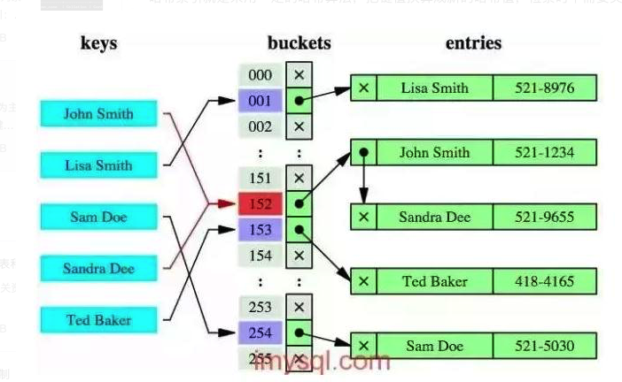

## 为什么使用数据索引能提高效率

1、数据索引的存储是有序的

2、在有序的情况下，通过索引查询一个数据是无需遍历索引记录的

3、极端情况下，数据索引的查询效率为二分法查询效率，趋近于 log2(N)

## Hash索引

哈希索引就是采用一定的哈希算法，把键值换算成新的哈希值，检索时不需要类似B+树那样从根节点到叶子节点逐级查找，只需一次哈希算法即可，是无序的。



### 优势

等值查询。哈希索引具有绝对优势（前提是：没有大量重复键值，如果大量重复键值时，哈希索引的效率很低，因为存在所谓的哈希碰撞问题。）

### 劣势

1、不支持范围查询

2、不支持索引完成排序

3、不支持联合索引的最左前缀匹配规则

通常，B+树索引结构适用于绝大多数场景，像下面这种场景用哈希索引才更有优势：

在HEAP表中，如果存储的数据重复度很低（也就是说基数很大），对该列数据以等值查询为主，没有范围查询、没有排序的时候，特别适合采用哈希索引，例如这种SQL：

```sql
Select * from table where name = '张三';   ----仅等值查询
```

而常用的InnoDB引擎中默认使用的是**B+树索引**，它会实时监控表上索引的使用情况，如果认为建立哈希索引可以提高查询效率，则自动在内存中的“自适应哈希索引缓冲区”建立哈希索引（在InnoDB中默认开启自适应哈希索引），通过观察搜索模式，MySQL会利用index key的前缀建立哈希索引，如果一个表几乎大部分都在缓冲池中，那么建立一个哈希索引能够加快等值查询。

注意：在某些工作负载下，通过哈希索引查找带来的性能提升远大于额外的监控索引搜索情况和保持这个哈希表结构所带来的开销。但某些时候，在负载高的情况下，自适应哈希索引中添加的read/write锁也会带来竞争，比如高并发的join操作。like操作和%的通配符操作也不适用于自适应哈希索引，可能要关闭自适应哈希索引。

## B树和B+树索引

### B树

每个节点都存储key和data，所有节点组成这棵树，并且叶子节点指针为nul，叶子结点不包含任何关键字信息。


### B+树

B+树是一个平衡的多叉树，从根节点到每个叶子节点的高度差值不超过1，而且同层级的节点间有指针相互链接，是有序的。

所有的叶子结点中包含了全部关键字的信息，及指向含有这些关键字记录的指针，且叶子结点本身依关键字的大小自小而大的顺序链接，所有的非终端结点可以看成是索引部分，结点中仅含有其子树根结点中最大（或最小）关键字。 (而B 树的非终节点也包含需要查找的有效信息)


**为什么说B+比B树更适合实际应用中操作系统的文件索引和数据库索引？**

1、B+的磁盘读写代价更低B+的内部结点并没有指向关键字具体信息的指针。因此其内部结点相对B树更小。如果把所有同一内部结点的关键字存放在同一盘块中，那么盘块所能容纳的关键字数量也越多。一次性读入内存中的需要查找的关键字也就越多。相对来说IO读写次数也就降低了。

2、B+-tree的查询效率更加稳定由于非终结点并不是最终指向文件内容的结点，而只是叶子结点中关键字的索引。所以任何关键字的查找必须走一条从根结点到叶子结点的路。所有关键字查询的路径长度相同，导致每一个数据的查询效率相当。

##  索引的分类

### 单列索引

1. **普通索引**，这个是最基本的索引。

     CREATE INDEX account_Index ON `award`(`account`);  或者

     ALTER TABLE award ADD INDEX account_Index(`account`);

2. **唯一索引**：和普通索引类似，但是唯一索引要求值不能重复，允许为空值。

   CREATE UNIQUE INDEX IndexName ON `TableName`(`字段名）; 或者 

   ALTER TABLE TableName ADD UNIQUE (column_list);

3. **主键索引**：不允许有空值，在建表的时候创建。

### 组合索引

CREATE INDEX nickname_account_createdTime_Index ON `award`(`nickname`, `account`, `created_time`);

上面的组合索引实际包含的是3个索引 (nickname) (nickname,account)(nickname,account,created_time)

在使用的时候遵循**最左前缀原则**

### 全文索引

