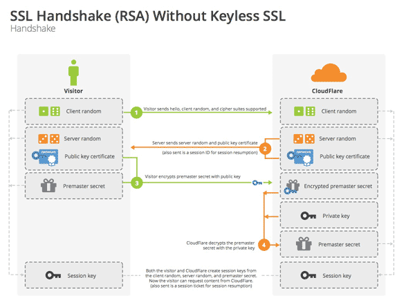

## 加密

对称加密：DES、Triple-DES、RC2 和 RC4。

非对称加密：RSA

混合加密：

任何人只要知道了其公开密钥，就可以向一台公共服务器发送安全报文，所以非对称的公开密钥加密系统是很好用的。两个节点无须为了进行安全的通信而先交换私有密钥。

但公开密钥加密算法的计算可能会很**慢**。实际上它混合使用了对称和非对称策略。 比如，比较常见的做法是在两节点间通过便捷的公开密钥加密技术建立起安全通信， 然后再用那条安全的通道产生并发送临时的随机对称密钥，通过更快的对称加密技术对其余的数据进行加密。（SSH和HTTPS都是这样的）

## 数字签名

**数字签名是附加在报文上的特殊加密校验码**。数字签名通常是用 `非对称公开密钥`技术产生的。因为只有所有者才知道其私有密钥， 所以可以将作者的私有密钥当作一种“指纹”使用。

>  私钥和公钥是一对，都可以加解密，配对使用。
>
> 1. 私钥加密公钥解密，能证明“私钥拥有者” 的唯一身份，用于签名。
> 2. 公钥加密私钥解密，确保发送的信息，只有有“私钥拥有者” 能够解密，（如果用私钥加密，传递数据，则会被公钥持有者（可能有很多持有者） 解密，失去对信息的保护）

## 数字证书

因特网上的“ID 卡”——数字证书。`数字证书(通常被称作“certs”，有点像 certs 牌薄荷糖)`中包含了由某个受信任组织担保的用户或公司的相关信息。

数字证书中还包含一组信息，所有这些信息都是由一个官方的 `证书颁发机构(CA)` 以数字方式签发的。

而且，数字证书通常还包括对象的公开密钥，以及对象和所用签名算法的描述性信息。任何人都可以创建一个数字证书，但并不是所有人都能够获得受人尊敬的签发 权，从而为证书信息担保，并用其私有密钥签发证书。

## HTTPS

使用 HTTPS 时，所有的 HTTP 请求和响应数据在发送到网络之前，都要进行加密。 HTTPS 在 HTTP 下面提供了一个传输级的密码安全层——可以使用 SSL，也可以使用其后继者—— `传输层安全(Transport Layer Security，TLS)`。由于 SSL 和 TLS 非常类似，所以我们不太严格地用术语 SSL 来表示 SSL 和 TLS。

### 工作原理

HTTPS监听在443端口。

总体说来，https通信的步骤是这样的：

（1） 客户端向服务器端索要并验证公钥。

（2） 双方协商生成"对话密钥"。

（3） 双方采用"对话密钥"进行加密通信。

**步骤一：4.1 客户端发出请求（ClientHello）**

首先，客户端（通常是浏览器）先向服务器发出加密通信的请求，这被叫做ClientHello请求。

在这一步，客户端主要向服务器提供以下信息。

（1） 支持的协议版本，比如TLS 1.0版。

（2） 一个客户端生成的随机数，稍后用于生成"对话密钥"。

（3） 支持的加密方法，比如RSA公钥加密。

（4） 支持的压缩方法。

这里需要注意的是，客户端发送的信息之中不包括服务器的域名。也就是说，理论上服务器只能包含一个网站，否则会分不清应该向客户端提供哪一个网站的数字证书。这就是为什么通常一台服务器只能有一张数字证书的原因。

对于虚拟主机的用户来说，这当然很不方便。2006年，TLS协议加入了一个Server Name Indication扩展，允许客户端向服务器提供它所请求的域名。

**步骤二：****服务器回应（SeverHello）**

服务器收到客户端请求后，向客户端发出回应，这叫做SeverHello。服务器的回应包含以下内容。

（1） 确认使用的加密通信协议版本，比如TLS 1.0版本。如果浏览器与服务器支持的版本不一致，服务器关闭加密通信。

（2） 一个服务器生成的随机数，稍后用于生成"对话密钥"。

（3） 确认使用的加密方法，比如RSA公钥加密。

（4） 服务器证书。

除了上面这些信息，如果服务器需要确认客户端的身份，就会再包含一项请求，要求客户端提供"客户端证书"。比如，金融机构往往只允许认证客户连入自己的网络，就会向正式客户提供USB密钥，里面就包含了一张客户端证书。

**步骤三：客户端回应**

客户端收到服务器回应以后，首先验证服务器证书。如果证书不是可信机构颁布、或者证书中的域名与实际域名不一致、或者证书已经过期，就会向访问者显示一个警告，由其选择是否还要继续通信。

如果证书没有问题，客户端就会从证书中取出服务器的公钥。然后，向服务器发送下面三项信息。

（1） 一个随机数。该随机数用服务器公钥加密，防止被窃听。

（2） 编码改变通知，表示随后的信息都将用双方商定的加密方法和密钥发送。

（3） 客户端握手结束通知，表示客户端的握手阶段已经结束。这一项同时也是前面发送的所有内容的hash值，用来供服务器校验。

上面第一项的随机数，是整个握手阶段出现的第三个随机数，又称"pre-master key"。有了它以后，客户端和服务器就同时有了三个随机数，接着双方就用事先商定的加密方法，各自生成本次会话所用的同一把"会话密钥"。

**步骤四：****服务器的最后回应**

服务器收到客户端的第三个随机数pre-master key之后，计算生成本次会话所用的"会话密钥"。然后，向客户端最后发送下面信息。

（1）编码改变通知，表示随后的信息都将用双方商定的加密方法和密钥发送。

（2）服务器握手结束通知，表示服务器的握手阶段已经结束。这一项同时也是前面发送的所有内容的hash值，用来供客户端校验。

**至此，整个握手阶段全部结束。接下来，客户端与服务器进入加密通信，就完全是使用普通的HTTP协议，只不过用"会话密钥"加密内容。**

> 握手阶段有三点需要注意：
>
> 1. 生成对话密钥一共需要三个随机数。
> 2. 握手之后的对话使用 `对话密钥（session key）` 加密（对称加密），服务器的公钥和私钥只用于加密和解密 `对话密钥（session key）`（非对称加密），无其他作用。
> 3. 服务器公钥放在服务器的数字证书之中。

### 站点证书的有效性

SSL 自身不要求用户检查 Web 服务器证书，但大部分现代浏览器都会对证书进行简 单的完整性检查，并为用户提供进行进一步彻查的手段。网景公司提出的一种 Web 服务器证书有效性算法是大部分浏览器有效性验证技术的基础。验证步骤如下所述：

- `日期检测` 首先，浏览器检查证书的起始日期和结束日期，以确保证书仍然有效。如果证书过期了，或者还未被激活，则证书有效性验证失败，浏览器显示一条错误信息。
- `签名颁发者可信度检测` 每个证书都是由某些 `证书颁发机构(CA)` 签发的，它们负责为服务器担保。证书有不同的等级，每种证书都要求不同级别的背景验证。比如，如果申请某个电子商务服务器证书，通常需要提供一个营业的合法证明。
  任何人都可以生成证书，但有些 CA 是非常著名的组织，它们通过非常清晰的流 程来验证证书申请人的身份及商业行为的合法性。因此，浏览器会附带一个签名颁发机构的受信列表。如果浏览器收到了某未知(可能是恶意的)颁发机构签发的证书，那它通常会显示一条警告信息。
- `签名检测` 一旦判定签名授权是可信的，浏览器就要对签名使用签名颁发机构的公开密钥， 并将其与校验码进行比较，以查看证书的完整性。
- `站点身份检测` 为防止服务器复制其他人的证书，或拦截其他人的流量，大部分浏览器都会试着 去验证证书中的域名与它们所对话的服务器的域名是否匹配。服务器证书中通常 都包含一个域名，但有些 CA 会为一组或一群服务器创建一些包含了服务器名称 列表或通配域名的证书。如果主机名与证书中的标识符不匹配，面向用户的客户 端要么就去通知用户，要么就以表示证书不正确的差错报文来终止连接。