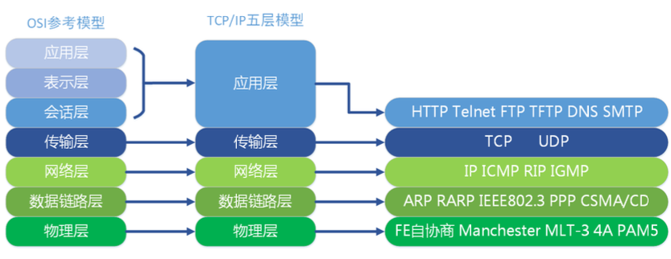

## IP地址

网络中计算机的唯一标识。32bit(4 字节)，一般用“点分十进制”表示，如 192.168.1.158。

IP 地址=网络地址+主机地址 。可分类:

**A类：**第 1 个 8 位表示网络地址。剩下的 3 个 8 位表示主机地址 。

**B类**:：前 2 个 8 位表示网络地址。剩下的 2 个 8 位表示主机地址。

**C类**：前 3 个 8 位表示网络地址。剩下的 1 个 8 位表示主机地址。

**D类**：地址用于在 IP 网络中的组播。

**E类**：地址保留作研究之用。

## 传输协议

通讯的规则
常见协议: UDP(用户数据报协议)、TCP(传输控制协议)。

- UDP
  1. 将数据的源头和目的地包装在数据包中，不需要建立连接。
  2. 每个数据包的大小限制在64KB内。
  3. 不可靠的协议。
  4. 省去了建立连接的开销，速度快。

- TCP
  1. 建立连接，形成传输数据的通道。
  2. 可以在连接中进行大数据传输。
  3. 通过三次握手建立连接，可靠的协议。
  4. 建立连接会降低效率。

## 网络模型

计算机网络之间以何种规则进行通信，就是网络模型所研究的问题。

网络模型一般是指 OSI 七层参考模型和 TCP/IP 五层参考模型。



每一层实现各自的功能和协议，并且都为上一层提供业务功能。为了提供这 种业务功能，下一层将上一层中的数据并入到本层的数据域中，然后通过加入报 头或报尾来实现该层业务功能，该过程叫做数据封装。用户的数据要经过一次次 包装，最后转化成可以在网络上传输的信号，发送到网络上。当到达目标计算机 后，再执行相反的数据拆包过程。

### 物理层

主要定义物理设备标准，如网线的接口类型、光纤的接口类型、各种传输介质的传输速率等。
主要作用是将数据最终编码为用 0、1 标识的比特流，通过物理介质传输。 这一层的数据叫做比特。

### 数据链路层
主要将接收到的数据进行 MAC 地址(网卡地址)的封装与解封装。 常把这一层的数据叫做帧。

这一层常工作的设备是交换机。

### 网络层
主要将接收到的数据进行 IP 地址的封装与解封装。 常把这一层的数据叫做数据包。这一层设备是路由器。

### 传输层
定义了一些数据传输的协议和端口号。 主要将接收的数据进行分段和传输，到达目的地址后在进行重组。 常把这一层的数据叫做段。

### 会话层
通过传输层建立数据传输的通路。 主要在系统之间发起会话或者接收会话请求。

### 表示层
主要进行对接收数据的解释、加密与解密、压缩与解压缩。 确保一个系统的应用层发送的数据能被另一个系统的应用层识别。

### 应用层

主要是为一些终端应用程序提供服务。直接面对着用户的。


## TCP协议的三次握手

URG：此标志表示TCP包的紧急指针域（后面马上就要说到）有效，用来保证TCP连接不被中断，并且督促中间层设备要尽快处理这些数据；

ACK：此标志表示应答域有效，就是说前面所说的TCP应答号将会包含在TCP数据包中；有两个取值：0和1，为1的时候表示应答域有效，反之为0；

PSH：这个标志位表示Push操作。所谓Push操作就是指在数据包到达接收端以后，立即传送给应用程序，而不是在缓冲区中排队；

RST：这个标志表示连接复位请求。用来复位那些产生错误的连接，也被用来拒绝错误和非法的数据包；

SYN：表示同步序号，用来建立连接。SYN标志位和ACK标志位搭配使用，当连接请求的时候，SYN=1，ACK=0；连接被响应的时候，SYN=1，ACK=1；这个标志的数据包经常被用来进行端口扫描。扫描者发送一个只有SYN的数据包，如果对方主机响应了一个数据包回来 ，就表明这台主机存在这个端口；但是由于这种扫描方式只是进行TCP三次握手的第一次握手，因此这种扫描的成功表示被扫描的机器不很安全，一台安全的主机将会强制要求一个连接严格的进行TCP的三次握手；

FIN： 表示发送端已经达到数据末尾，也就是说双方的数据传送完成，没有数据可以传送了，发送FIN标志位的TCP数据包后，连接将被断开。这个标志的数据包也经常被用于进行端口扫描。


暂时需要的信息有：

**ACK ： TCP协议规定，只有ACK=1时有效，也规定连接建立后所有发送的报文的ACK必须为1**

**SYN(SYNchronization) ： 在连接建立时用来同步序号。当SYN=1而ACK=0时，表明这是一个连接请求报文。对方若同意建立连接，则应在响应报文中使SYN=1和ACK=1. 因此, SYN置1就表示这是一个连接请求或连接接受报文。**

**FIN （finis）即完，终结的意思， 用来释放一个连接。当 FIN = 1 时，表明此报文段的发送方的数据已经发送完毕，并要求释放连接。**


SYN
SYN+ACK
ACK

TCP 是基于链接的，所以在传输数据前需要先建立链接，TCP 在传输上是双工传输，不区分 Client 端与 Server 端，为了便于理解，我们把主动发起建连请求的一端称作 Client 端，把被动建立链接的一端称作 Server 端。

1. 第一次握手：建立连接。客户端发送连接请求报文段，将SYN位置为1，Sequence Number为x；然后，客户端进入SYN_SEND状态，等待服务器的确认；
2. 第二次握手：服务器收到SYN报文段。服务器收到客户端的SYN报文段，需要对这个SYN报文段进行确认，设置Acknowledgment Number为x+1(Sequence Number+1)；同时，自己自己还要发送SYN请求信息，将SYN位置为1，Sequence Number为y；服务器端将上述所有信息放到一个报文段（即SYN+ACK报文段）中，一并发送给客户端，此时服务器进入SYN_RECV状态；
3. 第三次握手：客户端收到服务器的SYN+ACK报文段。然后将Acknowledgment Number设置为y+1，向服务器发送ACK报文段，这个报文段发送完毕以后，客户端和服务器端都进入ESTABLISHED状态，完成TCP三次握手


```java
首先建立链接前需要 Server 端先监听端口，因此 Server 端建立链接前的初始状态就是 LISTEN 状态，这时 Client 端准备建立链接，先发送一个 SYN 同步包，发送完同步包后，Client 端的链接状态变成了 SYN_SENT 状态。Server 端收到 SYN 后，同意建立链接，会向 Client 端回复一个 ACK。

由于 TCP 是双工传输，Server 端也会同时向 Client 端发送一个 SYN，申请 Server 向 Client 方向建立链接。发送完 ACK 和 SYN 后，Server 端的链接状态就变成了 SYN_RCVD。

Client 收到 Server 的 ACK 后，Client 端的链接状态就变成了 ESTABLISHED 状态，同时，Client 向 Server 端发送 ACK，回复 Server 端的 SYN 请求。

Server 端收到 Client 端的 ACK 后，Server 端的链接状态也就变成了的 ESTABLISHED 状态，此时建连完成，双方随时可以进行数据传输。

在面试时需要明白三次握手是为了建立双向的链接，需要记住 Client 端和 Server 端的链接状态变化。另外回答建连的问题时，可以提到 SYN 洪水攻击发生的原因，就是 Server 端收到 Client 端的 SYN 请求后，发送了 ACK 和 SYN，但是 Client 端不进行回复，导致 Server 端大量的链接处在 SYN_RCVD 状态，进而影响其他正常请求的建连。可以设置 tcp_synack_retries = 0 加快半链接的回收速度，或者调大 tcp_max_syn_backlog 来应对少量的 SYN 洪水攻击
```
## TCP协议的四次挥手

​    FIN
​    ACK
​    FIN
​    ACK

    TCP 链接的关闭，通信双方都可以先发起，我们暂且把先发起的一方看作 Client，从图中看出，通信中 Client 和 Server 两端的链接都是 ESTABLISHED 状态，然后 Client 先主动发起了关闭链接请求，Client 向 Server 发送了一个 FIN 包，表示 Client 端已经没有数据要发送了，然后 Client 进入了 FIN_WAIT_1 状态。
    
    Server 端收到 FIN 后，返回 ACK，然后进入 CLOSE_WAIT 状态。此时 Server 属于半关闭状态，因为此时 Client 向 Server 方向已经不会发送数据了，可是 Server 向 Client 端可能还有数据要发送。
    
    当Client收到server端返回的ack后，进入FIN_WAIT_2 状态。
    
    当 Server 端数据发送完毕后，Server 端会向 Client 端发送 FIN，表示 Server 端也没有数据要发送了，此时 Server 进入 LAST_ACK 状态，就等待 Client 的应答就可以关闭链接了。
    
    Client 端收到 Server 端的 FIN 后，回复 ACK，然后进入 TIME_WAIT 状态。TIME_WAIT 状态下需要等待 2 倍的最大报文段生存时间，来保证链接的可靠关闭，之后才会进入 CLOSED 关闭状态。而 Server 端收到 ACK 后直接就进入 CLOSED 状态。
    
    这里面试官可能会问为什么需要等待 2 倍最大报文段生存时间之后再关闭链接，原因有两个：
    
    保证 TCP 协议的全双工连接能够可靠关闭；
    
    保证这次连接的重复数据段从网络中消失，防止端口被重用时可能产生数据混淆。
    
    从这个交互流程可以看出，无论是建连还是断链，都是需要在两个方向上进行，只不过建连时，Server 端的 SYN 和 ACK 合并为一次发送，而断链时，两个方向上数据发送停止的时间可能不同，所以不能合并发送 FIN 和 ACK。这就是建连三次握手而断链需要四次的原因。 