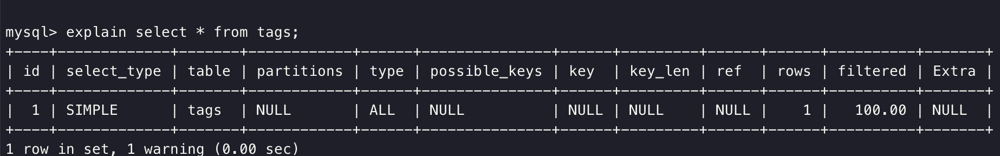

>  算法:无序数组中找到最长连续子序列

> MySQL:索引失效情况,SQL优化,分库分表,分页原理

1. 善用EXPLAIN查看SQL执行计划。

EXPLAIN + 要执行的SQL：

- type列，连接类型。一个好的sql语句至少要达到range级别。杜绝出现all级别
- key列，使用到的索引名。如果没有选择索引，值是NULL。可以采取强制索引方式
- key_len列，索引长度
- rows列，扫描行数。该值是个预估值
- extra列，详细说明。注意常见的不太友好的值有：Using filesort, Using temporary

  2. SQL 语句中IN包含的值不应过多

MySQL对于IN做了相应的优化，即将IN中的常量全部存储在一个数组里面，而且这个数组是排好序的。但是如果数值较多，产生的消耗也是比较大的。再例如：select id from table_name where num in(1,2,3) 对于连续的数值，能用 between 就不要用 in 了；再或者使用连接来替换。

3. SELECT语句务必指明字段名称

SELECT *增加很多不必要的消耗（cpu、io、内存、网络带宽）；增加了使用覆盖索引的可能性；当表结构发生改变时，前断也需要更新。所以要求直接在select后面接上字段名。

4. 当只需要一条数据的时候，使用limit 1

这是为了使EXPLAIN中type列达到const类型

5. 如果排序字段没有用到索引，就尽量少排序。

6. 使用合理的分页方式以提高分页的效率

select id,name from table_name limit 866613, 20

使用上述sql语句做分页的时候，可能有人会发现，随着表数据量的增加，直接使用limit分页查询会越来越慢。

优化的方法如下：可以取前一页的最大行数的id，然后根据这个最大的id来限制下一页的起点。比如此列中，上一页最大的id是866612。sql可以采用如下的写法：

select id,name from table_name where id> 866612 limit 20

7. 分段查询

在一些用户选择页面中，可能一些用户选择的时间范围过大，造成查询缓慢。主要的原因是扫描行数过多。这个时候可以通过程序，分段进行查询，循环遍历，将结果合并处理进行展示。

如下图这个sql语句，扫描的行数成百万级以上的时候就可以使用分段查询

8. 避免在 where 子句中对字段进行 null 值判断

对于null的判断会导致引擎放弃使用索引而进行全表扫描。

9. 不建议使用%前缀模糊查询

例如LIKE “%name”或者LIKE “%name%”，这种查询会导致索引失效而进行全表扫描。但是可以使用LIKE “name%”。

那如何查询%name%？

那么如何解决这个问题呢，答案：使用全文索引

在我们查询中经常会用到select id,fnum,fdst from table_name where user_name like '%zhangsan%';。这样的语句，普通索引是无法满足查询需求的。庆幸的是在MySQL中，有全文索引来帮助我们。

创建全文索引的sql语法是：

ALTER TABLE `table_name` ADD FULLTEXT INDEX `idx_user_name` (`user_name`);

使用全文索引的sql语句是：

select id,fnum,fdst from table_name 

where match(user_name) against('zhangsan' in boolean mode);

注意：在需要创建全文索引之前，请联系DBA确定能否创建。同时需要注意的是查询语句的写法与普通索引的区别

10. 对于联合索引来说，要遵守最左前缀法则

举列来说索引含有字段id,name,school，可以直接用id字段，也可以id,name这样的顺序，但是name，school都无法使用这个索引。所以在创建联合索引的时候一定要注意索引字段顺序，常用的查询字段放在最前面。

11. 必要时可以使用force index来强制查询走某个索引

有的时候MySQL优化器采取它认为合适的索引来检索sql语句，但是可能它所采用的索引并不是我们想要的。这时就可以采用force index来强制优化器使用我们制定的索引。

索引失效的几种情况：

1.查询条件包含or（只有当or两边的字段都有索引时才会走索引）

2.组合索引，不是使用第一列索引，索引失效（不符合最左前缀原则）

3.模糊查询like 以%开头

4.如何列类型是字符串，where时一定用引号括起来，否则索引失效；不用引号括起来

5.当全表扫描速度比索引速度快时，mysql会使用全表扫描，此时索引失效。

分页查询原理：

LIMIT 子句可以被用于强制 SELECT 语句返回指定的记录数。LIMIT 接受一个或两个数字参数。参数必须是一个整数常量。如果给定两个参数，第一个参数指定第一个返回记录行的偏移量，第二个参数指定返回记录行的最大数目。初始记录行的偏移量是 0(而不是 1)。

通过子查询优化。

> ConcurrentHashMap 底层结构

CAS+synchronized

> 项目情况

> 设计模式,分类,常用的

> Redis 数据类型&结构

> CAS 原理

https://segmentfault.com/a/1190000014858404  参考资料

在多处理器环境下，LOCK# 信号可以确保处理器独占使用某些共享内存。lock 可以被添加在下面的指令前：

ADD, ADC, AND, BTC, BTR, BTS, CMPXCHG, CMPXCH8B, CMPXCHG16B, DEC, INC, NEG, NOT, OR, SBB, SUB, XOR, XADD, and XCHG.

通过在 inc 指令前添加 lock 前缀，即可让该指令具备原子性。多个核心同时执行同一条 inc 指令时，会以串行的方式进行，也就避免了上面所说的那种情况。那么这里还有一个问题，lock 前缀是怎样保证核心独占某片内存区域的呢？答案如下：

在 Intel 处理器中，有两种方式保证处理器的某个核心独占某片内存区域。

第一种方式是通过锁定总线，让某个核心独占使用总线，但这样代价太大。总线被锁定后，其他核心就不能访问内存了，可能会导致其他核心短时内停止工作。

第二种方式是锁定缓存，若某处内存数据被缓存在处理器缓存中。处理器发出的 LOCK# 信号不会锁定总线，而是锁定缓存行对应的内存区域。其他处理器在这片内存区域锁定期间，无法对这片内存区域进行相关操作。相对于锁定总线，锁定缓存的代价明显比较小。

